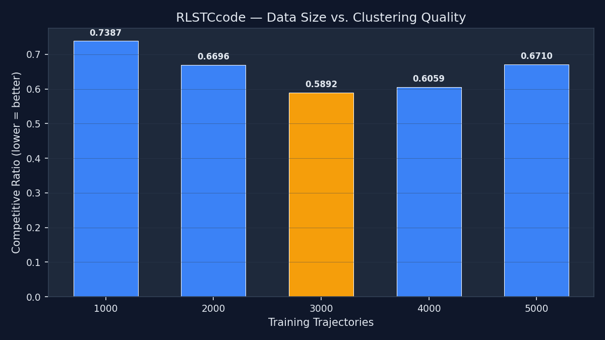
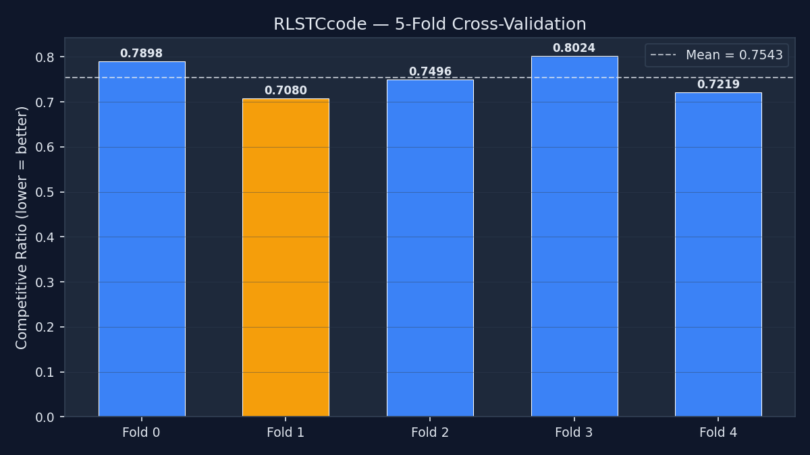
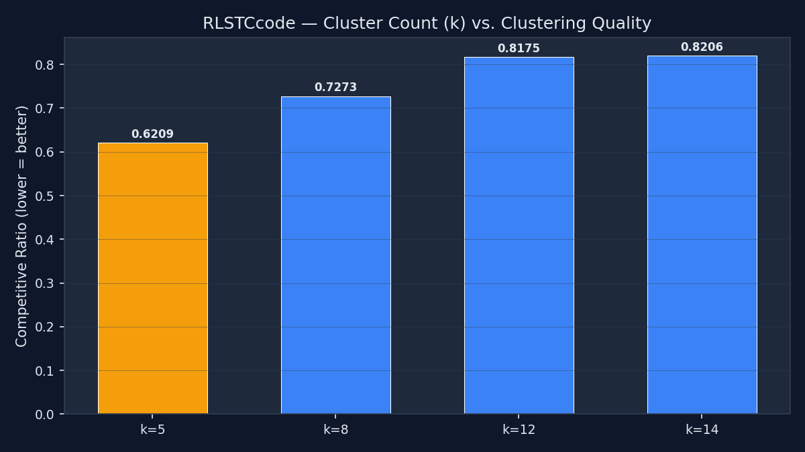
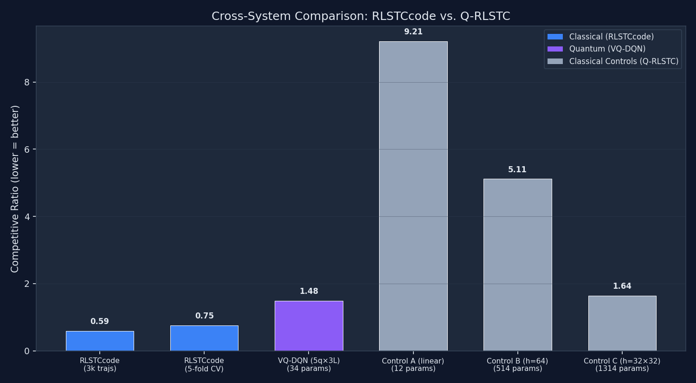
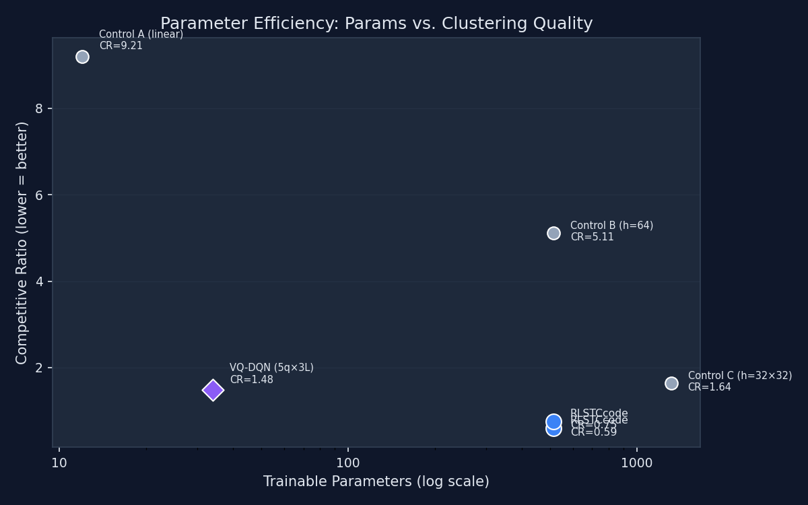

# Classical RLSTCcode — Experiment Report

Generated: 2026-02-24T20:12:42.769722

## Protocol

```json
{
  "source": "RLSTCcode (classical baseline)",
  "architecture": "DQN Dense(5\u219264\u21922)",
  "params": 514,
  "optimizer": "SGD (lr=0.001)",
  "gamma": 0.99,
  "target_update": "soft (\u03c4=0.05)",
  "double_dqn": false,
  "batch_size": 32,
  "memory_size": 5000,
  "epsilon_start": 1.0,
  "epsilon_min": 0.1,
  "epsilon_decay": 0.99
}
```

## Data-Size Experiment (T-Drive)

| Trajectories | Best Val CR | Folder |
|---|---|---|
| 1,000 | **0.7387** | `1kmodels` |
| 2,000 | **0.6696** | `2kmodels` |
| 3,000 | **0.5892** ★ | `3kmodels` |
| 4,000 | **0.6059** | `4kmodels` |
| 5,000 | **0.6710** | `5kmodels` |

## 5-Fold Cross-Validation

| Fold | Val CR | Folder |
|---|---|---|
| 0 | **0.7898** | `kfoldmodels0` |
| 1 | **0.7080** ★ | `kfoldmodels1` |
| 2 | **0.7496** | `kfoldmodels2` |
| 3 | **0.8024** | `kfoldmodels3` |
| 4 | **0.7219** | `kfoldmodels4` |
| **Mean ± Std** | **0.7543 ± 0.0369** | |

## Cluster-Count (k) Experiment

| k | Val CR | Folder |
|---|---|---|
| 5 | **0.6209** ★ | `modelsk5` |
| 8 | **0.7273** | `modelsk8` |
| 12 | **0.8175** | `modelsk12` |
| 14 | **0.8206** | `modelsk14` |

## Other Models

| Label | Val CR | Folder |
|---|---|---|
| modelstate4 | **1.5453** | `modelstate4` |

## Cross-System Comparison

> **Note**: Training conditions differ significantly (see bottom).

| System | Model | Params | Val CR | Optimizer | Training Data |
|---|---|---|---|---|---|
| RLSTCcode | DQN (5→64→2) | 514 | **0.5892** | SGD | 3,000 trajs |
| RLSTCcode | DQN (5-fold CV) | 514 | **0.7543** | SGD | ~4,000 trajs |
| Q-RLSTC | VQ-DQN (5q×3L) | 34 | **1.4811** | SPSA | 30 trajs |
| Q-RLSTC ctrl | Control A (linear) | 12 | **9.2051** | SPSA | 30 trajs |
| Q-RLSTC ctrl | Control B (h=64) | 514 | **5.1133** | SPSA | 30 trajs |
| Q-RLSTC ctrl | Control C (h=32×32) | 1314 | **1.6390** | SPSA | 30 trajs |

### Conditions Caveat

| Dimension | RLSTCcode | Q-RLSTC |
|---|---|---|
| Training trajectories | 500–5,000 | 30 |
| Epochs / Rounds | 2 full rounds | 2 epochs |
| Optimizer | SGD (backprop) | SPSA (gradient-free) |
| Target update | Soft (τ=0.05) | Hard copy (every 10 eps) |
| Double DQN | No | Yes |
| γ | 0.99 | 0.9 |
| Reward shaping | ΔOD raw | ΔOD + cut penalty + extend cost |

## Plots











## Raw Results (JSON)

See `classical_results.json` for machine-readable data.
