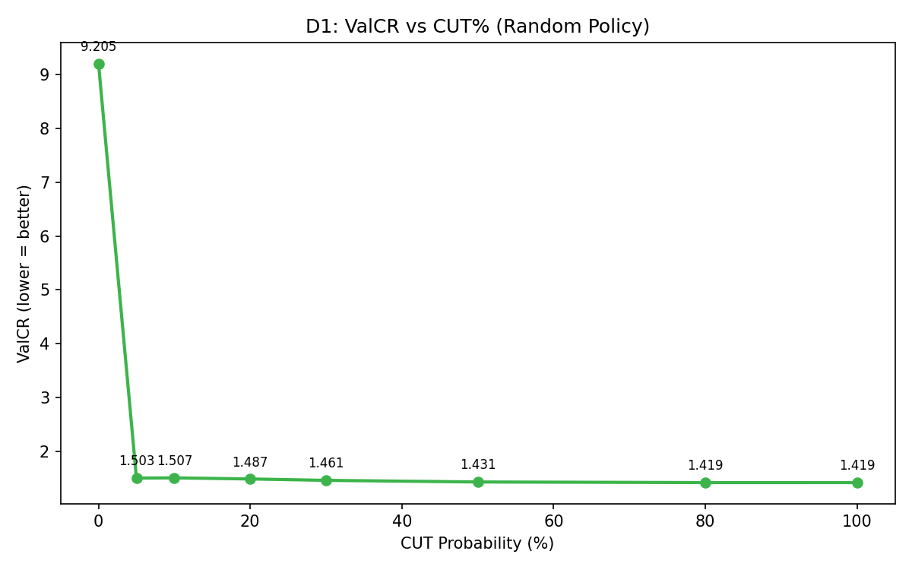
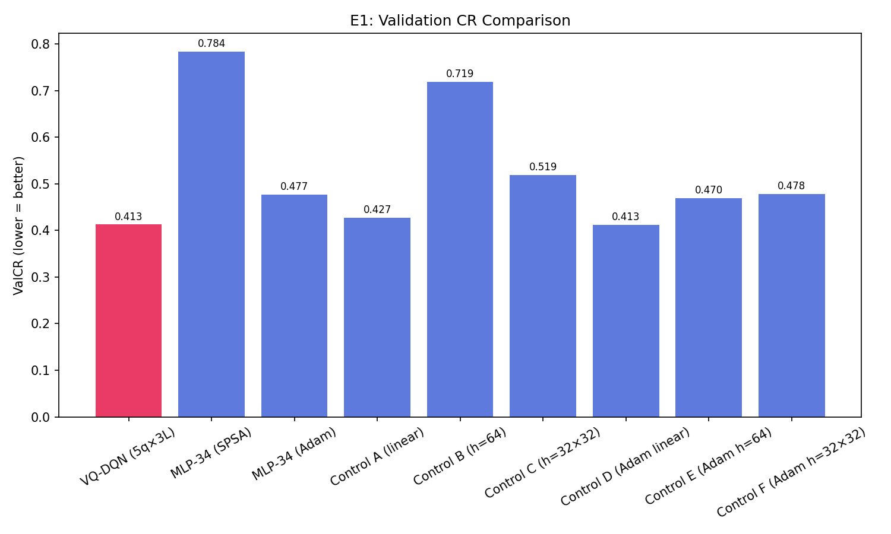
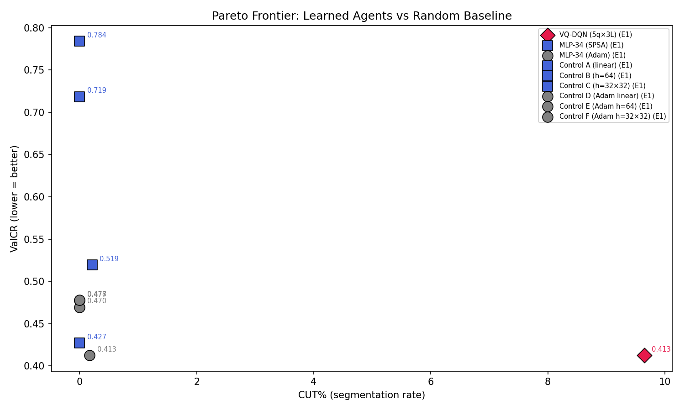

# Q-RLSTC Thesis Experiment Report

Generated: 2026-02-25T01:54:46.377005

## Protocol Constants

```json
{
  "batch_size": 32,
  "memory_size": 5000,
  "gamma": 0.9,
  "huber_delta": 1.0,
  "epsilon_start": 1.0,
  "epsilon_min": 0.1,
  "epsilon_decay": 0.99,
  "target_update_freq": 10,
  "L_MIN": 3,
  "CUT_PENALTY": 0.12,
  "EXTEND_COST": 0.01,
  "COMPLEXITY_LAMBDA": 0.03
}
```

## Full Terminal Output

```

══════════════════════════════════════════════════════════════════════
  Q-RLSTC THESIS EXPERIMENT RUNNER
  2026-02-25T01:40:38.445545
  Git: 09ae58181378
  Python: 3.12.12  |  NumPy: 2.4.1
  Experiments: E1
  Data: 20 trajectories, 1 epochs
  Seed: 42
  Multi-seed: [42, 123]
  Output: results/thesis
══════════════════════════════════════════════════════════════════════

══════════════════════════════════════════════════════════════════════
  E1: CORE QUANTUM UTILITY
══════════════════════════════════════════════════════════════════════
  [seed 1/2: 42] VQ-DQN (5q×3L)

───────────────────────────────────────────────────────
  VQ-DQN (5q×3L)  (34 params)
  Noise: ideal | Shots: 0
  Mode: standard | Data: 100%
  Epochs: 1 × 18 trajectories
───────────────────────────────────────────────────────
    ⏱ 37s total | epoch 1/1 | episode 3/18 | 37s this epoch
    ⏱ 72s total | epoch 1/1 | episode 5/18 | 72s this epoch
    ⏱ 106s total | epoch 1/1 | episode 7/18 | 106s this epoch
    ⏱ 140s total | epoch 1/1 | episode 9/18 | 140s this epoch
    ⏱ 175s total | epoch 1/1 | episode 11/18 | 175s this epoch
    ⏱ 211s total | epoch 1/1 | episode 13/18 | 211s this epoch
    ⏱ 247s total | epoch 1/1 | episode 15/18 | 247s this epoch
    ⏱ 283s total | epoch 1/1 | episode 17/18 | 283s this epoch
  Epoch  1/1: ValCR=0.6897 (OD=0.3146/bs=0.4562) medCR=0.4212 | R̄=-21.663 | CUT=0% | #segs=3 | ε=0.835 | Qmargin=+1.7878 | ReplayCUT=35% | BufCUT=35% ★ | Q̄ext=+2.995 Q̄cut=+1.208
  [seed 2/2: 123] VQ-DQN (5q×3L)

───────────────────────────────────────────────────────
  VQ-DQN (5q×3L)  (34 params)
  Noise: ideal | Shots: 0
  Mode: standard | Data: 100%
  Epochs: 1 × 18 trajectories
───────────────────────────────────────────────────────
    ⏱ 32s total | epoch 1/1 | episode 3/18 | 32s this epoch
    ⏱ 68s total | epoch 1/1 | episode 5/18 | 68s this epoch
    ⏱ 101s total | epoch 1/1 | episode 7/18 | 101s this epoch
    ⏱ 138s total | epoch 1/1 | episode 9/18 | 138s this epoch
    ⏱ 173s total | epoch 1/1 | episode 11/18 | 173s this epoch
    ⏱ 209s total | epoch 1/1 | episode 13/18 | 209s this epoch
    ⏱ 243s total | epoch 1/1 | episode 15/18 | 243s this epoch
    ⏱ 279s total | epoch 1/1 | episode 17/18 | 279s this epoch
  Epoch  1/1: ValCR=0.5634 (OD=0.2570/bs=0.4562) medCR=0.4643 | R̄=-20.388 | CUT=0% | #segs=4 | ε=0.835 | Qmargin=+0.9585 | ReplayCUT=32% | BufCUT=32% ★ | Q̄ext=+1.632 Q̄cut=+0.674
  [seed 1/2: 42] MLP-34 (SPSA)

───────────────────────────────────────────────────────
  MLP-34 (SPSA)  (34 params)
  Noise: ideal | Shots: 0
  Mode: standard | Data: 100%
  Epochs: 1 × 18 trajectories
───────────────────────────────────────────────────────
  Epoch  1/1: ValCR=0.7393 (OD=0.3373/bs=0.4562) medCR=0.5073 | R̄=-20.307 | CUT=0% | #segs=3 | ε=0.835 | Qmargin=+0.0853 | ReplayCUT=32% | BufCUT=31% ★ | Q̄ext=-0.663 Q̄cut=-0.749
  [seed 2/2: 123] MLP-34 (SPSA)

───────────────────────────────────────────────────────
  MLP-34 (SPSA)  (34 params)
  Noise: ideal | Shots: 0
  Mode: standard | Data: 100%
  Epochs: 1 × 18 trajectories
───────────────────────────────────────────────────────
  Epoch  1/1: ValCR=1.0000 (OD=0.4562/bs=0.4562) medCR=1.0000 | R̄=-19.999 | CUT=0% | #segs=2 | ε=0.835 | Qmargin=+1.7652 | ReplayCUT=31% | BufCUT=31% ★ | Q̄ext=+1.917 Q̄cut=+0.152
  [seed 1/2: 42] MLP-34 (Adam)

───────────────────────────────────────────────────────
  MLP-34 (Adam)  (34 params)
  Noise: ideal | Shots: 0
  Mode: standard | Data: 100%
  Epochs: 1 × 18 trajectories
───────────────────────────────────────────────────────
  Epoch  1/1: ValCR=0.9995 (OD=0.4560/bs=0.4562) medCR=0.9995 | R̄=-20.295 | CUT=0% | #segs=3 | ε=0.835 | Qmargin=+10.4778 | ReplayCUT=32% | BufCUT=31% ★ | Q̄ext=+5.134 Q̄cut=-5.343
  [seed 2/2: 123] MLP-34 (Adam)

───────────────────────────────────────────────────────
  MLP-34 (Adam)  (34 params)
  Noise: ideal | Shots: 0
  Mode: standard | Data: 100%
  Epochs: 1 × 18 trajectories
───────────────────────────────────────────────────────
  Epoch  1/1: ValCR=1.0000 (OD=0.4562/bs=0.4562) medCR=1.0000 | R̄=-19.968 | CUT=0% | #segs=2 | ε=0.835 | Qmargin=+1.6400 | ReplayCUT=31% | BufCUT=31% ★ | Q̄ext=+2.240 Q̄cut=+0.600
  [seed 1/2: 42] Control A (linear)

───────────────────────────────────────────────────────
  Control A (linear)  (12 params)
  Noise: ideal | Shots: 0
  Mode: standard | Data: 100%
  Epochs: 1 × 18 trajectories
───────────────────────────────────────────────────────
  Epoch  1/1: ValCR=1.0000 (OD=0.4562/bs=0.4562) medCR=1.0000 | R̄=-20.359 | CUT=0% | #segs=2 | ε=0.835 | Qmargin=+0.4188 | ReplayCUT=32% | BufCUT=31% ★ | Q̄ext=-6.840 Q̄cut=-7.259
  [seed 2/2: 123] Control A (linear)

───────────────────────────────────────────────────────
  Control A (linear)  (12 params)
  Noise: ideal | Shots: 0
  Mode: standard | Data: 100%
  Epochs: 1 × 18 trajectories
───────────────────────────────────────────────────────
  Epoch  1/1: ValCR=0.1366 (OD=0.0623/bs=0.4562) medCR=0.0884 | R̄=-20.500 | CUT=25% | #segs=233 | ε=0.835 | Qmargin=+0.0104 | ReplayCUT=32% | BufCUT=32% ★ | Q̄ext=+0.272 Q̄cut=+0.262
  [seed 1/2: 42] Control B (h=64)

───────────────────────────────────────────────────────
  Control B (h=64)  (514 params)
  Noise: ideal | Shots: 0
  Mode: standard | Data: 100%
  Epochs: 1 × 18 trajectories
───────────────────────────────────────────────────────
  Epoch  1/1: ValCR=0.5697 (OD=0.2599/bs=0.4562) medCR=0.4191 | R̄=-20.294 | CUT=0% | #segs=4 | ε=0.835 | Qmargin=+0.1927 | ReplayCUT=32% | BufCUT=31% ★ | Q̄ext=+0.046 Q̄cut=-0.147
  [seed 2/2: 123] Control B (h=64)

───────────────────────────────────────────────────────
  Control B (h=64)  (514 params)
  Noise: ideal | Shots: 0
  Mode: standard | Data: 100%
  Epochs: 1 × 18 trajectories
───────────────────────────────────────────────────────
  Epoch  1/1: ValCR=1.0000 (OD=0.4562/bs=0.4562) medCR=1.0000 | R̄=-20.060 | CUT=0% | #segs=2 | ε=0.835 | Qmargin=+0.7032 | ReplayCUT=32% | BufCUT=31% ★ | Q̄ext=+1.890 Q̄cut=+1.187
  [seed 1/2: 42] Control C (h=32×32)

───────────────────────────────────────────────────────
  Control C (h=32×32)  (1314 params)
  Noise: ideal | Shots: 0
  Mode: standard | Data: 100%
  Epochs: 1 × 18 trajectories
───────────────────────────────────────────────────────
  Epoch  1/1: ValCR=0.4677 (OD=0.2134/bs=0.4562) medCR=0.4191 | R̄=-20.147 | CUT=0% | #segs=5 | ε=0.835 | Qmargin=+0.0745 | ReplayCUT=32% | BufCUT=31% ★ | Q̄ext=-0.170 Q̄cut=-0.245
  [seed 2/2: 123] Control C (h=32×32)

───────────────────────────────────────────────────────
  Control C (h=32×32)  (1314 params)
  Noise: ideal | Shots: 0
  Mode: standard | Data: 100%
  Epochs: 1 × 18 trajectories
───────────────────────────────────────────────────────
  Epoch  1/1: ValCR=0.5697 (OD=0.2599/bs=0.4562) medCR=0.4191 | R̄=-20.153 | CUT=0% | #segs=4 | ε=0.835 | Qmargin=+0.1981 | ReplayCUT=31% | BufCUT=31% ★ | Q̄ext=-0.231 Q̄cut=-0.429
  [seed 1/2: 42] Control D (Adam linear)

───────────────────────────────────────────────────────
  Control D (Adam linear)  (12 params)
  Noise: ideal | Shots: 0
  Mode: standard | Data: 100%
  Epochs: 1 × 18 trajectories
───────────────────────────────────────────────────────
  Epoch  1/1: ValCR=0.4685 (OD=0.2137/bs=0.4562) medCR=0.4191 | R̄=-20.352 | CUT=0% | #segs=5 | ε=0.835 | Qmargin=+0.6105 | ReplayCUT=32% | BufCUT=31% ★ | Q̄ext=-0.100 Q̄cut=-0.711
  [seed 2/2: 123] Control D (Adam linear)

───────────────────────────────────────────────────────
  Control D (Adam linear)  (12 params)
  Noise: ideal | Shots: 0
  Mode: standard | Data: 100%
  Epochs: 1 × 18 trajectories
───────────────────────────────────────────────────────
  Epoch  1/1: ValCR=0.2724 (OD=0.1243/bs=0.4562) medCR=0.2351 | R̄=-19.946 | CUT=1% | #segs=10 | ε=0.835 | Qmargin=+0.0550 | ReplayCUT=31% | BufCUT=31% ★ | Q̄ext=+0.467 Q̄cut=+0.412
  [seed 1/2: 42] Control E (Adam h=64)

───────────────────────────────────────────────────────
  Control E (Adam h=64)  (514 params)
  Noise: ideal | Shots: 0
  Mode: standard | Data: 100%
  Epochs: 1 × 18 trajectories
───────────────────────────────────────────────────────
  Epoch  1/1: ValCR=0.9995 (OD=0.4560/bs=0.4562) medCR=0.9995 | R̄=-20.326 | CUT=0% | #segs=3 | ε=0.835 | Qmargin=+0.1546 | ReplayCUT=32% | BufCUT=31% ★ | Q̄ext=+5.272 Q̄cut=+5.117
  [seed 2/2: 123] Control E (Adam h=64)

───────────────────────────────────────────────────────
  Control E (Adam h=64)  (514 params)
  Noise: ideal | Shots: 0
  Mode: standard | Data: 100%
  Epochs: 1 × 18 trajectories
───────────────────────────────────────────────────────
  Epoch  1/1: ValCR=0.4381 (OD=0.1998/bs=0.4562) medCR=0.4075 | R̄=-20.077 | CUT=2% | #segs=22 | ε=0.835 | Qmargin=+0.3430 | ReplayCUT=32% | BufCUT=31% ★ | Q̄ext=+0.953 Q̄cut=+0.610
  [seed 1/2: 42] Control F (Adam h=32×32)

───────────────────────────────────────────────────────
  Control F (Adam h=32×32)  (1314 params)
  Noise: ideal | Shots: 0
  Mode: standard | Data: 100%
  Epochs: 1 × 18 trajectories
───────────────────────────────────────────────────────
  Epoch  1/1: ValCR=0.5697 (OD=0.2599/bs=0.4562) medCR=0.4191 | R̄=-20.140 | CUT=0% | #segs=4 | ε=0.835 | Qmargin=+0.1708 | ReplayCUT=32% | BufCUT=31% ★ | Q̄ext=-0.144 Q̄cut=-0.314
  [seed 2/2: 123] Control F (Adam h=32×32)

───────────────────────────────────────────────────────
  Control F (Adam h=32×32)  (1314 params)
  Noise: ideal | Shots: 0
  Mode: standard | Data: 100%
  Epochs: 1 × 18 trajectories
───────────────────────────────────────────────────────
  Epoch  1/1: ValCR=0.7299 (OD=0.3330/bs=0.4562) medCR=0.4212 | R̄=-20.123 | CUT=0% | #segs=3 | ε=0.835 | Qmargin=+0.1989 | ReplayCUT=31% | BufCUT=31% ★ | Q̄ext=-0.391 Q̄cut=-0.590

════════════════════════════════════════════════════════════════════════════════════════════════════
  E1: Core Quantum Utility — Multi-Seed Summary (2 seeds)
════════════════════════════════════════════════════════════════════════════════════════════════════

Model                          Params          ValCR         CUT%  #Segs     Time        Qmargin
────────────────────────────────────────────────────────────────────────────────────────────────────
VQ-DQN (5q×3L)                     34  0.6265±0.0631        0%±0%      3     635s   +1.373±0.415
MLP-34 (SPSA)                      34  0.8696±0.1304        0%±0%      2      10s   +0.925±0.840
MLP-34 (Adam)                      34  0.9997±0.0003        0%±0%      2      10s   +6.059±4.419
Control A (linear)                 12  0.5683±0.4317      12%±12%    117       5s   +0.215±0.204
Control B (h=64)                  514  0.7848±0.2152        0%±0%      3       6s   +0.448±0.255
Control C (h=32×32)              1314  0.5187±0.0510        0%±0%      4       6s   +0.136±0.062
Control D (Adam linear)            12  0.3704±0.0980        1%±0%      7      10s   +0.333±0.278
Control E (Adam h=64)             514  0.7188±0.2807        1%±1%     12       8s   +0.249±0.094
Control F (Adam h=32×32)         1314  0.6498±0.0801        0%±0%      3       9s   +0.185±0.014
────────────────────────────────────────────────────────────────────────────────────────────────────

══════════════════════════════════════════════════════════════════════
  GRAND SUMMARY
══════════════════════════════════════════════════════════════════════


══════════════════════════════════════════════════════════════════════════════════════════
  All Models — Summary
══════════════════════════════════════════════════════════════════════════════════════════

Model                          Params    ValCR   CUT%  #Segs BestEp    Time  Qmargin
──────────────────────────────────────────────────────────────────────────────────────────
VQ-DQN (5q×3L)                     34   0.6265     0%      3      1  635.4s  +1.3732
MLP-34 (SPSA)                      34   0.8696     0%      2      1    9.8s  +0.9253
MLP-34 (Adam)                      34   0.9997     0%      2      1    9.8s  +6.0589
Control A (linear)                 12   0.5683    12%    117      1    4.9s  +0.2146
Control B (h=64)                  514   0.7848     0%      3      1    6.0s  +0.4480
Control C (h=32×32)              1314   0.5187     0%      4      1    6.4s  +0.1363
Control D (Adam linear)            12   0.3704     1%      7      1    9.7s  +0.3327
Control E (Adam h=64)             514   0.7188     1%     12      1    7.8s  +0.2488
Control F (Adam h=32×32)         1314   0.6498     0%      3      1    8.8s  +0.1848
──────────────────────────────────────────────────────────────────────────────────────────

════════════════════════════════════════════════════════════════════════════════
  Pareto: Best ValCR at CUT ≤ threshold
════════════════════════════════════════════════════════════════════════════════

CUT ≤          Random (D1)    VQ-DQN (5q×3L)     MLP-34 (SPSA)     MLP-34 (Adam)  Control A (linear)  Control B (h=64)  Control C (h=32×32)  Control D (Adam linear)  Control E (Adam h=64)  Control F (Adam h=32×32)
────────────────────────────────────────────────────────────────────────────────
≤5%                      —            0.6265            0.8696            0.9997             (12%)            0.7848            0.5187            0.3704            0.7188            0.6498
≤10%                     —            0.6265            0.8696            0.9997             (12%)            0.7848            0.5187            0.3704            0.7188            0.6498
≤20%                     —            0.6265            0.8696            0.9997            0.5683            0.7848            0.5187            0.3704            0.7188            0.6498
≤30%                     —            0.6265            0.8696            0.9997            0.5683            0.7848            0.5187            0.3704            0.7188            0.6498
≤40%                     —            0.6265            0.8696            0.9997            0.5683            0.7848            0.5187            0.3704            0.7188            0.6498
≤50%                     —            0.6265            0.8696            0.9997            0.5683            0.7848            0.5187            0.3704            0.7188            0.6498
≤80%                     —            0.6265            0.8696            0.9997            0.5683            0.7848            0.5187            0.3704            0.7188            0.6498
────────────────────────────────────────────────────────────────────────────────

──────────────────────────────────────────────────────────────────────
  D2/D3/D5: Diagnostic Summary
  (Q-margins, Training Action Dist, Replay Buffer Dist)
──────────────────────────────────────────────────────────────────────

  VQ-DQN (5q×3L)                
    D2 Q-margin:    +1.373
    D3 TrainCUT%:   35%
    D5 BufferCUT%:  35%

  MLP-34 (SPSA)                 
    D2 Q-margin:    +0.925
    D3 TrainCUT%:   32%
    D5 BufferCUT%:  31%

  MLP-34 (Adam)                 
    D2 Q-margin:    +6.059
    D3 TrainCUT%:   32%
    D5 BufferCUT%:  31%

  Control A (linear)            
    D2 Q-margin:    +0.215
    D3 TrainCUT%:   32%
    D5 BufferCUT%:  31%

  Control B (h=64)              
    D2 Q-margin:    +0.448
    D3 TrainCUT%:   32%
    D5 BufferCUT%:  31%

  Control C (h=32×32)           
    D2 Q-margin:    +0.136
    D3 TrainCUT%:   32%
    D5 BufferCUT%:  31%

  Control D (Adam linear)       
    D2 Q-margin:    +0.333
    D3 TrainCUT%:   32%
    D5 BufferCUT%:  31%

  Control E (Adam h=64)         
    D2 Q-margin:    +0.249
    D3 TrainCUT%:   32%
    D5 BufferCUT%:  31%

  Control F (Adam h=32×32)      
    D2 Q-margin:    +0.185
    D3 TrainCUT%:   32%
    D5 BufferCUT%:  31%


════════════════════════════════════════════════════════════
  Generating Plots
════════════════════════════════════════════════════════════

  ✓ pareto_valcr_vs_cut.png
  ✓ e1_valcr_comparison.png

  Generated 2 plots → results/thesis/plots

```

## Plots








## Raw Results (JSON)

See `thesis_results_20260225_015446.json` for machine-readable data.
