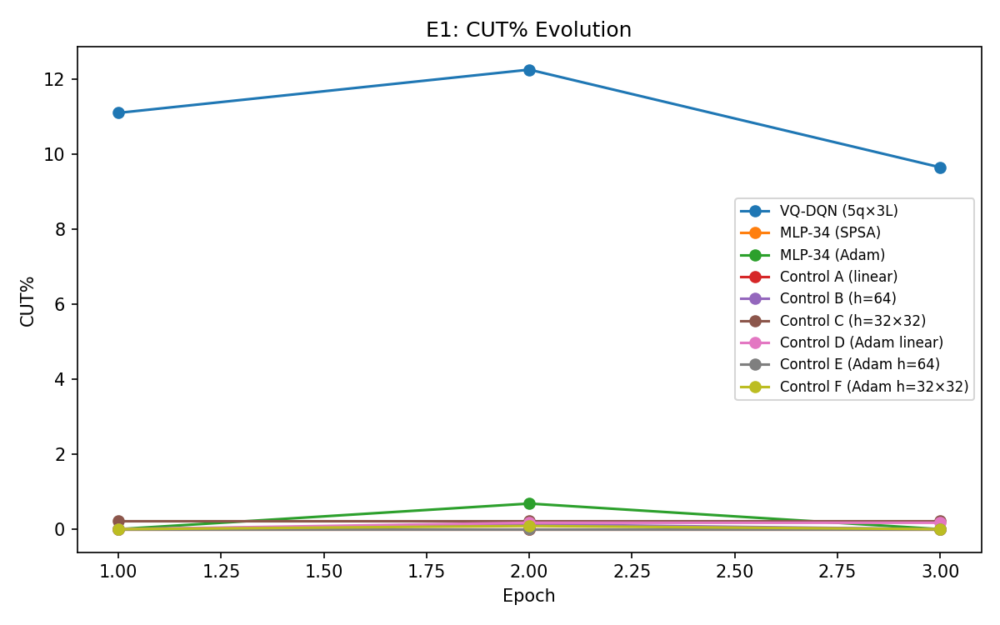

# Q-RLSTC Thesis Experiment Report

Generated: 2026-02-25T06:57:47.178524

## Protocol Constants

```json
{
  "batch_size": 32,
  "memory_size": 5000,
  "gamma": 0.9,
  "huber_delta": 1.0,
  "epsilon_start": 1.0,
  "epsilon_min": 0.1,
  "epsilon_decay": 0.99,
  "target_update_freq": 10,
  "L_MIN": 3,
  "CUT_PENALTY": 0.12,
  "EXTEND_COST": 0.01,
  "COMPLEXITY_LAMBDA": 0.03
}
```

## Full Terminal Output

```

══════════════════════════════════════════════════════════════════════
  Q-RLSTC THESIS EXPERIMENT RUNNER
  2026-02-25T03:26:36.023305
  Git: b451462680cb
  Python: 3.12.12  |  NumPy: 2.4.1
  Experiments: E1
  Data: 50 trajectories, 3 epochs
  Seed: 42
  Multi-seed: [42, 123, 7, 99, 2025]
  Output: results/thesis
══════════════════════════════════════════════════════════════════════

══════════════════════════════════════════════════════════════════════
  E1: CORE QUANTUM UTILITY
══════════════════════════════════════════════════════════════════════
  [seed 1/5: 42] VQ-DQN (5q×3L)

───────────────────────────────────────────────────────
  VQ-DQN (5q×3L)  (34 params)
  Noise: ideal | Shots: 0
  Mode: standard | Data: 100%
  Epochs: 3 × 45 trajectories
───────────────────────────────────────────────────────
    ⏱ 34s total | epoch 1/3 | episode 3/45 | 34s this epoch
    ⏱ 71s total | epoch 1/3 | episode 5/45 | 71s this epoch
    ⏱ 106s total | epoch 1/3 | episode 7/45 | 106s this epoch
    ⏱ 142s total | epoch 1/3 | episode 9/45 | 142s this epoch
    ⏱ 179s total | epoch 1/3 | episode 11/45 | 179s this epoch
    ⏱ 214s total | epoch 1/3 | episode 13/45 | 214s this epoch
    ⏱ 251s total | epoch 1/3 | episode 15/45 | 251s this epoch
    ⏱ 286s total | epoch 1/3 | episode 17/45 | 286s this epoch
    ⏱ 319s total | epoch 1/3 | episode 19/45 | 319s this epoch
    ⏱ 352s total | epoch 1/3 | episode 21/45 | 352s this epoch
    ⏱ 386s total | epoch 1/3 | episode 23/45 | 386s this epoch
    ⏱ 421s total | epoch 1/3 | episode 25/45 | 421s this epoch
    ⏱ 455s total | epoch 1/3 | episode 27/45 | 455s this epoch
    ⏱ 491s total | epoch 1/3 | episode 29/45 | 491s this epoch
    ⏱ 526s total | epoch 1/3 | episode 31/45 | 526s this epoch
    ⏱ 562s total | epoch 1/3 | episode 33/45 | 562s this epoch
    ⏱ 597s total | epoch 1/3 | episode 35/45 | 597s this epoch
    ⏱ 634s total | epoch 1/3 | episode 37/45 | 634s this epoch
    ⏱ 669s total | epoch 1/3 | episode 39/45 | 669s this epoch
    ⏱ 705s total | epoch 1/3 | episode 41/45 | 705s this epoch
    ⏱ 742s total | epoch 1/3 | episode 43/45 | 742s this epoch
    ⏱ 776s total | epoch 1/3 | episode 45/45 | 776s this epoch
  Epoch  1/3: ValCR=0.2631 (OD=0.1327/bs=0.5044) medCR=0.1384 | R̄=-19.902 | CUT=11% | #segs=265 | ε=0.636 | Qmargin=+0.4828 | ReplayCUT=31% | BufCUT=29% ★ | Q̄ext=+0.768 Q̄cut=+0.285
    ⏱ 829s total | epoch 2/3 | episode 3/45 | 36s this epoch
    ⏱ 866s total | epoch 2/3 | episode 5/45 | 73s this epoch
    ⏱ 901s total | epoch 2/3 | episode 7/45 | 108s this epoch
    ⏱ 938s total | epoch 2/3 | episode 9/45 | 145s this epoch
    ⏱ 973s total | epoch 2/3 | episode 11/45 | 180s this epoch
    ⏱ 1008s total | epoch 2/3 | episode 13/45 | 215s this epoch
    ⏱ 1043s total | epoch 2/3 | episode 15/45 | 250s this epoch
    ⏱ 1080s total | epoch 2/3 | episode 17/45 | 287s this epoch
    ⏱ 1113s total | epoch 2/3 | episode 19/45 | 320s this epoch
    ⏱ 1149s total | epoch 2/3 | episode 21/45 | 356s this epoch
    ⏱ 1182s total | epoch 2/3 | episode 23/45 | 389s this epoch
    ⏱ 1217s total | epoch 2/3 | episode 25/45 | 424s this epoch
    ⏱ 1250s total | epoch 2/3 | episode 27/45 | 457s this epoch
    ⏱ 1285s total | epoch 2/3 | episode 29/45 | 492s this epoch
    ⏱ 1320s total | epoch 2/3 | episode 31/45 | 528s this epoch
    ⏱ 1355s total | epoch 2/3 | episode 33/45 | 562s this epoch
    ⏱ 1391s total | epoch 2/3 | episode 35/45 | 598s this epoch
    ⏱ 1426s total | epoch 2/3 | episode 37/45 | 633s this epoch
    ⏱ 1460s total | epoch 2/3 | episode 39/45 | 667s this epoch
    ⏱ 1497s total | epoch 2/3 | episode 41/45 | 704s this epoch
    ⏱ 1532s total | epoch 2/3 | episode 43/45 | 739s this epoch
    ⏱ 1566s total | epoch 2/3 | episode 45/45 | 773s this epoch
  Epoch  2/3: ValCR=0.2504 (OD=0.1263/bs=0.5044) medCR=0.1347 | R̄=-12.595 | CUT=12% | #segs=292 | ε=0.405 | Qmargin=+0.3702 | ReplayCUT=22% | BufCUT=20% ★ | Q̄ext=+0.914 Q̄cut=+0.543
    ⏱ 1623s total | epoch 3/3 | episode 3/45 | 37s this epoch
    ⏱ 1659s total | epoch 3/3 | episode 5/45 | 73s this epoch
    ⏱ 1694s total | epoch 3/3 | episode 7/45 | 107s this epoch
    ⏱ 1729s total | epoch 3/3 | episode 9/45 | 143s this epoch
    ⏱ 1763s total | epoch 3/3 | episode 11/45 | 177s this epoch
    ⏱ 1797s total | epoch 3/3 | episode 13/45 | 211s this epoch
    ⏱ 1833s total | epoch 3/3 | episode 15/45 | 247s this epoch
    ⏱ 1869s total | epoch 3/3 | episode 17/45 | 283s this epoch
    ⏱ 1906s total | epoch 3/3 | episode 19/45 | 320s this epoch
    ⏱ 1941s total | epoch 3/3 | episode 21/45 | 355s this epoch
    ⏱ 1976s total | epoch 3/3 | episode 23/45 | 390s this epoch
    ⏱ 2009s total | epoch 3/3 | episode 25/45 | 423s this epoch
    ⏱ 2043s total | epoch 3/3 | episode 27/45 | 457s this epoch
    ⏱ 2075s total | epoch 3/3 | episode 29/45 | 489s this epoch
    ⏱ 2110s total | epoch 3/3 | episode 31/45 | 524s this epoch
    ⏱ 2141s total | epoch 3/3 | episode 33/45 | 555s this epoch
    ⏱ 2174s total | epoch 3/3 | episode 35/45 | 588s this epoch
    ⏱ 2208s total | epoch 3/3 | episode 37/45 | 622s this epoch
    ⏱ 2245s total | epoch 3/3 | episode 39/45 | 659s this epoch
    ⏱ 2280s total | epoch 3/3 | episode 41/45 | 694s this epoch
    ⏱ 2314s total | epoch 3/3 | episode 43/45 | 728s this epoch
    ⏱ 2350s total | epoch 3/3 | episode 45/45 | 764s this epoch
  Epoch  3/3: ValCR=0.3114 (OD=0.1570/bs=0.5044) medCR=0.1737 | R̄=-13.263 | CUT=10% | #segs=231 | ε=0.257 | Qmargin=+0.3825 | ReplayCUT=21% | BufCUT=25% | Q̄ext=+0.954 Q̄cut=+0.572
  [seed 2/5: 123] VQ-DQN (5q×3L)

───────────────────────────────────────────────────────
  VQ-DQN (5q×3L)  (34 params)
  Noise: ideal | Shots: 0
  Mode: standard | Data: 100%
  Epochs: 3 × 45 trajectories
───────────────────────────────────────────────────────
    ⏱ 34s total | epoch 1/3 | episode 3/45 | 34s this epoch
    ⏱ 69s total | epoch 1/3 | episode 5/45 | 69s this epoch
    ⏱ 101s total | epoch 1/3 | episode 7/45 | 101s this epoch
    ⏱ 135s total | epoch 1/3 | episode 9/45 | 135s this epoch
    ⏱ 169s total | epoch 1/3 | episode 11/45 | 169s this epoch
    ⏱ 203s total | epoch 1/3 | episode 13/45 | 203s this epoch
    ⏱ 239s total | epoch 1/3 | episode 15/45 | 239s this epoch
    ⏱ 275s total | epoch 1/3 | episode 17/45 | 275s this epoch
    ⏱ 310s total | epoch 1/3 | episode 19/45 | 310s this epoch
    ⏱ 345s total | epoch 1/3 | episode 21/45 | 345s this epoch
    ⏱ 378s total | epoch 1/3 | episode 23/45 | 378s this epoch
    ⏱ 414s total | epoch 1/3 | episode 25/45 | 414s this epoch
    ⏱ 446s total | epoch 1/3 | episode 27/45 | 446s this epoch
    ⏱ 480s total | epoch 1/3 | episode 29/45 | 480s this epoch
    ⏱ 513s total | epoch 1/3 | episode 31/45 | 513s this epoch
    ⏱ 547s total | epoch 1/3 | episode 33/45 | 547s this epoch
    ⏱ 583s total | epoch 1/3 | episode 35/45 | 583s this epoch
    ⏱ 619s total | epoch 1/3 | episode 37/45 | 619s this epoch
    ⏱ 655s total | epoch 1/3 | episode 39/45 | 655s this epoch
    ⏱ 690s total | epoch 1/3 | episode 41/45 | 690s this epoch
    ⏱ 724s total | epoch 1/3 | episode 43/45 | 724s this epoch
    ⏱ 760s total | epoch 1/3 | episode 45/45 | 760s this epoch
  Epoch  1/3: ValCR=0.4729 (OD=0.2385/bs=0.5044) medCR=0.4257 | R̄=-19.511 | CUT=4% | #segs=107 | ε=0.636 | Qmargin=+0.4490 | ReplayCUT=31% | BufCUT=30% ★ | Q̄ext=+1.039 Q̄cut=+0.590
    ⏱ 816s total | epoch 2/3 | episode 3/45 | 36s this epoch
    ⏱ 849s total | epoch 2/3 | episode 5/45 | 69s this epoch
    ⏱ 884s total | epoch 2/3 | episode 7/45 | 103s this epoch
    ⏱ 920s total | epoch 2/3 | episode 9/45 | 140s this epoch
    ⏱ 954s total | epoch 2/3 | episode 11/45 | 174s this epoch
    ⏱ 986s total | epoch 2/3 | episode 13/45 | 206s this epoch
    ⏱ 1020s total | epoch 2/3 | episode 15/45 | 240s this epoch
    ⏱ 1055s total | epoch 2/3 | episode 17/45 | 275s this epoch
    ⏱ 1090s total | epoch 2/3 | episode 19/45 | 310s this epoch
    ⏱ 1125s total | epoch 2/3 | episode 21/45 | 345s this epoch
    ⏱ 1161s total | epoch 2/3 | episode 23/45 | 381s this epoch
    ⏱ 1196s total | epoch 2/3 | episode 25/45 | 416s this epoch
    ⏱ 1234s total | epoch 2/3 | episode 27/45 | 453s this epoch
    ⏱ 1267s total | epoch 2/3 | episode 29/45 | 487s this epoch
    ⏱ 1299s total | epoch 2/3 | episode 31/45 | 518s this epoch
    ⏱ 1334s total | epoch 2/3 | episode 33/45 | 553s this epoch
    ⏱ 1369s total | epoch 2/3 | episode 35/45 | 589s this epoch
    ⏱ 1403s total | epoch 2/3 | episode 37/45 | 623s this epoch
    ⏱ 1439s total | epoch 2/3 | episode 39/45 | 658s this epoch
    ⏱ 1470s total | epoch 2/3 | episode 41/45 | 690s this epoch
    ⏱ 1505s total | epoch 2/3 | episode 43/45 | 725s this epoch
    ⏱ 1539s total | epoch 2/3 | episode 45/45 | 759s this epoch
  Epoch  2/3: ValCR=0.4051 (OD=0.2043/bs=0.5044) medCR=0.3221 | R̄=-13.767 | CUT=6% | #segs=144 | ε=0.405 | Qmargin=+0.2139 | ReplayCUT=22% | BufCUT=19% ★ | Q̄ext=+0.854 Q̄cut=+0.640
    ⏱ 1594s total | epoch 3/3 | episode 3/45 | 34s this epoch
    ⏱ 1626s total | epoch 3/3 | episode 5/45 | 66s this epoch
    ⏱ 1660s total | epoch 3/3 | episode 7/45 | 101s this epoch
    ⏱ 1693s total | epoch 3/3 | episode 9/45 | 134s this epoch
    ⏱ 1730s total | epoch 3/3 | episode 11/45 | 170s this epoch
    ⏱ 1764s total | epoch 3/3 | episode 13/45 | 205s this epoch
    ⏱ 1800s total | epoch 3/3 | episode 15/45 | 240s this epoch
    ⏱ 1835s total | epoch 3/3 | episode 17/45 | 276s this epoch
    ⏱ 1867s total | epoch 3/3 | episode 19/45 | 308s this epoch
    ⏱ 1903s total | epoch 3/3 | episode 21/45 | 344s this epoch
    ⏱ 1939s total | epoch 3/3 | episode 23/45 | 380s this epoch
    ⏱ 1975s total | epoch 3/3 | episode 25/45 | 416s this epoch
    ⏱ 2009s total | epoch 3/3 | episode 27/45 | 449s this epoch
    ⏱ 2044s total | epoch 3/3 | episode 29/45 | 485s this epoch
    ⏱ 2080s total | epoch 3/3 | episode 31/45 | 521s this epoch
    ⏱ 2113s total | epoch 3/3 | episode 33/45 | 554s this epoch
    ⏱ 2149s total | epoch 3/3 | episode 35/45 | 589s this epoch
    ⏱ 2183s total | epoch 3/3 | episode 37/45 | 623s this epoch
    ⏱ 2217s total | epoch 3/3 | episode 39/45 | 658s this epoch
    ⏱ 2252s total | epoch 3/3 | episode 41/45 | 692s this epoch
    ⏱ 2288s total | epoch 3/3 | episode 43/45 | 728s this epoch
    ⏱ 2321s total | epoch 3/3 | episode 45/45 | 762s this epoch
  Epoch  3/3: ValCR=0.3395 (OD=0.1712/bs=0.5044) medCR=0.3028 | R̄=-11.529 | CUT=10% | #segs=251 | ε=0.257 | Qmargin=+0.2195 | ReplayCUT=17% | BufCUT=17% ★ | Q̄ext=+0.894 Q̄cut=+0.675
  [seed 3/5: 7] VQ-DQN (5q×3L)

───────────────────────────────────────────────────────
  VQ-DQN (5q×3L)  (34 params)
  Noise: ideal | Shots: 0
  Mode: standard | Data: 100%
  Epochs: 3 × 45 trajectories
───────────────────────────────────────────────────────
    ⏱ 34s total | epoch 1/3 | episode 3/45 | 34s this epoch
    ⏱ 70s total | epoch 1/3 | episode 5/45 | 70s this epoch
    ⏱ 103s total | epoch 1/3 | episode 7/45 | 103s this epoch
    ⏱ 137s total | epoch 1/3 | episode 9/45 | 137s this epoch
    ⏱ 173s total | epoch 1/3 | episode 11/45 | 173s this epoch
    ⏱ 206s total | epoch 1/3 | episode 13/45 | 206s this epoch
    ⏱ 241s total | epoch 1/3 | episode 15/45 | 241s this epoch
    ⏱ 276s total | epoch 1/3 | episode 17/45 | 276s this epoch
    ⏱ 312s total | epoch 1/3 | episode 19/45 | 312s this epoch
    ⏱ 348s total | epoch 1/3 | episode 21/45 | 348s this epoch
    ⏱ 384s total | epoch 1/3 | episode 23/45 | 384s this epoch
    ⏱ 420s total | epoch 1/3 | episode 25/45 | 420s this epoch
    ⏱ 454s total | epoch 1/3 | episode 27/45 | 454s this epoch
    ⏱ 488s total | epoch 1/3 | episode 29/45 | 488s this epoch
    ⏱ 520s total | epoch 1/3 | episode 31/45 | 520s this epoch
    ⏱ 555s total | epoch 1/3 | episode 33/45 | 555s this epoch
    ⏱ 591s total | epoch 1/3 | episode 35/45 | 591s this epoch
    ⏱ 623s total | epoch 1/3 | episode 37/45 | 623s this epoch
    ⏱ 657s total | epoch 1/3 | episode 39/45 | 657s this epoch
    ⏱ 692s total | epoch 1/3 | episode 41/45 | 692s this epoch
    ⏱ 727s total | epoch 1/3 | episode 43/45 | 727s this epoch
    ⏱ 760s total | epoch 1/3 | episode 45/45 | 760s this epoch
  Epoch  1/3: ValCR=1.0000 (OD=0.5044/bs=0.5044) medCR=0.9009 | R̄=-19.469 | CUT=0% | #segs=5 | ε=0.636 | Qmargin=+1.9915 | ReplayCUT=31% | BufCUT=28% ★ | Q̄ext=+0.330 Q̄cut=-1.662
    ⏱ 812s total | epoch 2/3 | episode 3/45 | 33s this epoch
    ⏱ 845s total | epoch 2/3 | episode 5/45 | 66s this epoch
    ⏱ 877s total | epoch 2/3 | episode 7/45 | 98s this epoch
    ⏱ 913s total | epoch 2/3 | episode 9/45 | 133s this epoch
    ⏱ 948s total | epoch 2/3 | episode 11/45 | 169s this epoch
    ⏱ 983s total | epoch 2/3 | episode 13/45 | 204s this epoch
    ⏱ 1017s total | epoch 2/3 | episode 15/45 | 238s this epoch
    ⏱ 1054s total | epoch 2/3 | episode 17/45 | 274s this epoch
    ⏱ 1089s total | epoch 2/3 | episode 19/45 | 310s this epoch
    ⏱ 1124s total | epoch 2/3 | episode 21/45 | 344s this epoch
    ⏱ 1158s total | epoch 2/3 | episode 23/45 | 379s this epoch
    ⏱ 1193s total | epoch 2/3 | episode 25/45 | 414s this epoch
    ⏱ 1229s total | epoch 2/3 | episode 27/45 | 450s this epoch
    ⏱ 1264s total | epoch 2/3 | episode 29/45 | 485s this epoch
    ⏱ 1295s total | epoch 2/3 | episode 31/45 | 516s this epoch
    ⏱ 1330s total | epoch 2/3 | episode 33/45 | 551s this epoch
    ⏱ 1363s total | epoch 2/3 | episode 35/45 | 583s this epoch
    ⏱ 1398s total | epoch 2/3 | episode 37/45 | 619s this epoch
    ⏱ 1434s total | epoch 2/3 | episode 39/45 | 655s this epoch
    ⏱ 1470s total | epoch 2/3 | episode 41/45 | 691s this epoch
    ⏱ 1506s total | epoch 2/3 | episode 43/45 | 727s this epoch
    ⏱ 1541s total | epoch 2/3 | episode 45/45 | 762s this epoch
  Epoch  2/3: ValCR=1.0000 (OD=0.5044/bs=0.5044) medCR=0.9009 | R̄=-13.353 | CUT=0% | #segs=5 | ε=0.405 | Qmargin=+1.7563 | ReplayCUT=22% | BufCUT=17% | Q̄ext=+0.601 Q̄cut=-1.156
    ⏱ 1596s total | epoch 3/3 | episode 3/45 | 36s this epoch
    ⏱ 1629s total | epoch 3/3 | episode 5/45 | 69s this epoch
    ⏱ 1663s total | epoch 3/3 | episode 7/45 | 103s this epoch
    ⏱ 1697s total | epoch 3/3 | episode 9/45 | 137s this epoch
    ⏱ 1730s total | epoch 3/3 | episode 11/45 | 171s this epoch
    ⏱ 1766s total | epoch 3/3 | episode 13/45 | 206s this epoch
    ⏱ 1801s total | epoch 3/3 | episode 15/45 | 241s this epoch
    ⏱ 1836s total | epoch 3/3 | episode 17/45 | 276s this epoch
    ⏱ 1870s total | epoch 3/3 | episode 19/45 | 310s this epoch
    ⏱ 1904s total | epoch 3/3 | episode 21/45 | 344s this epoch
    ⏱ 1940s total | epoch 3/3 | episode 23/45 | 380s this epoch
    ⏱ 1976s total | epoch 3/3 | episode 25/45 | 416s this epoch
    ⏱ 2009s total | epoch 3/3 | episode 27/45 | 450s this epoch
    ⏱ 2045s total | epoch 3/3 | episode 29/45 | 485s this epoch
    ⏱ 2079s total | epoch 3/3 | episode 31/45 | 520s this epoch
    ⏱ 2115s total | epoch 3/3 | episode 33/45 | 555s this epoch
    ⏱ 2150s total | epoch 3/3 | episode 35/45 | 590s this epoch
    ⏱ 2187s total | epoch 3/3 | episode 37/45 | 627s this epoch
    ⏱ 2219s total | epoch 3/3 | episode 39/45 | 659s this epoch
    ⏱ 2255s total | epoch 3/3 | episode 41/45 | 695s this epoch
    ⏱ 2288s total | epoch 3/3 | episode 43/45 | 728s this epoch
    ⏱ 2323s total | epoch 3/3 | episode 45/45 | 763s this epoch
  Epoch  3/3: ValCR=1.0000 (OD=0.5044/bs=0.5044) medCR=0.9009 | R̄=-10.908 | CUT=0% | #segs=5 | ε=0.257 | Qmargin=+1.7162 | ReplayCUT=17% | BufCUT=15% | Q̄ext=+0.800 Q̄cut=-0.916
  [seed 4/5: 99] VQ-DQN (5q×3L)

───────────────────────────────────────────────────────
  VQ-DQN (5q×3L)  (34 params)
  Noise: ideal | Shots: 0
  Mode: standard | Data: 100%
  Epochs: 3 × 45 trajectories
───────────────────────────────────────────────────────
    ⏱ 34s total | epoch 1/3 | episode 3/45 | 34s this epoch
    ⏱ 69s total | epoch 1/3 | episode 5/45 | 69s this epoch
    ⏱ 104s total | epoch 1/3 | episode 7/45 | 104s this epoch
    ⏱ 140s total | epoch 1/3 | episode 9/45 | 140s this epoch
    ⏱ 175s total | epoch 1/3 | episode 11/45 | 175s this epoch
    ⏱ 210s total | epoch 1/3 | episode 13/45 | 210s this epoch
    ⏱ 245s total | epoch 1/3 | episode 15/45 | 245s this epoch
    ⏱ 278s total | epoch 1/3 | episode 17/45 | 278s this epoch
    ⏱ 313s total | epoch 1/3 | episode 19/45 | 313s this epoch
    ⏱ 347s total | epoch 1/3 | episode 21/45 | 347s this epoch
    ⏱ 381s total | epoch 1/3 | episode 23/45 | 381s this epoch
    ⏱ 416s total | epoch 1/3 | episode 25/45 | 416s this epoch
    ⏱ 448s total | epoch 1/3 | episode 27/45 | 448s this epoch
    ⏱ 484s total | epoch 1/3 | episode 29/45 | 484s this epoch
    ⏱ 519s total | epoch 1/3 | episode 31/45 | 519s this epoch
    ⏱ 553s total | epoch 1/3 | episode 33/45 | 553s this epoch
    ⏱ 589s total | epoch 1/3 | episode 35/45 | 589s this epoch
    ⏱ 623s total | epoch 1/3 | episode 37/45 | 623s this epoch
    ⏱ 658s total | epoch 1/3 | episode 39/45 | 658s this epoch
    ⏱ 694s total | epoch 1/3 | episode 41/45 | 694s this epoch
    ⏱ 725s total | epoch 1/3 | episode 43/45 | 725s this epoch
    ⏱ 762s total | epoch 1/3 | episode 45/45 | 762s this epoch
  Epoch  1/3: ValCR=0.5110 (OD=0.2578/bs=0.5044) medCR=0.7413 | R̄=-19.554 | CUT=0% | #segs=12 | ε=0.636 | Qmargin=+1.1506 | ReplayCUT=31% | BufCUT=28% ★ | Q̄ext=+1.872 Q̄cut=+0.721
    ⏱ 816s total | epoch 2/3 | episode 3/45 | 36s this epoch
    ⏱ 849s total | epoch 2/3 | episode 5/45 | 70s this epoch
    ⏱ 884s total | epoch 2/3 | episode 7/45 | 105s this epoch
    ⏱ 918s total | epoch 2/3 | episode 9/45 | 139s this epoch
    ⏱ 954s total | epoch 2/3 | episode 11/45 | 175s this epoch
    ⏱ 989s total | epoch 2/3 | episode 13/45 | 209s this epoch
    ⏱ 1023s total | epoch 2/3 | episode 15/45 | 243s this epoch
    ⏱ 1055s total | epoch 2/3 | episode 17/45 | 275s this epoch
    ⏱ 1090s total | epoch 2/3 | episode 19/45 | 310s this epoch
    ⏱ 1126s total | epoch 2/3 | episode 21/45 | 346s this epoch
    ⏱ 1160s total | epoch 2/3 | episode 23/45 | 380s this epoch
    ⏱ 1193s total | epoch 2/3 | episode 25/45 | 413s this epoch
    ⏱ 1228s total | epoch 2/3 | episode 27/45 | 448s this epoch
    ⏱ 1261s total | epoch 2/3 | episode 29/45 | 482s this epoch
    ⏱ 1297s total | epoch 2/3 | episode 31/45 | 518s this epoch
    ⏱ 1333s total | epoch 2/3 | episode 33/45 | 554s this epoch
    ⏱ 1367s total | epoch 2/3 | episode 35/45 | 588s this epoch
    ⏱ 1403s total | epoch 2/3 | episode 37/45 | 624s this epoch
    ⏱ 1438s total | epoch 2/3 | episode 39/45 | 659s this epoch
    ⏱ 1473s total | epoch 2/3 | episode 41/45 | 693s this epoch
    ⏱ 1508s total | epoch 2/3 | episode 43/45 | 728s this epoch
    ⏱ 1542s total | epoch 2/3 | episode 45/45 | 763s this epoch
  Epoch  2/3: ValCR=0.3439 (OD=0.1735/bs=0.5044) medCR=0.7504 | R̄=-12.795 | CUT=1% | #segs=20 | ε=0.405 | Qmargin=+0.8190 | ReplayCUT=21% | BufCUT=18% ★ | Q̄ext=+0.984 Q̄cut=+0.165
    ⏱ 1594s total | epoch 3/3 | episode 3/45 | 35s this epoch
    ⏱ 1629s total | epoch 3/3 | episode 5/45 | 71s this epoch
    ⏱ 1664s total | epoch 3/3 | episode 7/45 | 105s this epoch
    ⏱ 1698s total | epoch 3/3 | episode 9/45 | 139s this epoch
    ⏱ 1734s total | epoch 3/3 | episode 11/45 | 175s this epoch
    ⏱ 1770s total | epoch 3/3 | episode 13/45 | 211s this epoch
    ⏱ 1804s total | epoch 3/3 | episode 15/45 | 245s this epoch
    ⏱ 1840s total | epoch 3/3 | episode 17/45 | 281s this epoch
    ⏱ 1875s total | epoch 3/3 | episode 19/45 | 317s this epoch
    ⏱ 1911s total | epoch 3/3 | episode 21/45 | 353s this epoch
    ⏱ 1946s total | epoch 3/3 | episode 23/45 | 387s this epoch
    ⏱ 1981s total | epoch 3/3 | episode 25/45 | 423s this epoch
    ⏱ 2018s total | epoch 3/3 | episode 27/45 | 460s this epoch
    ⏱ 2053s total | epoch 3/3 | episode 29/45 | 495s this epoch
    ⏱ 2087s total | epoch 3/3 | episode 31/45 | 528s this epoch
    ⏱ 2120s total | epoch 3/3 | episode 33/45 | 562s this epoch
    ⏱ 2154s total | epoch 3/3 | episode 35/45 | 595s this epoch
    ⏱ 2187s total | epoch 3/3 | episode 37/45 | 629s this epoch
    ⏱ 2219s total | epoch 3/3 | episode 39/45 | 661s this epoch
    ⏱ 2252s total | epoch 3/3 | episode 41/45 | 693s this epoch
    ⏱ 2286s total | epoch 3/3 | episode 43/45 | 727s this epoch
    ⏱ 2318s total | epoch 3/3 | episode 45/45 | 760s this epoch
  Epoch  3/3: ValCR=0.4953 (OD=0.2498/bs=0.5044) medCR=0.5830 | R̄=-12.868 | CUT=0% | #segs=12 | ε=0.257 | Qmargin=+0.9651 | ReplayCUT=21% | BufCUT=25% | Q̄ext=+1.237 Q̄cut=+0.272
  [seed 5/5: 2025] VQ-DQN (5q×3L)

───────────────────────────────────────────────────────
  VQ-DQN (5q×3L)  (34 params)
  Noise: ideal | Shots: 0
  Mode: standard | Data: 100%
  Epochs: 3 × 45 trajectories
───────────────────────────────────────────────────────
    ⏱ 34s total | epoch 1/3 | episode 3/45 | 34s this epoch
    ⏱ 69s total | epoch 1/3 | episode 5/45 | 69s this epoch
    ⏱ 103s total | epoch 1/3 | episode 7/45 | 103s this epoch
    ⏱ 139s total | epoch 1/3 | episode 9/45 | 139s this epoch
    ⏱ 171s total | epoch 1/3 | episode 11/45 | 171s this epoch
    ⏱ 205s total | epoch 1/3 | episode 13/45 | 205s this epoch
    ⏱ 239s total | epoch 1/3 | episode 15/45 | 239s this epoch
    ⏱ 272s total | epoch 1/3 | episode 17/45 | 272s this epoch
    ⏱ 308s total | epoch 1/3 | episode 19/45 | 308s this epoch
    ⏱ 343s total | epoch 1/3 | episode 21/45 | 343s this epoch
    ⏱ 376s total | epoch 1/3 | episode 23/45 | 376s this epoch
    ⏱ 411s total | epoch 1/3 | episode 25/45 | 411s this epoch
    ⏱ 445s total | epoch 1/3 | episode 27/45 | 445s this epoch
    ⏱ 481s total | epoch 1/3 | episode 29/45 | 481s this epoch
    ⏱ 515s total | epoch 1/3 | episode 31/45 | 515s this epoch
    ⏱ 551s total | epoch 1/3 | episode 33/45 | 551s this epoch
    ⏱ 586s total | epoch 1/3 | episode 35/45 | 586s this epoch
    ⏱ 620s total | epoch 1/3 | episode 37/45 | 620s this epoch
    ⏱ 656s total | epoch 1/3 | episode 39/45 | 656s this epoch
    ⏱ 691s total | epoch 1/3 | episode 41/45 | 691s this epoch
    ⏱ 724s total | epoch 1/3 | episode 43/45 | 724s this epoch
    ⏱ 759s total | epoch 1/3 | episode 45/45 | 759s this epoch
  Epoch  1/3: ValCR=0.1356 (OD=0.0684/bs=0.5044) medCR=0.1490 | R̄=-19.237 | CUT=7% | #segs=164 | ε=0.636 | Qmargin=+0.4887 | ReplayCUT=30% | BufCUT=27% ★ | Q̄ext=+0.507 Q̄cut=+0.019
    ⏱ 814s total | epoch 2/3 | episode 3/45 | 35s this epoch
    ⏱ 850s total | epoch 2/3 | episode 5/45 | 71s this epoch
    ⏱ 885s total | epoch 2/3 | episode 7/45 | 106s this epoch
    ⏱ 919s total | epoch 2/3 | episode 9/45 | 141s this epoch
    ⏱ 955s total | epoch 2/3 | episode 11/45 | 176s this epoch
    ⏱ 989s total | epoch 2/3 | episode 13/45 | 210s this epoch
    ⏱ 1022s total | epoch 2/3 | episode 15/45 | 243s this epoch
    ⏱ 1057s total | epoch 2/3 | episode 17/45 | 278s this epoch
    ⏱ 1090s total | epoch 2/3 | episode 19/45 | 311s this epoch
    ⏱ 1126s total | epoch 2/3 | episode 21/45 | 347s this epoch
    ⏱ 1161s total | epoch 2/3 | episode 23/45 | 382s this epoch
    ⏱ 1194s total | epoch 2/3 | episode 25/45 | 415s this epoch
    ⏱ 1228s total | epoch 2/3 | episode 27/45 | 450s this epoch
    ⏱ 1264s total | epoch 2/3 | episode 29/45 | 485s this epoch
    ⏱ 1298s total | epoch 2/3 | episode 31/45 | 520s this epoch
    ⏱ 1332s total | epoch 2/3 | episode 33/45 | 554s this epoch
    ⏱ 1366s total | epoch 2/3 | episode 35/45 | 587s this epoch
    ⏱ 1403s total | epoch 2/3 | episode 37/45 | 624s this epoch
    ⏱ 1437s total | epoch 2/3 | episode 39/45 | 659s this epoch
    ⏱ 1473s total | epoch 2/3 | episode 41/45 | 695s this epoch
    ⏱ 1506s total | epoch 2/3 | episode 43/45 | 727s this epoch
    ⏱ 1539s total | epoch 2/3 | episode 45/45 | 760s this epoch
  Epoch  2/3: ValCR=0.1290 (OD=0.0651/bs=0.5044) medCR=0.1235 | R̄=-12.944 | CUT=6% | #segs=141 | ε=0.405 | Qmargin=+0.5458 | ReplayCUT=22% | BufCUT=20% ★ | Q̄ext=+0.723 Q̄cut=+0.177
    ⏱ 1594s total | epoch 3/3 | episode 3/45 | 35s this epoch
    ⏱ 1628s total | epoch 3/3 | episode 5/45 | 69s this epoch
    ⏱ 1663s total | epoch 3/3 | episode 7/45 | 104s this epoch
    ⏱ 1694s total | epoch 3/3 | episode 9/45 | 135s this epoch
    ⏱ 1729s total | epoch 3/3 | episode 11/45 | 170s this epoch
    ⏱ 1763s total | epoch 3/3 | episode 13/45 | 204s this epoch
    ⏱ 1799s total | epoch 3/3 | episode 15/45 | 240s this epoch
    ⏱ 1833s total | epoch 3/3 | episode 17/45 | 275s this epoch
    ⏱ 1867s total | epoch 3/3 | episode 19/45 | 308s this epoch
    ⏱ 1902s total | epoch 3/3 | episode 21/45 | 344s this epoch
    ⏱ 1938s total | epoch 3/3 | episode 23/45 | 379s this epoch
    ⏱ 1973s total | epoch 3/3 | episode 25/45 | 414s this epoch
    ⏱ 2008s total | epoch 3/3 | episode 27/45 | 449s this epoch
    ⏱ 2041s total | epoch 3/3 | episode 29/45 | 482s this epoch
    ⏱ 2074s total | epoch 3/3 | episode 31/45 | 515s this epoch
    ⏱ 2109s total | epoch 3/3 | episode 33/45 | 550s this epoch
    ⏱ 2145s total | epoch 3/3 | episode 35/45 | 586s this epoch
    ⏱ 2179s total | epoch 3/3 | episode 37/45 | 620s this epoch
    ⏱ 2214s total | epoch 3/3 | episode 39/45 | 655s this epoch
    ⏱ 2249s total | epoch 3/3 | episode 41/45 | 690s this epoch
    ⏱ 2281s total | epoch 3/3 | episode 43/45 | 722s this epoch
    ⏱ 2318s total | epoch 3/3 | episode 45/45 | 760s this epoch
  Epoch  3/3: ValCR=0.1306 (OD=0.0659/bs=0.5044) medCR=0.1228 | R̄=-10.995 | CUT=6% | #segs=136 | ε=0.257 | Qmargin=+0.5283 | ReplayCUT=16% | BufCUT=13% | Q̄ext=+0.765 Q̄cut=+0.237
  [seed 1/5: 42] MLP-34 (SPSA)

───────────────────────────────────────────────────────
  MLP-34 (SPSA)  (34 params)
  Noise: ideal | Shots: 0
  Mode: standard | Data: 100%
  Epochs: 3 × 45 trajectories
───────────────────────────────────────────────────────
  Epoch  1/3: ValCR=1.0000 (OD=0.5044/bs=0.5044) medCR=0.9009 | R̄=-18.547 | CUT=0% | #segs=5 | ε=0.636 | Qmargin=+0.1378 | ReplayCUT=29% | BufCUT=25% ★ | Q̄ext=-0.563 Q̄cut=-0.701
  Epoch  2/3: ValCR=1.0000 (OD=0.5044/bs=0.5044) medCR=0.9009 | R̄=-12.643 | CUT=0% | #segs=5 | ε=0.405 | Qmargin=+0.1245 | ReplayCUT=20% | BufCUT=17% | Q̄ext=-0.585 Q̄cut=-0.709
  Epoch  3/3: ValCR=1.0000 (OD=0.5044/bs=0.5044) medCR=0.9009 | R̄=-9.401 | CUT=0% | #segs=5 | ε=0.257 | Qmargin=+0.1290 | ReplayCUT=14% | BufCUT=12% | Q̄ext=-0.574 Q̄cut=-0.703
  [seed 2/5: 123] MLP-34 (SPSA)

───────────────────────────────────────────────────────
  MLP-34 (SPSA)  (34 params)
  Noise: ideal | Shots: 0
  Mode: standard | Data: 100%
  Epochs: 3 × 45 trajectories
───────────────────────────────────────────────────────
  Epoch  1/3: ValCR=1.0000 (OD=0.5044/bs=0.5044) medCR=0.9009 | R̄=-18.294 | CUT=0% | #segs=5 | ε=0.636 | Qmargin=+1.7399 | ReplayCUT=29% | BufCUT=26% ★ | Q̄ext=+1.701 Q̄cut=-0.039
  Epoch  2/3: ValCR=1.0000 (OD=0.5044/bs=0.5044) medCR=0.9009 | R̄=-13.461 | CUT=0% | #segs=5 | ε=0.405 | Qmargin=+1.6965 | ReplayCUT=21% | BufCUT=19% | Q̄ext=+1.660 Q̄cut=-0.036
  Epoch  3/3: ValCR=1.0000 (OD=0.5044/bs=0.5044) medCR=0.9009 | R̄=-10.492 | CUT=0% | #segs=5 | ε=0.257 | Qmargin=+1.5192 | ReplayCUT=14% | BufCUT=12% | Q̄ext=+1.451 Q̄cut=-0.068
  [seed 3/5: 7] MLP-34 (SPSA)

───────────────────────────────────────────────────────
  MLP-34 (SPSA)  (34 params)
  Noise: ideal | Shots: 0
  Mode: standard | Data: 100%
  Epochs: 3 × 45 trajectories
───────────────────────────────────────────────────────
  Epoch  1/3: ValCR=0.2590 (OD=0.1306/bs=0.5044) medCR=0.3593 | R̄=-18.652 | CUT=7% | #segs=159 | ε=0.636 | Qmargin=+0.1221 | ReplayCUT=29% | BufCUT=26% ★ | Q̄ext=-0.126 Q̄cut=-0.248
  Epoch  2/3: ValCR=0.2671 (OD=0.1347/bs=0.5044) medCR=0.3364 | R̄=-13.224 | CUT=8% | #segs=185 | ε=0.405 | Qmargin=+0.1099 | ReplayCUT=21% | BufCUT=17% | Q̄ext=-0.147 Q̄cut=-0.257
  Epoch  3/3: ValCR=0.2636 (OD=0.1330/bs=0.5044) medCR=0.3314 | R̄=-9.950 | CUT=8% | #segs=183 | ε=0.257 | Qmargin=+0.1044 | ReplayCUT=14% | BufCUT=12% | Q̄ext=-0.149 Q̄cut=-0.253
  [seed 4/5: 99] MLP-34 (SPSA)

───────────────────────────────────────────────────────
  MLP-34 (SPSA)  (34 params)
  Noise: ideal | Shots: 0
  Mode: standard | Data: 100%
  Epochs: 3 × 45 trajectories
───────────────────────────────────────────────────────
  Epoch  1/3: ValCR=0.6609 (OD=0.3333/bs=0.5044) medCR=0.7482 | R̄=-18.387 | CUT=0% | #segs=8 | ε=0.636 | Qmargin=+0.3718 | ReplayCUT=29% | BufCUT=25% ★ | Q̄ext=+0.550 Q̄cut=+0.178
  Epoch  2/3: ValCR=1.0000 (OD=0.5044/bs=0.5044) medCR=0.9009 | R̄=-12.623 | CUT=0% | #segs=5 | ε=0.405 | Qmargin=+0.5992 | ReplayCUT=21% | BufCUT=20% | Q̄ext=+0.858 Q̄cut=+0.259
  Epoch  3/3: ValCR=1.0000 (OD=0.5044/bs=0.5044) medCR=0.9009 | R̄=-10.425 | CUT=0% | #segs=5 | ε=0.257 | Qmargin=+0.5870 | ReplayCUT=16% | BufCUT=18% | Q̄ext=+0.824 Q̄cut=+0.237
  [seed 5/5: 2025] MLP-34 (SPSA)

───────────────────────────────────────────────────────
  MLP-34 (SPSA)  (34 params)
  Noise: ideal | Shots: 0
  Mode: standard | Data: 100%
  Epochs: 3 × 45 trajectories
───────────────────────────────────────────────────────
  Epoch  1/3: ValCR=1.0000 (OD=0.5044/bs=0.5044) medCR=0.9009 | R̄=-19.209 | CUT=0% | #segs=5 | ε=0.636 | Qmargin=+0.3805 | ReplayCUT=30% | BufCUT=27% ★ | Q̄ext=+0.406 Q̄cut=+0.025
  Epoch  2/3: ValCR=1.0000 (OD=0.5044/bs=0.5044) medCR=0.9009 | R̄=-13.447 | CUT=0% | #segs=5 | ε=0.405 | Qmargin=+0.3729 | ReplayCUT=22% | BufCUT=18% | Q̄ext=+0.345 Q̄cut=-0.028
  Epoch  3/3: ValCR=1.0000 (OD=0.5044/bs=0.5044) medCR=0.9009 | R̄=-12.059 | CUT=0% | #segs=5 | ε=0.257 | Qmargin=+0.3605 | ReplayCUT=17% | BufCUT=18% | Q̄ext=+0.302 Q̄cut=-0.059
  [seed 1/5: 42] MLP-34 (Adam)

───────────────────────────────────────────────────────
  MLP-34 (Adam)  (34 params)
  Noise: ideal | Shots: 0
  Mode: standard | Data: 100%
  Epochs: 3 × 45 trajectories
───────────────────────────────────────────────────────
  Epoch  1/3: ValCR=1.0000 (OD=0.5044/bs=0.5044) medCR=0.9009 | R̄=-18.772 | CUT=0% | #segs=5 | ε=0.636 | Qmargin=+0.1902 | ReplayCUT=29% | BufCUT=26% ★ | Q̄ext=+0.013 Q̄cut=-0.177
  Epoch  2/3: ValCR=0.4370 (OD=0.2204/bs=0.5044) medCR=0.6915 | R̄=-13.302 | CUT=1% | #segs=21 | ε=0.405 | Qmargin=+0.1832 | ReplayCUT=21% | BufCUT=18% ★ | Q̄ext=+0.055 Q̄cut=-0.129
  Epoch  3/3: ValCR=1.0000 (OD=0.5044/bs=0.5044) medCR=0.9009 | R̄=-9.928 | CUT=0% | #segs=5 | ε=0.257 | Qmargin=+0.1704 | ReplayCUT=15% | BufCUT=13% | Q̄ext=+0.004 Q̄cut=-0.166
  [seed 2/5: 123] MLP-34 (Adam)

───────────────────────────────────────────────────────
  MLP-34 (Adam)  (34 params)
  Noise: ideal | Shots: 0
  Mode: standard | Data: 100%
  Epochs: 3 × 45 trajectories
───────────────────────────────────────────────────────
  Epoch  1/3: ValCR=1.0000 (OD=0.5044/bs=0.5044) medCR=0.9009 | R̄=-18.252 | CUT=0% | #segs=5 | ε=0.636 | Qmargin=+0.8868 | ReplayCUT=28% | BufCUT=25% ★ | Q̄ext=+1.697 Q̄cut=+0.810
  Epoch  2/3: ValCR=0.4087 (OD=0.2061/bs=0.5044) medCR=0.4211 | R̄=-13.099 | CUT=0% | #segs=16 | ε=0.405 | Qmargin=+0.0438 | ReplayCUT=21% | BufCUT=18% ★ | Q̄ext=+0.200 Q̄cut=+0.156
  Epoch  3/3: ValCR=0.3938 (OD=0.1986/bs=0.5044) medCR=0.4781 | R̄=-10.192 | CUT=1% | #segs=32 | ε=0.257 | Qmargin=+0.0566 | ReplayCUT=14% | BufCUT=12% ★ | Q̄ext=+0.027 Q̄cut=-0.030
  [seed 3/5: 7] MLP-34 (Adam)

───────────────────────────────────────────────────────
  MLP-34 (Adam)  (34 params)
  Noise: ideal | Shots: 0
  Mode: standard | Data: 100%
  Epochs: 3 × 45 trajectories
───────────────────────────────────────────────────────
  Epoch  1/3: ValCR=1.0000 (OD=0.5044/bs=0.5044) medCR=0.9009 | R̄=-18.434 | CUT=0% | #segs=5 | ε=0.636 | Qmargin=+0.2831 | ReplayCUT=29% | BufCUT=25% ★ | Q̄ext=-0.082 Q̄cut=-0.365
  Epoch  2/3: ValCR=1.0000 (OD=0.5044/bs=0.5044) medCR=0.9009 | R̄=-13.138 | CUT=0% | #segs=5 | ε=0.405 | Qmargin=+0.1268 | ReplayCUT=20% | BufCUT=17% | Q̄ext=-0.092 Q̄cut=-0.218
  Epoch  3/3: ValCR=0.6735 (OD=0.3397/bs=0.5044) medCR=0.6497 | R̄=-9.951 | CUT=0% | #segs=8 | ε=0.257 | Qmargin=+0.1162 | ReplayCUT=14% | BufCUT=12% ★ | Q̄ext=-0.194 Q̄cut=-0.310
  [seed 4/5: 99] MLP-34 (Adam)

───────────────────────────────────────────────────────
  MLP-34 (Adam)  (34 params)
  Noise: ideal | Shots: 0
  Mode: standard | Data: 100%
  Epochs: 3 × 45 trajectories
───────────────────────────────────────────────────────
  Epoch  1/3: ValCR=0.7601 (OD=0.3834/bs=0.5044) medCR=0.7517 | R̄=-18.310 | CUT=0% | #segs=7 | ε=0.636 | Qmargin=+0.0865 | ReplayCUT=28% | BufCUT=25% ★ | Q̄ext=+0.094 Q̄cut=+0.008
  Epoch  2/3: ValCR=0.3128 (OD=0.1578/bs=0.5044) medCR=0.1200 | R̄=-12.234 | CUT=5% | #segs=125 | ε=0.405 | Qmargin=+0.0594 | ReplayCUT=20% | BufCUT=17% ★ | Q̄ext=-0.014 Q̄cut=-0.074
  Epoch  3/3: ValCR=0.2096 (OD=0.1057/bs=0.5044) medCR=0.2250 | R̄=-9.723 | CUT=2% | #segs=42 | ε=0.257 | Qmargin=+0.0451 | ReplayCUT=14% | BufCUT=12% ★ | Q̄ext=-0.048 Q̄cut=-0.093
  [seed 5/5: 2025] MLP-34 (Adam)

───────────────────────────────────────────────────────
  MLP-34 (Adam)  (34 params)
  Noise: ideal | Shots: 0
  Mode: standard | Data: 100%
  Epochs: 3 × 45 trajectories
───────────────────────────────────────────────────────
  Epoch  1/3: ValCR=0.6733 (OD=0.3396/bs=0.5044) medCR=0.7420 | R̄=-18.392 | CUT=0% | #segs=8 | ε=0.636 | Qmargin=+0.0633 | ReplayCUT=29% | BufCUT=25% ★ | Q̄ext=-0.817 Q̄cut=-0.880
  Epoch  2/3: ValCR=0.7646 (OD=0.3857/bs=0.5044) medCR=0.7527 | R̄=-12.591 | CUT=0% | #segs=7 | ε=0.405 | Qmargin=+0.0859 | ReplayCUT=20% | BufCUT=17% | Q̄ext=-0.716 Q̄cut=-0.802
  Epoch  3/3: ValCR=1.0000 (OD=0.5044/bs=0.5044) medCR=0.9009 | R̄=-10.446 | CUT=0% | #segs=5 | ε=0.257 | Qmargin=+0.0639 | ReplayCUT=14% | BufCUT=12% | Q̄ext=-0.671 Q̄cut=-0.735
  [seed 1/5: 42] Control A (linear)

───────────────────────────────────────────────────────
  Control A (linear)  (12 params)
  Noise: ideal | Shots: 0
  Mode: standard | Data: 100%
  Epochs: 3 × 45 trajectories
───────────────────────────────────────────────────────
  Epoch  1/3: ValCR=1.0000 (OD=0.5044/bs=0.5044) medCR=0.9009 | R̄=-18.720 | CUT=0% | #segs=5 | ε=0.636 | Qmargin=+1.0512 | ReplayCUT=29% | BufCUT=26% ★ | Q̄ext=-5.535 Q̄cut=-6.586
  Epoch  2/3: ValCR=1.0000 (OD=0.5044/bs=0.5044) medCR=0.9009 | R̄=-12.252 | CUT=0% | #segs=5 | ε=0.405 | Qmargin=+0.9289 | ReplayCUT=20% | BufCUT=18% | Q̄ext=-5.872 Q̄cut=-6.801
  Epoch  3/3: ValCR=1.0000 (OD=0.5044/bs=0.5044) medCR=0.9009 | R̄=-10.439 | CUT=0% | #segs=5 | ε=0.257 | Qmargin=+1.6443 | ReplayCUT=14% | BufCUT=14% | Q̄ext=-5.142 Q̄cut=-6.787
  [seed 2/5: 123] Control A (linear)

───────────────────────────────────────────────────────
  Control A (linear)  (12 params)
  Noise: ideal | Shots: 0
  Mode: standard | Data: 100%
  Epochs: 3 × 45 trajectories
───────────────────────────────────────────────────────
  Epoch  1/3: ValCR=0.1310 (OD=0.0661/bs=0.5044) medCR=0.1104 | R̄=-18.975 | CUT=15% | #segs=358 | ε=0.636 | Qmargin=+0.0778 | ReplayCUT=30% | BufCUT=28% ★ | Q̄ext=+0.383 Q̄cut=+0.305
  Epoch  2/3: ValCR=0.1396 (OD=0.0704/bs=0.5044) medCR=0.1243 | R̄=-12.800 | CUT=5% | #segs=123 | ε=0.405 | Qmargin=+0.1090 | ReplayCUT=22% | BufCUT=20% | Q̄ext=+0.447 Q̄cut=+0.338
  Epoch  3/3: ValCR=0.1539 (OD=0.0776/bs=0.5044) medCR=0.1353 | R̄=-11.862 | CUT=3% | #segs=86 | ε=0.257 | Qmargin=+0.1180 | ReplayCUT=17% | BufCUT=20% | Q̄ext=+0.405 Q̄cut=+0.287
  [seed 3/5: 7] Control A (linear)

───────────────────────────────────────────────────────
  Control A (linear)  (12 params)
  Noise: ideal | Shots: 0
  Mode: standard | Data: 100%
  Epochs: 3 × 45 trajectories
───────────────────────────────────────────────────────
  Epoch  1/3: ValCR=0.2932 (OD=0.1479/bs=0.5044) medCR=0.2562 | R̄=-18.462 | CUT=1% | #segs=24 | ε=0.636 | Qmargin=+0.1034 | ReplayCUT=29% | BufCUT=25% ★ | Q̄ext=-0.386 Q̄cut=-0.489
  Epoch  2/3: ValCR=0.3316 (OD=0.1672/bs=0.5044) medCR=0.3302 | R̄=-11.603 | CUT=1% | #segs=20 | ε=0.405 | Qmargin=+0.1251 | ReplayCUT=20% | BufCUT=17% | Q̄ext=-0.317 Q̄cut=-0.442
  Epoch  3/3: ValCR=0.3445 (OD=0.1738/bs=0.5044) medCR=0.3618 | R̄=-9.996 | CUT=1% | #segs=19 | ε=0.257 | Qmargin=+0.1346 | ReplayCUT=14% | BufCUT=12% | Q̄ext=-0.272 Q̄cut=-0.406
  [seed 4/5: 99] Control A (linear)

───────────────────────────────────────────────────────
  Control A (linear)  (12 params)
  Noise: ideal | Shots: 0
  Mode: standard | Data: 100%
  Epochs: 3 × 45 trajectories
───────────────────────────────────────────────────────
  Epoch  1/3: ValCR=0.3181 (OD=0.1604/bs=0.5044) medCR=0.7478 | R̄=-19.524 | CUT=1% | #segs=26 | ε=0.636 | Qmargin=+0.4713 | ReplayCUT=31% | BufCUT=27% ★ | Q̄ext=+1.118 Q̄cut=+0.647
  Epoch  2/3: ValCR=0.2169 (OD=0.1094/bs=0.5044) medCR=0.2438 | R̄=-12.958 | CUT=4% | #segs=92 | ε=0.405 | Qmargin=+0.3523 | ReplayCUT=20% | BufCUT=17% ★ | Q̄ext=+0.867 Q̄cut=+0.514
  Epoch  3/3: ValCR=0.1787 (OD=0.0901/bs=0.5044) medCR=0.1777 | R̄=-10.150 | CUT=6% | #segs=137 | ε=0.257 | Qmargin=+0.2935 | ReplayCUT=15% | BufCUT=12% ★ | Q̄ext=+0.661 Q̄cut=+0.367
  [seed 5/5: 2025] Control A (linear)

───────────────────────────────────────────────────────
  Control A (linear)  (12 params)
  Noise: ideal | Shots: 0
  Mode: standard | Data: 100%
  Epochs: 3 × 45 trajectories
───────────────────────────────────────────────────────
  Epoch  1/3: ValCR=0.5320 (OD=0.2683/bs=0.5044) medCR=0.7504 | R̄=-18.807 | CUT=0% | #segs=11 | ε=0.636 | Qmargin=+0.3721 | ReplayCUT=29% | BufCUT=26% ★ | Q̄ext=-0.722 Q̄cut=-1.094
  Epoch  2/3: ValCR=0.5320 (OD=0.2683/bs=0.5044) medCR=0.7504 | R̄=-13.020 | CUT=0% | #segs=11 | ε=0.405 | Qmargin=+0.3616 | ReplayCUT=21% | BufCUT=17% | Q̄ext=-0.628 Q̄cut=-0.989
  Epoch  3/3: ValCR=0.5320 (OD=0.2683/bs=0.5044) medCR=0.7504 | R̄=-10.684 | CUT=0% | #segs=11 | ε=0.257 | Qmargin=+0.3468 | ReplayCUT=15% | BufCUT=12% | Q̄ext=-0.604 Q̄cut=-0.950
  [seed 1/5: 42] Control B (h=64)

───────────────────────────────────────────────────────
  Control B (h=64)  (514 params)
  Noise: ideal | Shots: 0
  Mode: standard | Data: 100%
  Epochs: 3 × 45 trajectories
───────────────────────────────────────────────────────
  Epoch  1/3: ValCR=1.0000 (OD=0.5044/bs=0.5044) medCR=0.9009 | R̄=-18.475 | CUT=0% | #segs=5 | ε=0.636 | Qmargin=+0.2317 | ReplayCUT=29% | BufCUT=25% ★ | Q̄ext=+1.581 Q̄cut=+1.349
  Epoch  2/3: ValCR=0.6877 (OD=0.3469/bs=0.5044) medCR=0.7518 | R̄=-12.238 | CUT=0% | #segs=8 | ε=0.405 | Qmargin=+0.1745 | ReplayCUT=20% | BufCUT=17% ★ | Q̄ext=+0.437 Q̄cut=+0.263
  Epoch  3/3: ValCR=1.0000 (OD=0.5044/bs=0.5044) medCR=0.9009 | R̄=-10.485 | CUT=0% | #segs=5 | ε=0.257 | Qmargin=+0.1845 | ReplayCUT=14% | BufCUT=12% | Q̄ext=+1.302 Q̄cut=+1.117
  [seed 2/5: 123] Control B (h=64)

───────────────────────────────────────────────────────
  Control B (h=64)  (514 params)
  Noise: ideal | Shots: 0
  Mode: standard | Data: 100%
  Epochs: 3 × 45 trajectories
───────────────────────────────────────────────────────
  Epoch  1/3: ValCR=1.0000 (OD=0.5044/bs=0.5044) medCR=0.9009 | R̄=-18.371 | CUT=0% | #segs=5 | ε=0.636 | Qmargin=+0.3451 | ReplayCUT=29% | BufCUT=26% ★ | Q̄ext=+1.298 Q̄cut=+0.953
  Epoch  2/3: ValCR=1.0000 (OD=0.5044/bs=0.5044) medCR=0.9009 | R̄=-12.948 | CUT=0% | #segs=5 | ε=0.405 | Qmargin=+0.3507 | ReplayCUT=21% | BufCUT=18% | Q̄ext=+1.250 Q̄cut=+0.899
  Epoch  3/3: ValCR=1.0000 (OD=0.5044/bs=0.5044) medCR=0.9009 | R̄=-9.859 | CUT=0% | #segs=5 | ε=0.257 | Qmargin=+0.3251 | ReplayCUT=14% | BufCUT=11% | Q̄ext=+1.149 Q̄cut=+0.824
  [seed 3/5: 7] Control B (h=64)

───────────────────────────────────────────────────────
  Control B (h=64)  (514 params)
  Noise: ideal | Shots: 0
  Mode: standard | Data: 100%
  Epochs: 3 × 45 trajectories
───────────────────────────────────────────────────────
  Epoch  1/3: ValCR=1.0000 (OD=0.5044/bs=0.5044) medCR=0.9009 | R̄=-18.595 | CUT=0% | #segs=5 | ε=0.636 | Qmargin=+0.7585 | ReplayCUT=29% | BufCUT=26% ★ | Q̄ext=-0.590 Q̄cut=-1.348
  Epoch  2/3: ValCR=1.0000 (OD=0.5044/bs=0.5044) medCR=0.9009 | R̄=-13.010 | CUT=0% | #segs=5 | ε=0.405 | Qmargin=+0.7155 | ReplayCUT=20% | BufCUT=17% | Q̄ext=-0.555 Q̄cut=-1.270
  Epoch  3/3: ValCR=1.0000 (OD=0.5044/bs=0.5044) medCR=0.9009 | R̄=-10.122 | CUT=0% | #segs=5 | ε=0.257 | Qmargin=+0.6192 | ReplayCUT=14% | BufCUT=12% | Q̄ext=-0.559 Q̄cut=-1.179
  [seed 4/5: 99] Control B (h=64)

───────────────────────────────────────────────────────
  Control B (h=64)  (514 params)
  Noise: ideal | Shots: 0
  Mode: standard | Data: 100%
  Epochs: 3 × 45 trajectories
───────────────────────────────────────────────────────
  Epoch  1/3: ValCR=0.3333 (OD=0.1681/bs=0.5044) medCR=0.5497 | R̄=-18.435 | CUT=1% | #segs=19 | ε=0.636 | Qmargin=+0.0434 | ReplayCUT=29% | BufCUT=25% ★ | Q̄ext=-0.478 Q̄cut=-0.521
  Epoch  2/3: ValCR=0.5257 (OD=0.2651/bs=0.5044) medCR=0.7161 | R̄=-11.787 | CUT=0% | #segs=11 | ε=0.405 | Qmargin=+0.0587 | ReplayCUT=20% | BufCUT=18% | Q̄ext=-0.495 Q̄cut=-0.554
  Epoch  3/3: ValCR=0.4842 (OD=0.2442/bs=0.5044) medCR=0.6117 | R̄=-10.384 | CUT=0% | #segs=12 | ε=0.257 | Qmargin=+0.0462 | ReplayCUT=14% | BufCUT=12% | Q̄ext=-0.444 Q̄cut=-0.491
  [seed 5/5: 2025] Control B (h=64)

───────────────────────────────────────────────────────
  Control B (h=64)  (514 params)
  Noise: ideal | Shots: 0
  Mode: standard | Data: 100%
  Epochs: 3 × 45 trajectories
───────────────────────────────────────────────────────
  Epoch  1/3: ValCR=0.5716 (OD=0.2883/bs=0.5044) medCR=0.7504 | R̄=-18.410 | CUT=0% | #segs=10 | ε=0.636 | Qmargin=+0.1525 | ReplayCUT=28% | BufCUT=25% ★ | Q̄ext=-0.090 Q̄cut=-0.243
  Epoch  2/3: ValCR=0.5716 (OD=0.2883/bs=0.5044) medCR=0.7504 | R̄=-12.936 | CUT=0% | #segs=10 | ε=0.405 | Qmargin=+0.1772 | ReplayCUT=20% | BufCUT=18% | Q̄ext=-0.108 Q̄cut=-0.285
  Epoch  3/3: ValCR=0.5716 (OD=0.2883/bs=0.5044) medCR=0.7504 | R̄=-10.904 | CUT=0% | #segs=10 | ε=0.257 | Qmargin=+0.1727 | ReplayCUT=14% | BufCUT=12% | Q̄ext=-0.095 Q̄cut=-0.268
  [seed 1/5: 42] Control C (h=32×32)

───────────────────────────────────────────────────────
  Control C (h=32×32)  (1314 params)
  Noise: ideal | Shots: 0
  Mode: standard | Data: 100%
  Epochs: 3 × 45 trajectories
───────────────────────────────────────────────────────
  Epoch  1/3: ValCR=0.5716 (OD=0.2883/bs=0.5044) medCR=0.7504 | R̄=-18.477 | CUT=0% | #segs=10 | ε=0.636 | Qmargin=+0.0985 | ReplayCUT=29% | BufCUT=25% ★ | Q̄ext=-0.177 Q̄cut=-0.275
  Epoch  2/3: ValCR=0.5716 (OD=0.2883/bs=0.5044) medCR=0.7504 | R̄=-12.685 | CUT=0% | #segs=10 | ε=0.405 | Qmargin=+0.0855 | ReplayCUT=20% | BufCUT=17% | Q̄ext=-0.198 Q̄cut=-0.283
  Epoch  3/3: ValCR=0.5716 (OD=0.2883/bs=0.5044) medCR=0.7504 | R̄=-10.102 | CUT=0% | #segs=10 | ε=0.257 | Qmargin=+0.0858 | ReplayCUT=14% | BufCUT=12% | Q̄ext=-0.206 Q̄cut=-0.292
  [seed 2/5: 123] Control C (h=32×32)

───────────────────────────────────────────────────────
  Control C (h=32×32)  (1314 params)
  Noise: ideal | Shots: 0
  Mode: standard | Data: 100%
  Epochs: 3 × 45 trajectories
───────────────────────────────────────────────────────
  Epoch  1/3: ValCR=0.5716 (OD=0.2883/bs=0.5044) medCR=0.7504 | R̄=-18.348 | CUT=0% | #segs=10 | ε=0.636 | Qmargin=+0.1894 | ReplayCUT=28% | BufCUT=26% ★ | Q̄ext=-0.253 Q̄cut=-0.442
  Epoch  2/3: ValCR=0.5716 (OD=0.2883/bs=0.5044) medCR=0.7504 | R̄=-13.644 | CUT=0% | #segs=10 | ε=0.405 | Qmargin=+0.1985 | ReplayCUT=21% | BufCUT=18% | Q̄ext=-0.237 Q̄cut=-0.436
  Epoch  3/3: ValCR=0.5716 (OD=0.2883/bs=0.5044) medCR=0.7504 | R̄=-10.120 | CUT=0% | #segs=10 | ε=0.257 | Qmargin=+0.2025 | ReplayCUT=13% | BufCUT=11% | Q̄ext=-0.227 Q̄cut=-0.430
  [seed 3/5: 7] Control C (h=32×32)

───────────────────────────────────────────────────────
  Control C (h=32×32)  (1314 params)
  Noise: ideal | Shots: 0
  Mode: standard | Data: 100%
  Epochs: 3 × 45 trajectories
───────────────────────────────────────────────────────
  Epoch  1/3: ValCR=0.5716 (OD=0.2883/bs=0.5044) medCR=0.7504 | R̄=-18.597 | CUT=0% | #segs=10 | ε=0.636 | Qmargin=+0.1327 | ReplayCUT=29% | BufCUT=26% ★ | Q̄ext=-0.081 Q̄cut=-0.214
  Epoch  2/3: ValCR=0.5716 (OD=0.2883/bs=0.5044) medCR=0.7504 | R̄=-13.161 | CUT=0% | #segs=10 | ε=0.405 | Qmargin=+0.1394 | ReplayCUT=21% | BufCUT=17% | Q̄ext=-0.092 Q̄cut=-0.232
  Epoch  3/3: ValCR=0.5716 (OD=0.2883/bs=0.5044) medCR=0.7504 | R̄=-10.360 | CUT=0% | #segs=10 | ε=0.257 | Qmargin=+0.1395 | ReplayCUT=14% | BufCUT=12% | Q̄ext=-0.101 Q̄cut=-0.240
  [seed 4/5: 99] Control C (h=32×32)

───────────────────────────────────────────────────────
  Control C (h=32×32)  (1314 params)
  Noise: ideal | Shots: 0
  Mode: standard | Data: 100%
  Epochs: 3 × 45 trajectories
───────────────────────────────────────────────────────
  Epoch  1/3: ValCR=0.2345 (OD=0.1183/bs=0.5044) medCR=0.3362 | R̄=-18.915 | CUT=2% | #segs=60 | ε=0.636 | Qmargin=+0.0461 | ReplayCUT=29% | BufCUT=26% ★ | Q̄ext=+0.035 Q̄cut=-0.011
  Epoch  2/3: ValCR=0.1619 (OD=0.0817/bs=0.5044) medCR=0.1856 | R̄=-12.757 | CUT=7% | #segs=175 | ε=0.405 | Qmargin=+0.0252 | ReplayCUT=20% | BufCUT=18% ★ | Q̄ext=-0.044 Q̄cut=-0.069
  Epoch  3/3: ValCR=0.1606 (OD=0.0810/bs=0.5044) medCR=0.1471 | R̄=-10.000 | CUT=9% | #segs=214 | ε=0.257 | Qmargin=+0.0211 | ReplayCUT=15% | BufCUT=13% ★ | Q̄ext=-0.086 Q̄cut=-0.108
  [seed 5/5: 2025] Control C (h=32×32)

───────────────────────────────────────────────────────
  Control C (h=32×32)  (1314 params)
  Noise: ideal | Shots: 0
  Mode: standard | Data: 100%
  Epochs: 3 × 45 trajectories
───────────────────────────────────────────────────────
  Epoch  1/3: ValCR=0.7222 (OD=0.3643/bs=0.5044) medCR=0.8716 | R̄=-18.377 | CUT=0% | #segs=7 | ε=0.636 | Qmargin=+0.1931 | ReplayCUT=29% | BufCUT=26% ★ | Q̄ext=-0.410 Q̄cut=-0.603
  Epoch  2/3: ValCR=1.0000 (OD=0.5044/bs=0.5044) medCR=0.9009 | R̄=-12.890 | CUT=0% | #segs=5 | ε=0.405 | Qmargin=+0.2750 | ReplayCUT=20% | BufCUT=18% | Q̄ext=-0.338 Q̄cut=-0.612
  Epoch  3/3: ValCR=1.0000 (OD=0.5044/bs=0.5044) medCR=0.9009 | R̄=-10.457 | CUT=0% | #segs=5 | ε=0.257 | Qmargin=+0.2896 | ReplayCUT=14% | BufCUT=13% | Q̄ext=-0.300 Q̄cut=-0.590
  [seed 1/5: 42] Control D (Adam linear)

───────────────────────────────────────────────────────
  Control D (Adam linear)  (12 params)
  Noise: ideal | Shots: 0
  Mode: standard | Data: 100%
  Epochs: 3 × 45 trajectories
───────────────────────────────────────────────────────
  Epoch  1/3: ValCR=1.0000 (OD=0.5044/bs=0.5044) medCR=0.9009 | R̄=-18.514 | CUT=0% | #segs=5 | ε=0.636 | Qmargin=+0.4134 | ReplayCUT=29% | BufCUT=25% ★ | Q̄ext=-0.842 Q̄cut=-1.256
  Epoch  2/3: ValCR=0.6192 (OD=0.3123/bs=0.5044) medCR=0.7518 | R̄=-12.134 | CUT=0% | #segs=9 | ε=0.405 | Qmargin=+0.3319 | ReplayCUT=20% | BufCUT=17% ★ | Q̄ext=-0.276 Q̄cut=-0.607
  Epoch  3/3: ValCR=0.6132 (OD=0.3093/bs=0.5044) medCR=0.5393 | R̄=-10.169 | CUT=0% | #segs=9 | ε=0.257 | Qmargin=+0.0878 | ReplayCUT=14% | BufCUT=12% ★ | Q̄ext=-0.330 Q̄cut=-0.418
  [seed 2/5: 123] Control D (Adam linear)

───────────────────────────────────────────────────────
  Control D (Adam linear)  (12 params)
  Noise: ideal | Shots: 0
  Mode: standard | Data: 100%
  Epochs: 3 × 45 trajectories
───────────────────────────────────────────────────────
  Epoch  1/3: ValCR=0.2151 (OD=0.1085/bs=0.5044) medCR=0.1705 | R̄=-18.329 | CUT=2% | #segs=41 | ε=0.636 | Qmargin=+0.0570 | ReplayCUT=28% | BufCUT=25% ★ | Q̄ext=+0.264 Q̄cut=+0.207
  Epoch  2/3: ValCR=0.1954 (OD=0.0986/bs=0.5044) medCR=0.1226 | R̄=-12.156 | CUT=3% | #segs=65 | ε=0.405 | Qmargin=+0.0457 | ReplayCUT=21% | BufCUT=18% ★ | Q̄ext=+0.100 Q̄cut=+0.055
  Epoch  3/3: ValCR=0.2453 (OD=0.1237/bs=0.5044) medCR=0.2455 | R̄=-10.326 | CUT=1% | #segs=30 | ε=0.257 | Qmargin=+0.0546 | ReplayCUT=14% | BufCUT=12% | Q̄ext=+0.030 Q̄cut=-0.025
  [seed 3/5: 7] Control D (Adam linear)

───────────────────────────────────────────────────────
  Control D (Adam linear)  (12 params)
  Noise: ideal | Shots: 0
  Mode: standard | Data: 100%
  Epochs: 3 × 45 trajectories
───────────────────────────────────────────────────────
  Epoch  1/3: ValCR=1.0000 (OD=0.5044/bs=0.5044) medCR=0.9009 | R̄=-18.431 | CUT=0% | #segs=5 | ε=0.636 | Qmargin=+0.2981 | ReplayCUT=29% | BufCUT=25% ★ | Q̄ext=-0.593 Q̄cut=-0.891
  Epoch  2/3: ValCR=1.0000 (OD=0.5044/bs=0.5044) medCR=0.9009 | R̄=-11.593 | CUT=0% | #segs=5 | ε=0.405 | Qmargin=+0.5215 | ReplayCUT=20% | BufCUT=17% | Q̄ext=-0.336 Q̄cut=-0.858
  Epoch  3/3: ValCR=0.5716 (OD=0.2883/bs=0.5044) medCR=0.7504 | R̄=-10.006 | CUT=0% | #segs=10 | ε=0.257 | Qmargin=+0.0960 | ReplayCUT=14% | BufCUT=12% ★ | Q̄ext=-0.131 Q̄cut=-0.227
  [seed 4/5: 99] Control D (Adam linear)

───────────────────────────────────────────────────────
  Control D (Adam linear)  (12 params)
  Noise: ideal | Shots: 0
  Mode: standard | Data: 100%
  Epochs: 3 × 45 trajectories
───────────────────────────────────────────────────────
  Epoch  1/3: ValCR=0.2819 (OD=0.1422/bs=0.5044) medCR=0.2818 | R̄=-18.383 | CUT=1% | #segs=24 | ε=0.636 | Qmargin=+0.0646 | ReplayCUT=29% | BufCUT=25% ★ | Q̄ext=-0.484 Q̄cut=-0.548
  Epoch  2/3: ValCR=0.3286 (OD=0.1657/bs=0.5044) medCR=0.3216 | R̄=-13.028 | CUT=1% | #segs=20 | ε=0.405 | Qmargin=+0.0975 | ReplayCUT=20% | BufCUT=17% | Q̄ext=-0.356 Q̄cut=-0.454
  Epoch  3/3: ValCR=0.3005 (OD=0.1516/bs=0.5044) medCR=0.3338 | R̄=-10.322 | CUT=1% | #segs=22 | ε=0.257 | Qmargin=+0.0486 | ReplayCUT=14% | BufCUT=12% | Q̄ext=-0.248 Q̄cut=-0.297
  [seed 5/5: 2025] Control D (Adam linear)

───────────────────────────────────────────────────────
  Control D (Adam linear)  (12 params)
  Noise: ideal | Shots: 0
  Mode: standard | Data: 100%
  Epochs: 3 × 45 trajectories
───────────────────────────────────────────────────────
  Epoch  1/3: ValCR=0.4083 (OD=0.2059/bs=0.5044) medCR=0.4185 | R̄=-18.461 | CUT=0% | #segs=15 | ε=0.636 | Qmargin=+0.0549 | ReplayCUT=29% | BufCUT=25% ★ | Q̄ext=-1.109 Q̄cut=-1.164
  Epoch  2/3: ValCR=0.6835 (OD=0.3448/bs=0.5044) medCR=0.7512 | R̄=-12.671 | CUT=0% | #segs=8 | ε=0.405 | Qmargin=+0.2603 | ReplayCUT=20% | BufCUT=17% | Q̄ext=-0.958 Q̄cut=-1.218
  Epoch  3/3: ValCR=0.4006 (OD=0.2020/bs=0.5044) medCR=0.3575 | R̄=-10.569 | CUT=0% | #segs=15 | ε=0.257 | Qmargin=+0.0572 | ReplayCUT=14% | BufCUT=12% ★ | Q̄ext=-0.482 Q̄cut=-0.539
  [seed 1/5: 42] Control E (Adam h=64)

───────────────────────────────────────────────────────
  Control E (Adam h=64)  (514 params)
  Noise: ideal | Shots: 0
  Mode: standard | Data: 100%
  Epochs: 3 × 45 trajectories
───────────────────────────────────────────────────────
  Epoch  1/3: ValCR=1.0000 (OD=0.5044/bs=0.5044) medCR=0.9009 | R̄=-18.477 | CUT=0% | #segs=5 | ε=0.636 | Qmargin=+0.7214 | ReplayCUT=29% | BufCUT=25% ★ | Q̄ext=+0.633 Q̄cut=-0.089
  Epoch  2/3: ValCR=1.0000 (OD=0.5044/bs=0.5044) medCR=0.9009 | R̄=-12.536 | CUT=0% | #segs=5 | ε=0.405 | Qmargin=+0.5186 | ReplayCUT=20% | BufCUT=17% | Q̄ext=+0.355 Q̄cut=-0.163
  Epoch  3/3: ValCR=1.0000 (OD=0.5044/bs=0.5044) medCR=0.9009 | R̄=-10.721 | CUT=0% | #segs=5 | ε=0.257 | Qmargin=+0.3206 | ReplayCUT=14% | BufCUT=12% | Q̄ext=+0.141 Q̄cut=-0.180
  [seed 2/5: 123] Control E (Adam h=64)

───────────────────────────────────────────────────────
  Control E (Adam h=64)  (514 params)
  Noise: ideal | Shots: 0
  Mode: standard | Data: 100%
  Epochs: 3 × 45 trajectories
───────────────────────────────────────────────────────
  Epoch  1/3: ValCR=0.3467 (OD=0.1749/bs=0.5044) medCR=0.3754 | R̄=-18.417 | CUT=1% | #segs=19 | ε=0.636 | Qmargin=+0.1304 | ReplayCUT=29% | BufCUT=26% ★ | Q̄ext=+0.488 Q̄cut=+0.358
  Epoch  2/3: ValCR=0.5716 (OD=0.2883/bs=0.5044) medCR=0.7504 | R̄=-12.938 | CUT=0% | #segs=10 | ε=0.405 | Qmargin=+0.4404 | ReplayCUT=21% | BufCUT=18% | Q̄ext=+0.060 Q̄cut=-0.380
  Epoch  3/3: ValCR=0.4942 (OD=0.2493/bs=0.5044) medCR=0.4686 | R̄=-10.040 | CUT=2% | #segs=48 | ε=0.257 | Qmargin=+0.1877 | ReplayCUT=14% | BufCUT=11% | Q̄ext=+0.250 Q̄cut=+0.063
  [seed 3/5: 7] Control E (Adam h=64)

───────────────────────────────────────────────────────
  Control E (Adam h=64)  (514 params)
  Noise: ideal | Shots: 0
  Mode: standard | Data: 100%
  Epochs: 3 × 45 trajectories
───────────────────────────────────────────────────────
  Epoch  1/3: ValCR=0.5461 (OD=0.2755/bs=0.5044) medCR=0.6135 | R̄=-18.439 | CUT=0% | #segs=10 | ε=0.636 | Qmargin=+0.1352 | ReplayCUT=29% | BufCUT=25% ★ | Q̄ext=-0.142 Q̄cut=-0.277
  Epoch  2/3: ValCR=0.8381 (OD=0.4227/bs=0.5044) medCR=0.7545 | R̄=-13.007 | CUT=0% | #segs=6 | ε=0.405 | Qmargin=+0.5303 | ReplayCUT=20% | BufCUT=17% | Q̄ext=-0.206 Q̄cut=-0.737
  Epoch  3/3: ValCR=0.5348 (OD=0.2697/bs=0.5044) medCR=0.4739 | R̄=-11.262 | CUT=0% | #segs=11 | ε=0.257 | Qmargin=+0.1478 | ReplayCUT=16% | BufCUT=21% ★ | Q̄ext=-0.086 Q̄cut=-0.233
  [seed 4/5: 99] Control E (Adam h=64)

───────────────────────────────────────────────────────
  Control E (Adam h=64)  (514 params)
  Noise: ideal | Shots: 0
  Mode: standard | Data: 100%
  Epochs: 3 × 45 trajectories
───────────────────────────────────────────────────────
  Epoch  1/3: ValCR=0.5716 (OD=0.2883/bs=0.5044) medCR=0.7504 | R̄=-18.430 | CUT=0% | #segs=10 | ε=0.636 | Qmargin=+0.2928 | ReplayCUT=29% | BufCUT=25% ★ | Q̄ext=-0.233 Q̄cut=-0.526
  Epoch  2/3: ValCR=0.2297 (OD=0.1159/bs=0.5044) medCR=0.2072 | R̄=-11.890 | CUT=14% | #segs=323 | ε=0.405 | Qmargin=+0.0482 | ReplayCUT=20% | BufCUT=18% ★ | Q̄ext=-0.255 Q̄cut=-0.303
  Epoch  3/3: ValCR=1.0000 (OD=0.5044/bs=0.5044) medCR=0.9009 | R̄=-10.487 | CUT=0% | #segs=5 | ε=0.257 | Qmargin=+0.2938 | ReplayCUT=14% | BufCUT=12% | Q̄ext=-0.064 Q̄cut=-0.358
  [seed 5/5: 2025] Control E (Adam h=64)

───────────────────────────────────────────────────────
  Control E (Adam h=64)  (514 params)
  Noise: ideal | Shots: 0
  Mode: standard | Data: 100%
  Epochs: 3 × 45 trajectories
───────────────────────────────────────────────────────
  Epoch  1/3: ValCR=0.5684 (OD=0.2867/bs=0.5044) medCR=0.7424 | R̄=-18.400 | CUT=0% | #segs=10 | ε=0.636 | Qmargin=+0.0622 | ReplayCUT=29% | BufCUT=25% ★ | Q̄ext=-0.115 Q̄cut=-0.177
  Epoch  2/3: ValCR=0.3557 (OD=0.1794/bs=0.5044) medCR=0.4776 | R̄=-19.310 | CUT=8% | #segs=190 | ε=0.405 | Qmargin=+0.0098 | ReplayCUT=32% | BufCUT=37% ★ | Q̄ext=-0.115 Q̄cut=-0.125
  Epoch  3/3: ValCR=0.2367 (OD=0.1194/bs=0.5044) medCR=0.5168 | R̄=-23.556 | CUT=3% | #segs=67 | ε=0.257 | Qmargin=+0.0180 | ReplayCUT=40% | BufCUT=46% ★ | Q̄ext=-0.127 Q̄cut=-0.145
  [seed 1/5: 42] Control F (Adam h=32×32)

───────────────────────────────────────────────────────
  Control F (Adam h=32×32)  (1314 params)
  Noise: ideal | Shots: 0
  Mode: standard | Data: 100%
  Epochs: 3 × 45 trajectories
───────────────────────────────────────────────────────
  Epoch  1/3: ValCR=1.0000 (OD=0.5044/bs=0.5044) medCR=0.9009 | R̄=-18.438 | CUT=0% | #segs=5 | ε=0.636 | Qmargin=+0.1476 | ReplayCUT=29% | BufCUT=24% ★ | Q̄ext=-0.149 Q̄cut=-0.296
  Epoch  2/3: ValCR=0.7279 (OD=0.3671/bs=0.5044) medCR=0.8673 | R̄=-12.735 | CUT=0% | #segs=7 | ε=0.405 | Qmargin=+0.1237 | ReplayCUT=20% | BufCUT=17% ★ | Q̄ext=-0.113 Q̄cut=-0.236
  Epoch  3/3: ValCR=1.0000 (OD=0.5044/bs=0.5044) medCR=0.9009 | R̄=-10.675 | CUT=0% | #segs=5 | ε=0.257 | Qmargin=+0.7578 | ReplayCUT=15% | BufCUT=12% | Q̄ext=-0.132 Q̄cut=-0.890
  [seed 2/5: 123] Control F (Adam h=32×32)

───────────────────────────────────────────────────────
  Control F (Adam h=32×32)  (1314 params)
  Noise: ideal | Shots: 0
  Mode: standard | Data: 100%
  Epochs: 3 × 45 trajectories
───────────────────────────────────────────────────────
  Epoch  1/3: ValCR=0.6192 (OD=0.3123/bs=0.5044) medCR=0.7518 | R̄=-18.322 | CUT=0% | #segs=9 | ε=0.636 | Qmargin=+0.1496 | ReplayCUT=28% | BufCUT=26% ★ | Q̄ext=-0.220 Q̄cut=-0.370
  Epoch  2/3: ValCR=0.5716 (OD=0.2883/bs=0.5044) medCR=0.7504 | R̄=-13.637 | CUT=0% | #segs=10 | ε=0.405 | Qmargin=+0.1357 | ReplayCUT=21% | BufCUT=18% ★ | Q̄ext=-0.162 Q̄cut=-0.298
  Epoch  3/3: ValCR=0.5226 (OD=0.2636/bs=0.5044) medCR=0.6379 | R̄=-10.185 | CUT=0% | #segs=11 | ε=0.257 | Qmargin=+0.1158 | ReplayCUT=13% | BufCUT=11% ★ | Q̄ext=-0.127 Q̄cut=-0.243
  [seed 3/5: 7] Control F (Adam h=32×32)

───────────────────────────────────────────────────────
  Control F (Adam h=32×32)  (1314 params)
  Noise: ideal | Shots: 0
  Mode: standard | Data: 100%
  Epochs: 3 × 45 trajectories
───────────────────────────────────────────────────────
  Epoch  1/3: ValCR=0.5246 (OD=0.2646/bs=0.5044) medCR=0.4683 | R̄=-18.579 | CUT=0% | #segs=10 | ε=0.636 | Qmargin=+0.1029 | ReplayCUT=29% | BufCUT=26% ★ | Q̄ext=-0.092 Q̄cut=-0.195
  Epoch  2/3: ValCR=0.5667 (OD=0.2858/bs=0.5044) medCR=0.7415 | R̄=-13.175 | CUT=0% | #segs=10 | ε=0.405 | Qmargin=+0.1268 | ReplayCUT=21% | BufCUT=18% | Q̄ext=-0.052 Q̄cut=-0.179
  Epoch  3/3: ValCR=0.7479 (OD=0.3773/bs=0.5044) medCR=0.6065 | R̄=-11.759 | CUT=0% | #segs=7 | ε=0.257 | Qmargin=+0.0908 | ReplayCUT=17% | BufCUT=16% | Q̄ext=-0.126 Q̄cut=-0.217
  [seed 4/5: 99] Control F (Adam h=32×32)

───────────────────────────────────────────────────────
  Control F (Adam h=32×32)  (1314 params)
  Noise: ideal | Shots: 0
  Mode: standard | Data: 100%
  Epochs: 3 × 45 trajectories
───────────────────────────────────────────────────────
  Epoch  1/3: ValCR=1.0000 (OD=0.5044/bs=0.5044) medCR=0.9009 | R̄=-18.583 | CUT=0% | #segs=5 | ε=0.636 | Qmargin=+1.3369 | ReplayCUT=29% | BufCUT=26% ★ | Q̄ext=+1.984 Q̄cut=+0.647
  Epoch  2/3: ValCR=0.7371 (OD=0.3718/bs=0.5044) medCR=0.8938 | R̄=-12.584 | CUT=0% | #segs=7 | ε=0.405 | Qmargin=+0.8007 | ReplayCUT=20% | BufCUT=17% ★ | Q̄ext=+1.166 Q̄cut=+0.365
  Epoch  3/3: ValCR=0.2825 (OD=0.1425/bs=0.5044) medCR=0.5511 | R̄=-9.727 | CUT=4% | #segs=105 | ε=0.257 | Qmargin=+0.4717 | ReplayCUT=14% | BufCUT=12% ★ | Q̄ext=+0.542 Q̄cut=+0.070
  [seed 5/5: 2025] Control F (Adam h=32×32)

───────────────────────────────────────────────────────
  Control F (Adam h=32×32)  (1314 params)
  Noise: ideal | Shots: 0
  Mode: standard | Data: 100%
  Epochs: 3 × 45 trajectories
───────────────────────────────────────────────────────
  Epoch  1/3: ValCR=0.5716 (OD=0.2883/bs=0.5044) medCR=0.7504 | R̄=-18.393 | CUT=0% | #segs=10 | ε=0.636 | Qmargin=+0.1401 | ReplayCUT=29% | BufCUT=26% ★ | Q̄ext=-0.234 Q̄cut=-0.374
  Epoch  2/3: ValCR=1.0000 (OD=0.5044/bs=0.5044) medCR=0.9009 | R̄=-12.891 | CUT=0% | #segs=5 | ε=0.405 | Qmargin=+0.5017 | ReplayCUT=20% | BufCUT=18% | Q̄ext=-0.256 Q̄cut=-0.758
  Epoch  3/3: ValCR=0.3311 (OD=0.1670/bs=0.5044) medCR=0.4318 | R̄=-17.103 | CUT=1% | #segs=21 | ε=0.257 | Qmargin=+0.1740 | ReplayCUT=28% | BufCUT=27% ★ | Q̄ext=-0.130 Q̄cut=-0.304

════════════════════════════════════════════════════════════════════════════════════════════════════
  E1: Core Quantum Utility — Multi-Seed Summary (5 seeds)
════════════════════════════════════════════════════════════════════════════════════════════════════

Model                          Params          ValCR         CUT%  #Segs     Time        Qmargin
────────────────────────────────────────────────────────────────────────────────────────────────────
VQ-DQN (5q×3L)                     34  0.4126±0.3039        6%±5%    141   11727s   +0.762±0.538
MLP-34 (SPSA)                      34  0.7840±0.2935        1%±3%     36      45s   +0.540±0.520
MLP-34 (Adam)                      34  0.4774±0.1773        1%±1%     22      57s   +0.090±0.047
Control A (linear)                 12  0.4270±0.3183        4%±6%    107      48s   +0.507±0.575
Control B (h=64)                  514  0.7185±0.2567        0%±0%      9      58s   +0.270±0.196
Control C (h=32×32)              1314  0.5195±0.1887        2%±3%     50      69s   +0.148±0.093
Control D (Adam linear)            12  0.4125±0.1612        1%±1%     24      46s   +0.069±0.019
Control E (Adam h=64)             514  0.4696±0.2872        3%±5%     85      63s   +0.194±0.109
Control F (Adam h=32×32)         1314  0.4777±0.1590        1%±2%     30      77s   +0.322±0.257
────────────────────────────────────────────────────────────────────────────────────────────────────

══════════════════════════════════════════════════════════════════════
  GRAND SUMMARY
══════════════════════════════════════════════════════════════════════


══════════════════════════════════════════════════════════════════════════════════════════
  All Models — Summary
══════════════════════════════════════════════════════════════════════════════════════════

Model                          Params    ValCR   CUT%  #Segs BestEp    Time  Qmargin
──────────────────────────────────────────────────────────────────────────────────────────
VQ-DQN (5q×3L)                     34   0.4126     6%    141      2 11726.6s  +0.7623
MLP-34 (SPSA)                      34   0.7840     1%     36      1   44.7s  +0.5400
MLP-34 (Adam)                      34   0.4774     1%     22      2   57.3s  +0.0905
Control A (linear)                 12   0.4270     4%    107      1   47.9s  +0.5074
Control B (h=64)                  514   0.7185     0%      9      2   57.5s  +0.2695
Control C (h=32×32)              1314   0.5195     2%     50      1   68.8s  +0.1477
Control D (Adam linear)            12   0.4125     1%     24      3   46.0s  +0.0688
Control E (Adam h=64)             514   0.4696     3%     85      1   63.3s  +0.1936
Control F (Adam h=32×32)         1314   0.4777     1%     30      2   77.0s  +0.3220
──────────────────────────────────────────────────────────────────────────────────────────

════════════════════════════════════════════════════════════════════════════════
  Pareto: Best ValCR at CUT ≤ threshold
════════════════════════════════════════════════════════════════════════════════

CUT ≤          Random (D1)    VQ-DQN (5q×3L)     MLP-34 (SPSA)     MLP-34 (Adam)  Control A (linear)  Control B (h=64)  Control C (h=32×32)  Control D (Adam linear)  Control E (Adam h=64)  Control F (Adam h=32×32)
────────────────────────────────────────────────────────────────────────────────
≤5%                      —              (6%)            0.7840            0.4774            0.4270            0.7185            0.5195            0.4125            0.4696            0.4777
≤10%                     —            0.4126            0.7840            0.4774            0.4270            0.7185            0.5195            0.4125            0.4696            0.4777
≤20%                     —            0.4126            0.7840            0.4774            0.4270            0.7185            0.5195            0.4125            0.4696            0.4777
≤30%                     —            0.4126            0.7840            0.4774            0.4270            0.7185            0.5195            0.4125            0.4696            0.4777
≤40%                     —            0.4126            0.7840            0.4774            0.4270            0.7185            0.5195            0.4125            0.4696            0.4777
≤50%                     —            0.4126            0.7840            0.4774            0.4270            0.7185            0.5195            0.4125            0.4696            0.4777
≤80%                     —            0.4126            0.7840            0.4774            0.4270            0.7185            0.5195            0.4125            0.4696            0.4777
────────────────────────────────────────────────────────────────────────────────

──────────────────────────────────────────────────────────────────────
  D2/D3/D5: Diagnostic Summary
  (Q-margins, Training Action Dist, Replay Buffer Dist)
──────────────────────────────────────────────────────────────────────

  VQ-DQN (5q×3L)                
    D2 Q-margin:    +0.762
    D3 TrainCUT%:   31% → 22% → 21%
    D5 BufferCUT%:  29% → 20% → 25%

  MLP-34 (SPSA)                 
    D2 Q-margin:    +0.540
    D3 TrainCUT%:   29% → 20% → 14%
    D5 BufferCUT%:  25% → 17% → 12%

  MLP-34 (Adam)                 
    D2 Q-margin:    +0.090
    D3 TrainCUT%:   29% → 21% → 15%
    D5 BufferCUT%:  26% → 18% → 13%

  Control A (linear)            
    D2 Q-margin:    +0.507
    D3 TrainCUT%:   29% → 20% → 14%
    D5 BufferCUT%:  26% → 18% → 14%

  Control B (h=64)              
    D2 Q-margin:    +0.270
    D3 TrainCUT%:   29% → 20% → 14%
    D5 BufferCUT%:  25% → 17% → 12%

  Control C (h=32×32)           
    D2 Q-margin:    +0.148
    D3 TrainCUT%:   29% → 20% → 14%
    D5 BufferCUT%:  25% → 17% → 12%

  Control D (Adam linear)       
    D2 Q-margin:    +0.069
    D3 TrainCUT%:   29% → 20% → 14%
    D5 BufferCUT%:  25% → 17% → 12%

  Control E (Adam h=64)         
    D2 Q-margin:    +0.194
    D3 TrainCUT%:   29% → 20% → 14%
    D5 BufferCUT%:  25% → 17% → 12%

  Control F (Adam h=32×32)      
    D2 Q-margin:    +0.322
    D3 TrainCUT%:   29% → 20% → 15%
    D5 BufferCUT%:  24% → 17% → 12%


════════════════════════════════════════════════════════════
  Generating Plots
════════════════════════════════════════════════════════════

  ✓ pareto_valcr_vs_cut.png
  ✓ e1_valcr_comparison.png
  ✓ e1_cut_evolution.png

  Generated 3 plots → results/thesis/plots

```

## Plots





## Raw Results (JSON)

See `thesis_results_20260225_065747.json` for machine-readable data.
