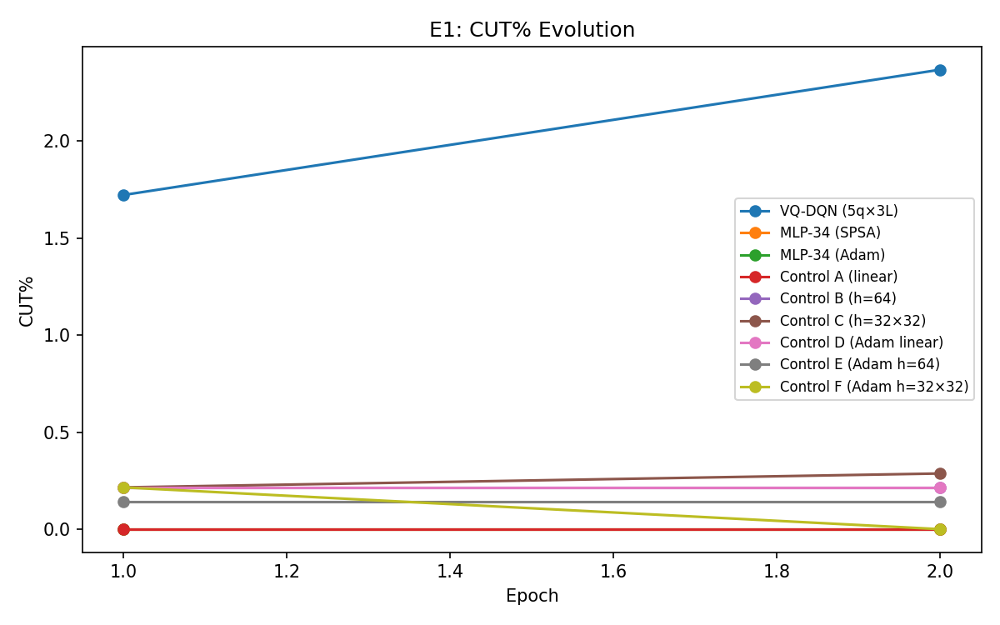
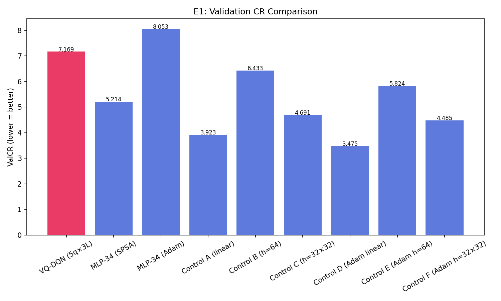
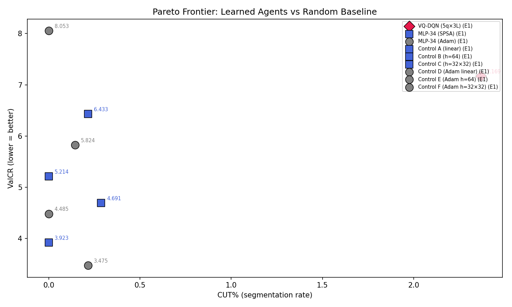

# Q-RLSTC Thesis Experiment Report

Generated: 2026-02-25T00:46:51.542786

## Protocol Constants

```json
{
  "batch_size": 32,
  "memory_size": 5000,
  "gamma": 0.9,
  "huber_delta": 1.0,
  "epsilon_start": 1.0,
  "epsilon_min": 0.1,
  "epsilon_decay": 0.99,
  "target_update_freq": 10,
  "L_MIN": 3,
  "CUT_PENALTY": 0.12,
  "EXTEND_COST": 0.01,
  "COMPLEXITY_LAMBDA": 0.03
}
```

## Full Terminal Output

```

══════════════════════════════════════════════════════════════════════
  Q-RLSTC THESIS EXPERIMENT RUNNER
  2026-02-24T23:15:20.638968
  Git: 09ae58181378
  Python: 3.12.12  |  NumPy: 2.4.1
  Experiments: E1
  Data: 30 trajectories, 2 epochs
  Seed: 42
  Multi-seed: [42, 123, 7, 99, 2025]
  Output: results/thesis_multiseed
══════════════════════════════════════════════════════════════════════

══════════════════════════════════════════════════════════════════════
  E1: CORE QUANTUM UTILITY
══════════════════════════════════════════════════════════════════════
  [seed 1/5: 42] VQ-DQN (5q×3L)

───────────────────────────────────────────────────────
  VQ-DQN (5q×3L)  (34 params)
  Noise: ideal | Shots: 0
  Mode: standard | Data: 100%
  Epochs: 2 × 27 trajectories
───────────────────────────────────────────────────────
    ⏱ 37s total | epoch 1/2 | episode 3/27 | 37s this epoch
    ⏱ 71s total | epoch 1/2 | episode 5/27 | 71s this epoch
    ⏱ 107s total | epoch 1/2 | episode 7/27 | 107s this epoch
    ⏱ 142s total | epoch 1/2 | episode 9/27 | 142s this epoch
    ⏱ 178s total | epoch 1/2 | episode 11/27 | 178s this epoch
    ⏱ 212s total | epoch 1/2 | episode 13/27 | 212s this epoch
    ⏱ 249s total | epoch 1/2 | episode 15/27 | 249s this epoch
    ⏱ 286s total | epoch 1/2 | episode 17/27 | 286s this epoch
    ⏱ 323s total | epoch 1/2 | episode 19/27 | 323s this epoch
    ⏱ 357s total | epoch 1/2 | episode 21/27 | 357s this epoch
    ⏱ 390s total | epoch 1/2 | episode 23/27 | 390s this epoch
    ⏱ 425s total | epoch 1/2 | episode 25/27 | 425s this epoch
    ⏱ 462s total | epoch 1/2 | episode 27/27 | 462s this epoch
  Epoch  1/2: ValCR=1.7937 (OD=0.1393/bs=0.0776) medCR=1.8268 | R̄=-20.102 | CUT=2% | #segs=27 | ε=0.762 | Qmargin=+0.3992 | ReplayCUT=32% | BufCUT=30% ★ | Q̄ext=+1.279 Q̄cut=+0.880
    ⏱ 517s total | epoch 2/2 | episode 3/27 | 37s this epoch
    ⏱ 551s total | epoch 2/2 | episode 5/27 | 70s this epoch
    ⏱ 588s total | epoch 2/2 | episode 7/27 | 107s this epoch
    ⏱ 625s total | epoch 2/2 | episode 9/27 | 144s this epoch
    ⏱ 660s total | epoch 2/2 | episode 11/27 | 179s this epoch
    ⏱ 694s total | epoch 2/2 | episode 13/27 | 214s this epoch
    ⏱ 731s total | epoch 2/2 | episode 15/27 | 250s this epoch
    ⏱ 768s total | epoch 2/2 | episode 17/27 | 287s this epoch
    ⏱ 802s total | epoch 2/2 | episode 19/27 | 322s this epoch
    ⏱ 836s total | epoch 2/2 | episode 21/27 | 355s this epoch
    ⏱ 871s total | epoch 2/2 | episode 23/27 | 390s this epoch
    ⏱ 907s total | epoch 2/2 | episode 25/27 | 427s this epoch
    ⏱ 943s total | epoch 2/2 | episode 27/27 | 463s this epoch
  Epoch  2/2: ValCR=1.0611 (OD=0.0824/bs=0.0776) medCR=2.6751 | R̄=-13.943 | CUT=2% | #segs=36 | ε=0.581 | Qmargin=+0.3651 | ReplayCUT=26% | BufCUT=24% ★ | Q̄ext=+1.558 Q̄cut=+1.193
  [seed 2/5: 123] VQ-DQN (5q×3L)

───────────────────────────────────────────────────────
  VQ-DQN (5q×3L)  (34 params)
  Noise: ideal | Shots: 0
  Mode: standard | Data: 100%
  Epochs: 2 × 27 trajectories
───────────────────────────────────────────────────────
    ⏱ 36s total | epoch 1/2 | episode 3/27 | 36s this epoch
    ⏱ 70s total | epoch 1/2 | episode 5/27 | 70s this epoch
    ⏱ 107s total | epoch 1/2 | episode 7/27 | 107s this epoch
    ⏱ 142s total | epoch 1/2 | episode 9/27 | 142s this epoch
    ⏱ 178s total | epoch 1/2 | episode 11/27 | 178s this epoch
    ⏱ 214s total | epoch 1/2 | episode 13/27 | 214s this epoch
    ⏱ 252s total | epoch 1/2 | episode 15/27 | 252s this epoch
    ⏱ 287s total | epoch 1/2 | episode 17/27 | 287s this epoch
    ⏱ 321s total | epoch 1/2 | episode 19/27 | 321s this epoch
    ⏱ 358s total | epoch 1/2 | episode 21/27 | 358s this epoch
    ⏱ 395s total | epoch 1/2 | episode 23/27 | 395s this epoch
    ⏱ 429s total | epoch 1/2 | episode 25/27 | 429s this epoch
    ⏱ 466s total | epoch 1/2 | episode 27/27 | 466s this epoch
  Epoch  1/2: ValCR=9.2051 (OD=0.7147/bs=0.0776) medCR=9.4045 | R̄=-20.172 | CUT=0% | #segs=3 | ε=0.762 | Qmargin=+0.8504 | ReplayCUT=32% | BufCUT=31% ★ | Q̄ext=+1.162 Q̄cut=+0.311
    ⏱ 522s total | epoch 2/2 | episode 3/27 | 37s this epoch
    ⏱ 559s total | epoch 2/2 | episode 5/27 | 73s this epoch
    ⏱ 596s total | epoch 2/2 | episode 7/27 | 110s this epoch
    ⏱ 633s total | epoch 2/2 | episode 9/27 | 148s this epoch
    ⏱ 668s total | epoch 2/2 | episode 11/27 | 182s this epoch
    ⏱ 703s total | epoch 2/2 | episode 13/27 | 217s this epoch
    ⏱ 739s total | epoch 2/2 | episode 15/27 | 253s this epoch
    ⏱ 775s total | epoch 2/2 | episode 17/27 | 289s this epoch
    ⏱ 809s total | epoch 2/2 | episode 19/27 | 323s this epoch
    ⏱ 845s total | epoch 2/2 | episode 21/27 | 359s this epoch
    ⏱ 883s total | epoch 2/2 | episode 23/27 | 397s this epoch
    ⏱ 919s total | epoch 2/2 | episode 25/27 | 433s this epoch
    ⏱ 954s total | epoch 2/2 | episode 27/27 | 468s this epoch
  Epoch  2/2: ValCR=9.2051 (OD=0.7147/bs=0.0776) medCR=9.4045 | R̄=-13.251 | CUT=0% | #segs=3 | ε=0.581 | Qmargin=+0.7501 | ReplayCUT=25% | BufCUT=24% | Q̄ext=+1.050 Q̄cut=+0.300
  [seed 3/5: 7] VQ-DQN (5q×3L)

───────────────────────────────────────────────────────
  VQ-DQN (5q×3L)  (34 params)
  Noise: ideal | Shots: 0
  Mode: standard | Data: 100%
  Epochs: 2 × 27 trajectories
───────────────────────────────────────────────────────
    ⏱ 36s total | epoch 1/2 | episode 3/27 | 36s this epoch
    ⏱ 72s total | epoch 1/2 | episode 5/27 | 72s this epoch
    ⏱ 105s total | epoch 1/2 | episode 7/27 | 105s this epoch
    ⏱ 140s total | epoch 1/2 | episode 9/27 | 140s this epoch
    ⏱ 176s total | epoch 1/2 | episode 11/27 | 176s this epoch
    ⏱ 214s total | epoch 1/2 | episode 13/27 | 214s this epoch
    ⏱ 250s total | epoch 1/2 | episode 15/27 | 250s this epoch
    ⏱ 285s total | epoch 1/2 | episode 17/27 | 285s this epoch
    ⏱ 323s total | epoch 1/2 | episode 19/27 | 323s this epoch
    ⏱ 359s total | epoch 1/2 | episode 21/27 | 359s this epoch
    ⏱ 396s total | epoch 1/2 | episode 23/27 | 396s this epoch
    ⏱ 432s total | epoch 1/2 | episode 25/27 | 432s this epoch
    ⏱ 467s total | epoch 1/2 | episode 27/27 | 467s this epoch
  Epoch  1/2: ValCR=9.2051 (OD=0.7147/bs=0.0776) medCR=9.4045 | R̄=-20.260 | CUT=0% | #segs=3 | ε=0.762 | Qmargin=+2.0107 | ReplayCUT=32% | BufCUT=30% ★ | Q̄ext=-0.100 Q̄cut=-2.110
    ⏱ 522s total | epoch 2/2 | episode 3/27 | 36s this epoch
    ⏱ 556s total | epoch 2/2 | episode 5/27 | 71s this epoch
    ⏱ 590s total | epoch 2/2 | episode 7/27 | 104s this epoch
    ⏱ 626s total | epoch 2/2 | episode 9/27 | 141s this epoch
    ⏱ 662s total | epoch 2/2 | episode 11/27 | 176s this epoch
    ⏱ 697s total | epoch 2/2 | episode 13/27 | 212s this epoch
    ⏱ 732s total | epoch 2/2 | episode 15/27 | 247s this epoch
    ⏱ 767s total | epoch 2/2 | episode 17/27 | 282s this epoch
    ⏱ 803s total | epoch 2/2 | episode 19/27 | 318s this epoch
    ⏱ 838s total | epoch 2/2 | episode 21/27 | 353s this epoch
    ⏱ 874s total | epoch 2/2 | episode 23/27 | 389s this epoch
    ⏱ 909s total | epoch 2/2 | episode 25/27 | 423s this epoch
    ⏱ 944s total | epoch 2/2 | episode 27/27 | 459s this epoch
  Epoch  2/2: ValCR=9.2051 (OD=0.7147/bs=0.0776) medCR=9.4045 | R̄=-13.969 | CUT=0% | #segs=3 | ε=0.581 | Qmargin=+1.8292 | ReplayCUT=25% | BufCUT=23% | Q̄ext=+0.150 Q̄cut=-1.679
  [seed 4/5: 99] VQ-DQN (5q×3L)

───────────────────────────────────────────────────────
  VQ-DQN (5q×3L)  (34 params)
  Noise: ideal | Shots: 0
  Mode: standard | Data: 100%
  Epochs: 2 × 27 trajectories
───────────────────────────────────────────────────────
    ⏱ 37s total | epoch 1/2 | episode 3/27 | 37s this epoch
    ⏱ 73s total | epoch 1/2 | episode 5/27 | 73s this epoch
    ⏱ 110s total | epoch 1/2 | episode 7/27 | 110s this epoch
    ⏱ 144s total | epoch 1/2 | episode 9/27 | 144s this epoch
    ⏱ 179s total | epoch 1/2 | episode 11/27 | 179s this epoch
    ⏱ 216s total | epoch 1/2 | episode 13/27 | 216s this epoch
    ⏱ 252s total | epoch 1/2 | episode 15/27 | 252s this epoch
    ⏱ 287s total | epoch 1/2 | episode 17/27 | 287s this epoch
    ⏱ 321s total | epoch 1/2 | episode 19/27 | 321s this epoch
    ⏱ 357s total | epoch 1/2 | episode 21/27 | 357s this epoch
    ⏱ 391s total | epoch 1/2 | episode 23/27 | 391s this epoch
    ⏱ 427s total | epoch 1/2 | episode 25/27 | 427s this epoch
    ⏱ 462s total | epoch 1/2 | episode 27/27 | 462s this epoch
  Epoch  1/2: ValCR=9.2051 (OD=0.7147/bs=0.0776) medCR=9.4045 | R̄=-19.895 | CUT=0% | #segs=3 | ε=0.762 | Qmargin=+2.1472 | ReplayCUT=31% | BufCUT=30% ★ | Q̄ext=+2.568 Q̄cut=+0.421
    ⏱ 515s total | epoch 2/2 | episode 3/27 | 34s this epoch
    ⏱ 553s total | epoch 2/2 | episode 5/27 | 73s this epoch
    ⏱ 589s total | epoch 2/2 | episode 7/27 | 108s this epoch
    ⏱ 622s total | epoch 2/2 | episode 9/27 | 141s this epoch
    ⏱ 657s total | epoch 2/2 | episode 11/27 | 176s this epoch
    ⏱ 694s total | epoch 2/2 | episode 13/27 | 213s this epoch
    ⏱ 729s total | epoch 2/2 | episode 15/27 | 248s this epoch
    ⏱ 765s total | epoch 2/2 | episode 17/27 | 284s this epoch
    ⏱ 801s total | epoch 2/2 | episode 19/27 | 321s this epoch
    ⏱ 836s total | epoch 2/2 | episode 21/27 | 355s this epoch
    ⏱ 872s total | epoch 2/2 | episode 23/27 | 392s this epoch
    ⏱ 906s total | epoch 2/2 | episode 25/27 | 426s this epoch
    ⏱ 941s total | epoch 2/2 | episode 27/27 | 461s this epoch
  Epoch  2/2: ValCR=9.2051 (OD=0.7147/bs=0.0776) medCR=9.4045 | R̄=-14.675 | CUT=0% | #segs=3 | ε=0.581 | Qmargin=+1.8822 | ReplayCUT=26% | BufCUT=24% | Q̄ext=+2.326 Q̄cut=+0.444
  [seed 5/5: 2025] VQ-DQN (5q×3L)

───────────────────────────────────────────────────────
  VQ-DQN (5q×3L)  (34 params)
  Noise: ideal | Shots: 0
  Mode: standard | Data: 100%
  Epochs: 2 × 27 trajectories
───────────────────────────────────────────────────────
    ⏱ 35s total | epoch 1/2 | episode 3/27 | 35s this epoch
    ⏱ 69s total | epoch 1/2 | episode 5/27 | 69s this epoch
    ⏱ 103s total | epoch 1/2 | episode 7/27 | 103s this epoch
    ⏱ 137s total | epoch 1/2 | episode 9/27 | 137s this epoch
    ⏱ 173s total | epoch 1/2 | episode 11/27 | 173s this epoch
    ⏱ 210s total | epoch 1/2 | episode 13/27 | 210s this epoch
    ⏱ 247s total | epoch 1/2 | episode 15/27 | 247s this epoch
    ⏱ 280s total | epoch 1/2 | episode 17/27 | 280s this epoch
    ⏱ 312s total | epoch 1/2 | episode 19/27 | 312s this epoch
    ⏱ 347s total | epoch 1/2 | episode 21/27 | 347s this epoch
    ⏱ 382s total | epoch 1/2 | episode 23/27 | 382s this epoch
    ⏱ 418s total | epoch 1/2 | episode 25/27 | 418s this epoch
    ⏱ 453s total | epoch 1/2 | episode 27/27 | 453s this epoch
  Epoch  1/2: ValCR=7.1697 (OD=0.5567/bs=0.0776) medCR=8.7959 | R̄=-20.319 | CUT=0% | #segs=6 | ε=0.762 | Qmargin=+0.6516 | ReplayCUT=32% | BufCUT=31% ★ | Q̄ext=-0.145 Q̄cut=-0.797
    ⏱ 509s total | epoch 2/2 | episode 3/27 | 37s this epoch
    ⏱ 542s total | epoch 2/2 | episode 5/27 | 70s this epoch
    ⏱ 577s total | epoch 2/2 | episode 7/27 | 105s this epoch
    ⏱ 612s total | epoch 2/2 | episode 9/27 | 140s this epoch
    ⏱ 648s total | epoch 2/2 | episode 11/27 | 176s this epoch
    ⏱ 682s total | epoch 2/2 | episode 13/27 | 210s this epoch
    ⏱ 718s total | epoch 2/2 | episode 15/27 | 246s this epoch
    ⏱ 754s total | epoch 2/2 | episode 17/27 | 282s this epoch
    ⏱ 790s total | epoch 2/2 | episode 19/27 | 318s this epoch
    ⏱ 828s total | epoch 2/2 | episode 21/27 | 356s this epoch
    ⏱ 863s total | epoch 2/2 | episode 23/27 | 391s this epoch
    ⏱ 897s total | epoch 2/2 | episode 25/27 | 425s this epoch
    ⏱ 931s total | epoch 2/2 | episode 27/27 | 458s this epoch
  Epoch  2/2: ValCR=7.1697 (OD=0.5567/bs=0.0776) medCR=8.7959 | R̄=-13.576 | CUT=0% | #segs=6 | ε=0.581 | Qmargin=+0.6011 | ReplayCUT=25% | BufCUT=24% | Q̄ext=+0.062 Q̄cut=-0.539
  [seed 1/5: 42] MLP-34 (SPSA)

───────────────────────────────────────────────────────
  MLP-34 (SPSA)  (34 params)
  Noise: ideal | Shots: 0
  Mode: standard | Data: 100%
  Epochs: 2 × 27 trajectories
───────────────────────────────────────────────────────
  Epoch  1/2: ValCR=9.2051 (OD=0.7147/bs=0.0776) medCR=9.4045 | R̄=-19.738 | CUT=0% | #segs=3 | ε=0.762 | Qmargin=+0.3918 | ReplayCUT=31% | BufCUT=29% ★ | Q̄ext=-1.003 Q̄cut=-1.395
  Epoch  2/2: ValCR=9.2051 (OD=0.7147/bs=0.0776) medCR=9.4045 | R̄=-14.075 | CUT=0% | #segs=3 | ε=0.581 | Qmargin=+0.3670 | ReplayCUT=25% | BufCUT=23% | Q̄ext=-1.011 Q̄cut=-1.378
  [seed 2/5: 123] MLP-34 (SPSA)

───────────────────────────────────────────────────────
  MLP-34 (SPSA)  (34 params)
  Noise: ideal | Shots: 0
  Mode: standard | Data: 100%
  Epochs: 2 × 27 trajectories
───────────────────────────────────────────────────────
  Epoch  1/2: ValCR=9.1965 (OD=0.7140/bs=0.0776) medCR=9.3949 | R̄=-19.384 | CUT=0% | #segs=5 | ε=0.762 | Qmargin=+0.4063 | ReplayCUT=30% | BufCUT=28% ★ | Q̄ext=+6.989 Q̄cut=+6.583
  Epoch  2/2: ValCR=9.1965 (OD=0.7140/bs=0.0776) medCR=9.3949 | R̄=-14.216 | CUT=0% | #segs=5 | ε=0.581 | Qmargin=+0.4070 | ReplayCUT=25% | BufCUT=24% | Q̄ext=+6.985 Q̄cut=+6.578
  [seed 3/5: 7] MLP-34 (SPSA)

───────────────────────────────────────────────────────
  MLP-34 (SPSA)  (34 params)
  Noise: ideal | Shots: 0
  Mode: standard | Data: 100%
  Epochs: 2 × 27 trajectories
───────────────────────────────────────────────────────
  Epoch  1/2: ValCR=1.6847 (OD=0.1308/bs=0.0776) medCR=4.8520 | R̄=-19.530 | CUT=4% | #segs=65 | ε=0.762 | Qmargin=+0.2170 | ReplayCUT=31% | BufCUT=29% ★ | Q̄ext=-0.068 Q̄cut=-0.285
  Epoch  2/2: ValCR=2.0013 (OD=0.1554/bs=0.0776) medCR=3.4343 | R̄=-14.435 | CUT=9% | #segs=123 | ε=0.581 | Qmargin=+0.0972 | ReplayCUT=25% | BufCUT=23% | Q̄ext=-0.194 Q̄cut=-0.292
  [seed 4/5: 99] MLP-34 (SPSA)

───────────────────────────────────────────────────────
  MLP-34 (SPSA)  (34 params)
  Noise: ideal | Shots: 0
  Mode: standard | Data: 100%
  Epochs: 2 × 27 trajectories
───────────────────────────────────────────────────────
  Epoch  1/2: ValCR=5.1133 (OD=0.3970/bs=0.0776) medCR=8.7799 | R̄=-19.519 | CUT=0% | #segs=6 | ε=0.762 | Qmargin=+0.4358 | ReplayCUT=30% | BufCUT=29% ★ | Q̄ext=+0.629 Q̄cut=+0.193
  Epoch  2/2: ValCR=5.1133 (OD=0.3970/bs=0.0776) medCR=8.7799 | R̄=-13.697 | CUT=0% | #segs=6 | ε=0.581 | Qmargin=+0.4105 | ReplayCUT=25% | BufCUT=24% | Q̄ext=+0.603 Q̄cut=+0.193
  [seed 5/5: 2025] MLP-34 (SPSA)

───────────────────────────────────────────────────────
  MLP-34 (SPSA)  (34 params)
  Noise: ideal | Shots: 0
  Mode: standard | Data: 100%
  Epochs: 2 × 27 trajectories
───────────────────────────────────────────────────────
  Epoch  1/2: ValCR=0.8721 (OD=0.0677/bs=0.0776) medCR=1.2535 | R̄=-20.730 | CUT=22% | #segs=314 | ε=0.762 | Qmargin=-0.0032 | ReplayCUT=33% | BufCUT=32% ★ | Q̄ext=+0.209 Q̄cut=+0.212
  Epoch  2/2: ValCR=1.1428 (OD=0.0887/bs=0.0776) medCR=1.5711 | R̄=-14.436 | CUT=4% | #segs=56 | ε=0.581 | Qmargin=+0.3464 | ReplayCUT=26% | BufCUT=25% | Q̄ext=+0.469 Q̄cut=+0.122
  [seed 1/5: 42] MLP-34 (Adam)

───────────────────────────────────────────────────────
  MLP-34 (Adam)  (34 params)
  Noise: ideal | Shots: 0
  Mode: standard | Data: 100%
  Epochs: 2 × 27 trajectories
───────────────────────────────────────────────────────
  Epoch  1/2: ValCR=9.2051 (OD=0.7147/bs=0.0776) medCR=9.4045 | R̄=-19.719 | CUT=0% | #segs=3 | ε=0.762 | Qmargin=+0.2426 | ReplayCUT=31% | BufCUT=29% ★ | Q̄ext=-0.000 Q̄cut=-0.243
  Epoch  2/2: ValCR=9.2051 (OD=0.7147/bs=0.0776) medCR=9.4045 | R̄=-14.242 | CUT=0% | #segs=3 | ε=0.581 | Qmargin=+0.2458 | ReplayCUT=25% | BufCUT=24% | Q̄ext=+0.074 Q̄cut=-0.172
  [seed 2/5: 123] MLP-34 (Adam)

───────────────────────────────────────────────────────
  MLP-34 (Adam)  (34 params)
  Noise: ideal | Shots: 0
  Mode: standard | Data: 100%
  Epochs: 2 × 27 trajectories
───────────────────────────────────────────────────────
  Epoch  1/2: ValCR=9.2051 (OD=0.7147/bs=0.0776) medCR=9.4045 | R̄=-19.366 | CUT=0% | #segs=3 | ε=0.762 | Qmargin=+2.7189 | ReplayCUT=30% | BufCUT=28% ★ | Q̄ext=+2.351 Q̄cut=-0.368
  Epoch  2/2: ValCR=9.2051 (OD=0.7147/bs=0.0776) medCR=9.4045 | R̄=-14.092 | CUT=0% | #segs=3 | ε=0.581 | Qmargin=+2.2914 | ReplayCUT=25% | BufCUT=24% | Q̄ext=+1.676 Q̄cut=-0.615
  [seed 3/5: 7] MLP-34 (Adam)

───────────────────────────────────────────────────────
  MLP-34 (Adam)  (34 params)
  Noise: ideal | Shots: 0
  Mode: standard | Data: 100%
  Epochs: 2 × 27 trajectories
───────────────────────────────────────────────────────
  Epoch  1/2: ValCR=9.2051 (OD=0.7147/bs=0.0776) medCR=9.4045 | R̄=-19.387 | CUT=0% | #segs=3 | ε=0.762 | Qmargin=+0.2229 | ReplayCUT=30% | BufCUT=29% ★ | Q̄ext=-0.299 Q̄cut=-0.522
  Epoch  2/2: ValCR=9.2051 (OD=0.7147/bs=0.0776) medCR=9.4045 | R̄=-14.435 | CUT=0% | #segs=3 | ε=0.581 | Qmargin=+0.5796 | ReplayCUT=25% | BufCUT=23% | Q̄ext=-0.473 Q̄cut=-1.053
  [seed 4/5: 99] MLP-34 (Adam)

───────────────────────────────────────────────────────
  MLP-34 (Adam)  (34 params)
  Noise: ideal | Shots: 0
  Mode: standard | Data: 100%
  Epochs: 2 × 27 trajectories
───────────────────────────────────────────────────────
  Epoch  1/2: ValCR=9.2051 (OD=0.7147/bs=0.0776) medCR=9.4045 | R̄=-19.297 | CUT=0% | #segs=3 | ε=0.762 | Qmargin=+0.0399 | ReplayCUT=30% | BufCUT=28% ★ | Q̄ext=+0.332 Q̄cut=+0.292
  Epoch  2/2: ValCR=9.2051 (OD=0.7147/bs=0.0776) medCR=9.4045 | R̄=-13.773 | CUT=0% | #segs=3 | ε=0.581 | Qmargin=+0.3900 | ReplayCUT=25% | BufCUT=24% | Q̄ext=+0.341 Q̄cut=-0.049
  [seed 5/5: 2025] MLP-34 (Adam)

───────────────────────────────────────────────────────
  MLP-34 (Adam)  (34 params)
  Noise: ideal | Shots: 0
  Mode: standard | Data: 100%
  Epochs: 2 × 27 trajectories
───────────────────────────────────────────────────────
  Epoch  1/2: ValCR=9.2051 (OD=0.7147/bs=0.0776) medCR=9.4045 | R̄=-19.517 | CUT=0% | #segs=3 | ε=0.762 | Qmargin=+0.1242 | ReplayCUT=30% | BufCUT=28% ★ | Q̄ext=-1.449 Q̄cut=-1.573
  Epoch  2/2: ValCR=3.4445 (OD=0.2674/bs=0.0776) medCR=3.9862 | R̄=-14.980 | CUT=1% | #segs=11 | ε=0.581 | Qmargin=+0.0596 | ReplayCUT=25% | BufCUT=23% ★ | Q̄ext=-0.863 Q̄cut=-0.922
  [seed 1/5: 42] Control A (linear)

───────────────────────────────────────────────────────
  Control A (linear)  (12 params)
  Noise: ideal | Shots: 0
  Mode: standard | Data: 100%
  Epochs: 2 × 27 trajectories
───────────────────────────────────────────────────────
  Epoch  1/2: ValCR=9.2051 (OD=0.7147/bs=0.0776) medCR=9.4045 | R̄=-19.953 | CUT=0% | #segs=3 | ε=0.762 | Qmargin=+0.1241 | ReplayCUT=31% | BufCUT=29% ★ | Q̄ext=-8.414 Q̄cut=-8.538
  Epoch  2/2: ValCR=9.2051 (OD=0.7147/bs=0.0776) medCR=9.4045 | R̄=-13.510 | CUT=0% | #segs=3 | ε=0.581 | Qmargin=+0.4378 | ReplayCUT=25% | BufCUT=23% | Q̄ext=-8.336 Q̄cut=-8.774
  [seed 2/5: 123] Control A (linear)

───────────────────────────────────────────────────────
  Control A (linear)  (12 params)
  Noise: ideal | Shots: 0
  Mode: standard | Data: 100%
  Epochs: 2 × 27 trajectories
───────────────────────────────────────────────────────
  Epoch  1/2: ValCR=0.8364 (OD=0.0649/bs=0.0776) medCR=0.9817 | R̄=-19.756 | CUT=21% | #segs=293 | ε=0.762 | Qmargin=+0.1124 | ReplayCUT=31% | BufCUT=30% ★ | Q̄ext=+0.624 Q̄cut=+0.512
  Epoch  2/2: ValCR=3.2443 (OD=0.2519/bs=0.0776) medCR=4.9860 | R̄=-14.182 | CUT=1% | #segs=10 | ε=0.581 | Qmargin=+0.2018 | ReplayCUT=26% | BufCUT=25% | Q̄ext=+0.760 Q̄cut=+0.558
  [seed 3/5: 7] Control A (linear)

───────────────────────────────────────────────────────
  Control A (linear)  (12 params)
  Noise: ideal | Shots: 0
  Mode: standard | Data: 100%
  Epochs: 2 × 27 trajectories
───────────────────────────────────────────────────────
  Epoch  1/2: ValCR=3.5891 (OD=0.2787/bs=0.0776) medCR=2.3491 | R̄=-19.434 | CUT=0% | #segs=9 | ε=0.762 | Qmargin=+0.1850 | ReplayCUT=30% | BufCUT=29% ★ | Q̄ext=-0.522 Q̄cut=-0.707
  Epoch  2/2: ValCR=4.0208 (OD=0.3122/bs=0.0776) medCR=3.1215 | R̄=-14.450 | CUT=0% | #segs=8 | ε=0.581 | Qmargin=+0.1954 | ReplayCUT=25% | BufCUT=23% | Q̄ext=-0.416 Q̄cut=-0.611
  [seed 4/5: 99] Control A (linear)

───────────────────────────────────────────────────────
  Control A (linear)  (12 params)
  Noise: ideal | Shots: 0
  Mode: standard | Data: 100%
  Epochs: 2 × 27 trajectories
───────────────────────────────────────────────────────
  Epoch  1/2: ValCR=1.3639 (OD=0.1059/bs=0.0776) medCR=1.1924 | R̄=-21.071 | CUT=42% | #segs=585 | ε=0.762 | Qmargin=-0.2735 | ReplayCUT=33% | BufCUT=33% ★ | Q̄ext=+1.427 Q̄cut=+1.701
  Epoch  2/2: ValCR=0.8703 (OD=0.0676/bs=0.0776) medCR=0.9800 | R̄=-14.922 | CUT=8% | #segs=117 | ε=0.581 | Qmargin=+0.1502 | ReplayCUT=27% | BufCUT=26% ★ | Q̄ext=+6.860 Q̄cut=+6.710
  [seed 5/5: 2025] Control A (linear)

───────────────────────────────────────────────────────
  Control A (linear)  (12 params)
  Noise: ideal | Shots: 0
  Mode: standard | Data: 100%
  Epochs: 2 × 27 trajectories
───────────────────────────────────────────────────────
  Epoch  1/2: ValCR=5.1133 (OD=0.3970/bs=0.0776) medCR=8.7799 | R̄=-19.877 | CUT=0% | #segs=6 | ε=0.762 | Qmargin=+0.6604 | ReplayCUT=31% | BufCUT=29% ★ | Q̄ext=-0.890 Q̄cut=-1.550
  Epoch  2/2: ValCR=5.1133 (OD=0.3970/bs=0.0776) medCR=8.7799 | R̄=-14.944 | CUT=0% | #segs=6 | ε=0.581 | Qmargin=+0.5910 | ReplayCUT=25% | BufCUT=24% | Q̄ext=-0.843 Q̄cut=-1.434
  [seed 1/5: 42] Control B (h=64)

───────────────────────────────────────────────────────
  Control B (h=64)  (514 params)
  Noise: ideal | Shots: 0
  Mode: standard | Data: 100%
  Epochs: 2 × 27 trajectories
───────────────────────────────────────────────────────
  Epoch  1/2: ValCR=5.1133 (OD=0.3970/bs=0.0776) medCR=8.7799 | R̄=-19.600 | CUT=0% | #segs=6 | ε=0.762 | Qmargin=+0.1831 | ReplayCUT=31% | BufCUT=29% ★ | Q̄ext=+0.153 Q̄cut=-0.030
  Epoch  2/2: ValCR=5.1133 (OD=0.3970/bs=0.0776) medCR=8.7799 | R̄=-14.160 | CUT=0% | #segs=6 | ε=0.581 | Qmargin=+0.1937 | ReplayCUT=25% | BufCUT=23% | Q̄ext=+0.172 Q̄cut=-0.022
  [seed 2/5: 123] Control B (h=64)

───────────────────────────────────────────────────────
  Control B (h=64)  (514 params)
  Noise: ideal | Shots: 0
  Mode: standard | Data: 100%
  Epochs: 2 × 27 trajectories
───────────────────────────────────────────────────────
  Epoch  1/2: ValCR=9.2051 (OD=0.7147/bs=0.0776) medCR=9.4045 | R̄=-19.329 | CUT=0% | #segs=3 | ε=0.762 | Qmargin=+0.3555 | ReplayCUT=30% | BufCUT=28% ★ | Q̄ext=+2.020 Q̄cut=+1.665
  Epoch  2/2: ValCR=9.2051 (OD=0.7147/bs=0.0776) medCR=9.4045 | R̄=-14.114 | CUT=0% | #segs=3 | ε=0.581 | Qmargin=+0.2735 | ReplayCUT=25% | BufCUT=24% | Q̄ext=+2.038 Q̄cut=+1.764
  [seed 3/5: 7] Control B (h=64)

───────────────────────────────────────────────────────
  Control B (h=64)  (514 params)
  Noise: ideal | Shots: 0
  Mode: standard | Data: 100%
  Epochs: 2 × 27 trajectories
───────────────────────────────────────────────────────
  Epoch  1/2: ValCR=9.2051 (OD=0.7147/bs=0.0776) medCR=9.4045 | R̄=-19.899 | CUT=0% | #segs=3 | ε=0.762 | Qmargin=+0.5816 | ReplayCUT=31% | BufCUT=30% ★ | Q̄ext=-1.345 Q̄cut=-1.926
  Epoch  2/2: ValCR=9.2051 (OD=0.7147/bs=0.0776) medCR=9.4045 | R̄=-14.062 | CUT=0% | #segs=3 | ε=0.581 | Qmargin=+0.4679 | ReplayCUT=25% | BufCUT=24% | Q̄ext=-1.304 Q̄cut=-1.772
  [seed 4/5: 99] Control B (h=64)

───────────────────────────────────────────────────────
  Control B (h=64)  (514 params)
  Noise: ideal | Shots: 0
  Mode: standard | Data: 100%
  Epochs: 2 × 27 trajectories
───────────────────────────────────────────────────────
  Epoch  1/2: ValCR=3.5263 (OD=0.2738/bs=0.0776) medCR=6.3365 | R̄=-19.358 | CUT=0% | #segs=9 | ε=0.762 | Qmargin=+0.0479 | ReplayCUT=30% | BufCUT=29% ★ | Q̄ext=-0.739 Q̄cut=-0.787
  Epoch  2/2: ValCR=4.0170 (OD=0.3119/bs=0.0776) medCR=5.5264 | R̄=-14.212 | CUT=0% | #segs=8 | ε=0.581 | Qmargin=+0.0692 | ReplayCUT=25% | BufCUT=24% | Q̄ext=-0.729 Q̄cut=-0.798
  [seed 5/5: 2025] Control B (h=64)

───────────────────────────────────────────────────────
  Control B (h=64)  (514 params)
  Noise: ideal | Shots: 0
  Mode: standard | Data: 100%
  Epochs: 2 × 27 trajectories
───────────────────────────────────────────────────────
  Epoch  1/2: ValCR=5.1133 (OD=0.3970/bs=0.0776) medCR=8.7799 | R̄=-19.586 | CUT=0% | #segs=6 | ε=0.762 | Qmargin=+0.1139 | ReplayCUT=30% | BufCUT=28% ★ | Q̄ext=-0.209 Q̄cut=-0.323
  Epoch  2/2: ValCR=5.1133 (OD=0.3970/bs=0.0776) medCR=8.7799 | R̄=-14.759 | CUT=0% | #segs=6 | ε=0.581 | Qmargin=+0.1278 | ReplayCUT=25% | BufCUT=24% | Q̄ext=-0.315 Q̄cut=-0.442
  [seed 1/5: 42] Control C (h=32×32)

───────────────────────────────────────────────────────
  Control C (h=32×32)  (1314 params)
  Noise: ideal | Shots: 0
  Mode: standard | Data: 100%
  Epochs: 2 × 27 trajectories
───────────────────────────────────────────────────────
  Epoch  1/2: ValCR=5.1133 (OD=0.3970/bs=0.0776) medCR=8.7799 | R̄=-19.618 | CUT=0% | #segs=6 | ε=0.762 | Qmargin=+0.0837 | ReplayCUT=31% | BufCUT=29% ★ | Q̄ext=-0.286 Q̄cut=-0.370
  Epoch  2/2: ValCR=4.4201 (OD=0.3432/bs=0.0776) medCR=4.7347 | R̄=-14.211 | CUT=0% | #segs=7 | ε=0.581 | Qmargin=+0.0685 | ReplayCUT=25% | BufCUT=23% ★ | Q̄ext=-0.288 Q̄cut=-0.357
  [seed 2/5: 123] Control C (h=32×32)

───────────────────────────────────────────────────────
  Control C (h=32×32)  (1314 params)
  Noise: ideal | Shots: 0
  Mode: standard | Data: 100%
  Epochs: 2 × 27 trajectories
───────────────────────────────────────────────────────
  Epoch  1/2: ValCR=9.2051 (OD=0.7147/bs=0.0776) medCR=9.4045 | R̄=-19.443 | CUT=0% | #segs=3 | ε=0.762 | Qmargin=+0.3107 | ReplayCUT=30% | BufCUT=28% ★ | Q̄ext=-2.004 Q̄cut=-2.315
  Epoch  2/2: ValCR=9.2051 (OD=0.7147/bs=0.0776) medCR=9.4045 | R̄=-14.915 | CUT=0% | #segs=3 | ε=0.581 | Qmargin=+0.2669 | ReplayCUT=25% | BufCUT=23% | Q̄ext=-1.820 Q̄cut=-2.087
  [seed 3/5: 7] Control C (h=32×32)

───────────────────────────────────────────────────────
  Control C (h=32×32)  (1314 params)
  Noise: ideal | Shots: 0
  Mode: standard | Data: 100%
  Epochs: 2 × 27 trajectories
───────────────────────────────────────────────────────
  Epoch  1/2: ValCR=5.1133 (OD=0.3970/bs=0.0776) medCR=8.7799 | R̄=-19.561 | CUT=0% | #segs=6 | ε=0.762 | Qmargin=+0.1370 | ReplayCUT=30% | BufCUT=29% ★ | Q̄ext=-0.178 Q̄cut=-0.315
  Epoch  2/2: ValCR=5.1133 (OD=0.3970/bs=0.0776) medCR=8.7799 | R̄=-13.282 | CUT=0% | #segs=6 | ε=0.581 | Qmargin=+0.1429 | ReplayCUT=25% | BufCUT=23% | Q̄ext=-0.180 Q̄cut=-0.323
  [seed 4/5: 99] Control C (h=32×32)

───────────────────────────────────────────────────────
  Control C (h=32×32)  (1314 params)
  Noise: ideal | Shots: 0
  Mode: standard | Data: 100%
  Epochs: 2 × 27 trajectories
───────────────────────────────────────────────────────
  Epoch  1/2: ValCR=3.1027 (OD=0.2409/bs=0.0776) medCR=8.5773 | R̄=-19.576 | CUT=1% | #segs=11 | ε=0.762 | Qmargin=+0.0698 | ReplayCUT=30% | BufCUT=29% ★ | Q̄ext=+0.228 Q̄cut=+0.158
  Epoch  2/2: ValCR=1.1202 (OD=0.0870/bs=0.0776) medCR=1.8356 | R̄=-14.070 | CUT=7% | #segs=101 | ε=0.581 | Qmargin=+0.0216 | ReplayCUT=25% | BufCUT=23% ★ | Q̄ext=+0.134 Q̄cut=+0.113
  [seed 5/5: 2025] Control C (h=32×32)

───────────────────────────────────────────────────────
  Control C (h=32×32)  (1314 params)
  Noise: ideal | Shots: 0
  Mode: standard | Data: 100%
  Epochs: 2 × 27 trajectories
───────────────────────────────────────────────────────
  Epoch  1/2: ValCR=3.5982 (OD=0.2794/bs=0.0776) medCR=4.5983 | R̄=-19.355 | CUT=0% | #segs=9 | ε=0.762 | Qmargin=+0.1434 | ReplayCUT=30% | BufCUT=28% ★ | Q̄ext=-0.522 Q̄cut=-0.666
  Epoch  2/2: ValCR=9.2051 (OD=0.7147/bs=0.0776) medCR=9.4045 | R̄=-13.709 | CUT=0% | #segs=3 | ε=0.581 | Qmargin=+0.3414 | ReplayCUT=25% | BufCUT=24% | Q̄ext=-0.742 Q̄cut=-1.083
  [seed 1/5: 42] Control D (Adam linear)

───────────────────────────────────────────────────────
  Control D (Adam linear)  (12 params)
  Noise: ideal | Shots: 0
  Mode: standard | Data: 100%
  Epochs: 2 × 27 trajectories
───────────────────────────────────────────────────────
  Epoch  1/2: ValCR=5.1133 (OD=0.3970/bs=0.0776) medCR=8.7799 | R̄=-19.849 | CUT=0% | #segs=6 | ε=0.762 | Qmargin=+0.3501 | ReplayCUT=31% | BufCUT=29% ★ | Q̄ext=-0.892 Q̄cut=-1.242
  Epoch  2/2: ValCR=5.1133 (OD=0.3970/bs=0.0776) medCR=8.7799 | R̄=-13.510 | CUT=0% | #segs=6 | ε=0.581 | Qmargin=+0.5239 | ReplayCUT=25% | BufCUT=23% | Q̄ext=-0.637 Q̄cut=-1.161
  [seed 2/5: 123] Control D (Adam linear)

───────────────────────────────────────────────────────
  Control D (Adam linear)  (12 params)
  Noise: ideal | Shots: 0
  Mode: standard | Data: 100%
  Epochs: 2 × 27 trajectories
───────────────────────────────────────────────────────
  Epoch  1/2: ValCR=1.7374 (OD=0.1349/bs=0.0776) medCR=1.8060 | R̄=-19.369 | CUT=2% | #segs=24 | ε=0.762 | Qmargin=+0.0578 | ReplayCUT=30% | BufCUT=28% ★ | Q̄ext=+0.607 Q̄cut=+0.549
  Epoch  2/2: ValCR=1.4431 (OD=0.1120/bs=0.0776) medCR=0.9798 | R̄=-13.788 | CUT=7% | #segs=96 | ε=0.581 | Qmargin=+0.0326 | ReplayCUT=25% | BufCUT=24% ★ | Q̄ext=+0.320 Q̄cut=+0.287
  [seed 3/5: 7] Control D (Adam linear)

───────────────────────────────────────────────────────
  Control D (Adam linear)  (12 params)
  Noise: ideal | Shots: 0
  Mode: standard | Data: 100%
  Epochs: 2 × 27 trajectories
───────────────────────────────────────────────────────
  Epoch  1/2: ValCR=5.9182 (OD=0.4595/bs=0.0776) medCR=8.7838 | R̄=-19.434 | CUT=0% | #segs=5 | ε=0.762 | Qmargin=+0.3270 | ReplayCUT=30% | BufCUT=29% ★ | Q̄ext=-0.637 Q̄cut=-0.964
  Epoch  2/2: ValCR=9.2051 (OD=0.7147/bs=0.0776) medCR=9.4045 | R̄=-14.436 | CUT=0% | #segs=3 | ε=0.581 | Qmargin=+0.7288 | ReplayCUT=25% | BufCUT=23% | Q̄ext=-0.757 Q̄cut=-1.486
  [seed 4/5: 99] Control D (Adam linear)

───────────────────────────────────────────────────────
  Control D (Adam linear)  (12 params)
  Noise: ideal | Shots: 0
  Mode: standard | Data: 100%
  Epochs: 2 × 27 trajectories
───────────────────────────────────────────────────────
  Epoch  1/2: ValCR=9.2051 (OD=0.7147/bs=0.0776) medCR=9.4045 | R̄=-19.383 | CUT=0% | #segs=3 | ε=0.762 | Qmargin=+0.3499 | ReplayCUT=30% | BufCUT=28% ★ | Q̄ext=-0.150 Q̄cut=-0.500
  Epoch  2/2: ValCR=2.2478 (OD=0.1745/bs=0.0776) medCR=1.7746 | R̄=-13.960 | CUT=10% | #segs=141 | ε=0.581 | Qmargin=+0.0501 | ReplayCUT=25% | BufCUT=23% ★ | Q̄ext=-0.182 Q̄cut=-0.232
  [seed 5/5: 2025] Control D (Adam linear)

───────────────────────────────────────────────────────
  Control D (Adam linear)  (12 params)
  Noise: ideal | Shots: 0
  Mode: standard | Data: 100%
  Epochs: 2 × 27 trajectories
───────────────────────────────────────────────────────
  Epoch  1/2: ValCR=2.6549 (OD=0.2061/bs=0.0776) medCR=2.5142 | R̄=-19.668 | CUT=1% | #segs=12 | ε=0.762 | Qmargin=+0.0554 | ReplayCUT=30% | BufCUT=28% ★ | Q̄ext=-1.609 Q̄cut=-1.664
  Epoch  2/2: ValCR=3.2541 (OD=0.2526/bs=0.0776) medCR=2.2995 | R̄=-14.717 | CUT=1% | #segs=10 | ε=0.581 | Qmargin=+0.0471 | ReplayCUT=25% | BufCUT=23% | Q̄ext=-1.241 Q̄cut=-1.288
  [seed 1/5: 42] Control E (Adam h=64)

───────────────────────────────────────────────────────
  Control E (Adam h=64)  (514 params)
  Noise: ideal | Shots: 0
  Mode: standard | Data: 100%
  Epochs: 2 × 27 trajectories
───────────────────────────────────────────────────────
  Epoch  1/2: ValCR=9.1965 (OD=0.7140/bs=0.0776) medCR=9.3949 | R̄=-19.613 | CUT=0% | #segs=5 | ε=0.762 | Qmargin=+0.1591 | ReplayCUT=31% | BufCUT=29% ★ | Q̄ext=+6.626 Q̄cut=+6.467
  Epoch  2/2: ValCR=9.1965 (OD=0.7140/bs=0.0776) medCR=9.3949 | R̄=-15.494 | CUT=0% | #segs=5 | ε=0.581 | Qmargin=+13.1206 | ReplayCUT=27% | BufCUT=26% | Q̄ext=+6.544 Q̄cut=-6.577
  [seed 2/5: 123] Control E (Adam h=64)

───────────────────────────────────────────────────────
  Control E (Adam h=64)  (514 params)
  Noise: ideal | Shots: 0
  Mode: standard | Data: 100%
  Epochs: 2 × 27 trajectories
───────────────────────────────────────────────────────
  Epoch  1/2: ValCR=6.9778 (OD=0.5418/bs=0.0776) medCR=7.2413 | R̄=-19.357 | CUT=0% | #segs=6 | ε=0.762 | Qmargin=+0.0255 | ReplayCUT=30% | BufCUT=28% ★ | Q̄ext=+6.711 Q̄cut=+6.686
  Epoch  2/2: ValCR=3.9135 (OD=0.3038/bs=0.0776) medCR=2.4758 | R̄=-14.258 | CUT=1% | #segs=10 | ε=0.581 | Qmargin=-0.0047 | ReplayCUT=25% | BufCUT=24% ★ | Q̄ext=+6.601 Q̄cut=+6.605
  [seed 3/5: 7] Control E (Adam h=64)

───────────────────────────────────────────────────────
  Control E (Adam h=64)  (514 params)
  Noise: ideal | Shots: 0
  Mode: standard | Data: 100%
  Epochs: 2 × 27 trajectories
───────────────────────────────────────────────────────
  Epoch  1/2: ValCR=9.2051 (OD=0.7147/bs=0.0776) medCR=9.4045 | R̄=-19.565 | CUT=0% | #segs=3 | ε=0.762 | Qmargin=+0.6260 | ReplayCUT=30% | BufCUT=29% ★ | Q̄ext=-0.364 Q̄cut=-0.990
  Epoch  2/2: ValCR=9.2051 (OD=0.7147/bs=0.0776) medCR=9.4045 | R̄=-14.157 | CUT=0% | #segs=3 | ε=0.581 | Qmargin=+0.1548 | ReplayCUT=25% | BufCUT=23% | Q̄ext=-0.077 Q̄cut=-0.232
  [seed 4/5: 99] Control E (Adam h=64)

───────────────────────────────────────────────────────
  Control E (Adam h=64)  (514 params)
  Noise: ideal | Shots: 0
  Mode: standard | Data: 100%
  Epochs: 2 × 27 trajectories
───────────────────────────────────────────────────────
  Epoch  1/2: ValCR=5.1133 (OD=0.3970/bs=0.0776) medCR=8.7799 | R̄=-19.351 | CUT=0% | #segs=6 | ε=0.762 | Qmargin=+0.3372 | ReplayCUT=30% | BufCUT=29% ★ | Q̄ext=-0.508 Q̄cut=-0.845
  Epoch  2/2: ValCR=1.8575 (OD=0.1442/bs=0.0776) medCR=1.4657 | R̄=-14.202 | CUT=10% | #segs=140 | ε=0.581 | Qmargin=+0.1595 | ReplayCUT=25% | BufCUT=24% ★ | Q̄ext=-0.841 Q̄cut=-1.001
  [seed 5/5: 2025] Control E (Adam h=64)

───────────────────────────────────────────────────────
  Control E (Adam h=64)  (514 params)
  Noise: ideal | Shots: 0
  Mode: standard | Data: 100%
  Epochs: 2 × 27 trajectories
───────────────────────────────────────────────────────
  Epoch  1/2: ValCR=4.9480 (OD=0.3842/bs=0.0776) medCR=8.2785 | R̄=-19.590 | CUT=0% | #segs=6 | ε=0.762 | Qmargin=+0.2364 | ReplayCUT=30% | BufCUT=28% ★ | Q̄ext=-0.061 Q̄cut=-0.297
  Epoch  2/2: ValCR=9.2051 (OD=0.7147/bs=0.0776) medCR=9.4045 | R̄=-15.544 | CUT=0% | #segs=3 | ε=0.581 | Qmargin=+0.5024 | ReplayCUT=27% | BufCUT=24% | Q̄ext=-0.281 Q̄cut=-0.783
  [seed 1/5: 42] Control F (Adam h=32×32)

───────────────────────────────────────────────────────
  Control F (Adam h=32×32)  (1314 params)
  Noise: ideal | Shots: 0
  Mode: standard | Data: 100%
  Epochs: 2 × 27 trajectories
───────────────────────────────────────────────────────
  Epoch  1/2: ValCR=5.1133 (OD=0.3970/bs=0.0776) medCR=8.7799 | R̄=-19.608 | CUT=0% | #segs=6 | ε=0.762 | Qmargin=+0.1626 | ReplayCUT=31% | BufCUT=29% ★ | Q̄ext=-0.242 Q̄cut=-0.405
  Epoch  2/2: ValCR=9.2051 (OD=0.7147/bs=0.0776) medCR=9.4045 | R̄=-14.206 | CUT=0% | #segs=3 | ε=0.581 | Qmargin=+0.5009 | ReplayCUT=25% | BufCUT=23% | Q̄ext=-0.217 Q̄cut=-0.718
  [seed 2/5: 123] Control F (Adam h=32×32)

───────────────────────────────────────────────────────
  Control F (Adam h=32×32)  (1314 params)
  Noise: ideal | Shots: 0
  Mode: standard | Data: 100%
  Epochs: 2 × 27 trajectories
───────────────────────────────────────────────────────
  Epoch  1/2: ValCR=7.1761 (OD=0.5572/bs=0.0776) medCR=8.8026 | R̄=-19.447 | CUT=0% | #segs=4 | ε=0.762 | Qmargin=+0.1397 | ReplayCUT=30% | BufCUT=28% ★ | Q̄ext=-0.886 Q̄cut=-1.025
  Epoch  2/2: ValCR=1.4950 (OD=0.1161/bs=0.0776) medCR=1.2940 | R̄=-15.028 | CUT=33% | #segs=457 | ε=0.581 | Qmargin=-13.0279 | ReplayCUT=25% | BufCUT=24% ★ | Q̄ext=-6.602 Q̄cut=+6.426
  [seed 3/5: 7] Control F (Adam h=32×32)

───────────────────────────────────────────────────────
  Control F (Adam h=32×32)  (1314 params)
  Noise: ideal | Shots: 0
  Mode: standard | Data: 100%
  Epochs: 2 × 27 trajectories
───────────────────────────────────────────────────────
  Epoch  1/2: ValCR=9.2051 (OD=0.7147/bs=0.0776) medCR=9.4045 | R̄=-19.561 | CUT=0% | #segs=3 | ε=0.762 | Qmargin=+0.1527 | ReplayCUT=30% | BufCUT=29% ★ | Q̄ext=-0.123 Q̄cut=-0.276
  Epoch  2/2: ValCR=1.4959 (OD=0.1161/bs=0.0776) medCR=1.2952 | R̄=-15.266 | CUT=33% | #segs=456 | ε=0.581 | Qmargin=-13.0152 | ReplayCUT=29% | BufCUT=33% ★ | Q̄ext=-6.536 Q̄cut=+6.480
  [seed 4/5: 99] Control F (Adam h=32×32)

───────────────────────────────────────────────────────
  Control F (Adam h=32×32)  (1314 params)
  Noise: ideal | Shots: 0
  Mode: standard | Data: 100%
  Epochs: 2 × 27 trajectories
───────────────────────────────────────────────────────
  Epoch  1/2: ValCR=9.2051 (OD=0.7147/bs=0.0776) medCR=9.4045 | R̄=-19.499 | CUT=0% | #segs=3 | ε=0.762 | Qmargin=+2.4499 | ReplayCUT=30% | BufCUT=28% ★ | Q̄ext=+3.714 Q̄cut=+1.264
  Epoch  2/2: ValCR=9.2051 (OD=0.7147/bs=0.0776) medCR=9.4045 | R̄=-14.053 | CUT=0% | #segs=3 | ε=0.581 | Qmargin=+2.6946 | ReplayCUT=25% | BufCUT=23% | Q̄ext=+2.577 Q̄cut=-0.118
  [seed 5/5: 2025] Control F (Adam h=32×32)

───────────────────────────────────────────────────────
  Control F (Adam h=32×32)  (1314 params)
  Noise: ideal | Shots: 0
  Mode: standard | Data: 100%
  Epochs: 2 × 27 trajectories
───────────────────────────────────────────────────────
  Epoch  1/2: ValCR=5.1133 (OD=0.3970/bs=0.0776) medCR=8.7799 | R̄=-19.355 | CUT=0% | #segs=6 | ε=0.762 | Qmargin=+0.2177 | ReplayCUT=30% | BufCUT=28% ★ | Q̄ext=-0.401 Q̄cut=-0.619
  Epoch  2/2: ValCR=9.2051 (OD=0.7147/bs=0.0776) medCR=9.4045 | R̄=-13.709 | CUT=0% | #segs=3 | ε=0.581 | Qmargin=+0.3042 | ReplayCUT=25% | BufCUT=24% | Q̄ext=-0.390 Q̄cut=-0.694

════════════════════════════════════════════════════════════════════════════════════════════════════
  E1: Core Quantum Utility — Multi-Seed Summary (5 seeds)
════════════════════════════════════════════════════════════════════════════════════════════════════

Model                          Params          ValCR         CUT%  #Segs     Time        Qmargin
────────────────────────────────────────────────────────────────────────────────────────────────────
VQ-DQN (5q×3L)                     34  7.1692±3.1542        1%±1%     10    4806s   +1.086±0.641
MLP-34 (SPSA)                      34  5.2144±3.5527        5%±9%     78      44s   +0.326±0.117
MLP-34 (Adam)                      34  8.0530±2.3043        0%±0%      4      41s   +0.713±0.807
Control A (linear)                 12  3.9229±3.1073        6%±8%     85      37s   +0.315±0.171
Control B (h=64)                  514  6.4327±2.3367        0%±0%      5      38s   +0.226±0.139
Control C (h=32×32)              1314  4.6914±2.6296        2%±3%     25      38s   +0.168±0.120
Control D (Adam linear)            12  3.4754±1.7298        4%±4%     52      27s   +0.277±0.293
Control E (Adam h=64)             514  5.8242±2.9311        2%±4%     32      42s   +2.787±5.170
Control F (Adam h=32×32)         1314  4.4846±2.8616      13%±16%    185      51s   -4.509±7.001
────────────────────────────────────────────────────────────────────────────────────────────────────

══════════════════════════════════════════════════════════════════════
  GRAND SUMMARY
══════════════════════════════════════════════════════════════════════


══════════════════════════════════════════════════════════════════════════════════════════
  All Models — Summary
══════════════════════════════════════════════════════════════════════════════════════════

Model                          Params    ValCR   CUT%  #Segs BestEp    Time  Qmargin
──────────────────────────────────────────────────────────────────────────────────────────
VQ-DQN (5q×3L)                     34   7.1692     1%     10      2 4805.7s  +1.0856
MLP-34 (SPSA)                      34   5.2144     5%     78      1   44.3s  +0.3256
MLP-34 (Adam)                      34   8.0530     0%      4      1   41.0s  +0.7133
Control A (linear)                 12   3.9229     6%     85      1   36.7s  +0.3153
Control B (h=64)                  514   6.4327     0%      5      1   37.9s  +0.2264
Control C (h=32×32)              1314   4.6914     2%     25      2   37.6s  +0.1682
Control D (Adam linear)            12   3.4754     4%     52      1   27.3s  +0.2765
Control E (Adam h=64)             514   5.8242     2%     32      1   41.6s  +2.7865
Control F (Adam h=32×32)         1314   4.4846    13%    185      1   50.7s  -4.5087
──────────────────────────────────────────────────────────────────────────────────────────

════════════════════════════════════════════════════════════════════════════════
  Pareto: Best ValCR at CUT ≤ threshold
════════════════════════════════════════════════════════════════════════════════

CUT ≤          Random (D1)    VQ-DQN (5q×3L)     MLP-34 (SPSA)     MLP-34 (Adam)  Control A (linear)  Control B (h=64)  Control C (h=32×32)  Control D (Adam linear)  Control E (Adam h=64)  Control F (Adam h=32×32)
────────────────────────────────────────────────────────────────────────────────
≤5%                      —            7.1692              (5%)            8.0530              (6%)            6.4327            4.6914            3.4754            5.8242             (13%)
≤10%                     —            7.1692            5.2144            8.0530            3.9229            6.4327            4.6914            3.4754            5.8242             (13%)
≤20%                     —            7.1692            5.2144            8.0530            3.9229            6.4327            4.6914            3.4754            5.8242            4.4846
≤30%                     —            7.1692            5.2144            8.0530            3.9229            6.4327            4.6914            3.4754            5.8242            4.4846
≤40%                     —            7.1692            5.2144            8.0530            3.9229            6.4327            4.6914            3.4754            5.8242            4.4846
≤50%                     —            7.1692            5.2144            8.0530            3.9229            6.4327            4.6914            3.4754            5.8242            4.4846
≤80%                     —            7.1692            5.2144            8.0530            3.9229            6.4327            4.6914            3.4754            5.8242            4.4846
────────────────────────────────────────────────────────────────────────────────

──────────────────────────────────────────────────────────────────────
  D2/D3/D5: Diagnostic Summary
  (Q-margins, Training Action Dist, Replay Buffer Dist)
──────────────────────────────────────────────────────────────────────

  VQ-DQN (5q×3L)                
    D2 Q-margin:    +1.086
    D3 TrainCUT%:   32% → 26%
    D5 BufferCUT%:  30% → 24%

  MLP-34 (SPSA)                 
    D2 Q-margin:    +0.326
    D3 TrainCUT%:   31% → 25%
    D5 BufferCUT%:  29% → 23%

  MLP-34 (Adam)                 
    D2 Q-margin:    +0.713
    D3 TrainCUT%:   31% → 25%
    D5 BufferCUT%:  29% → 24%

  Control A (linear)            
    D2 Q-margin:    +0.315
    D3 TrainCUT%:   31% → 25%
    D5 BufferCUT%:  29% → 23%

  Control B (h=64)              
    D2 Q-margin:    +0.226
    D3 TrainCUT%:   31% → 25%
    D5 BufferCUT%:  29% → 23%

  Control C (h=32×32)           
    D2 Q-margin:    +0.168
    D3 TrainCUT%:   31% → 25%
    D5 BufferCUT%:  29% → 23%

  Control D (Adam linear)       
    D2 Q-margin:    +0.277
    D3 TrainCUT%:   31% → 25%
    D5 BufferCUT%:  29% → 23%

  Control E (Adam h=64)         
    D2 Q-margin:    +2.787
    D3 TrainCUT%:   31% → 27%
    D5 BufferCUT%:  29% → 26%

  Control F (Adam h=32×32)      
    D2 Q-margin:    -4.509
    D3 TrainCUT%:   31% → 25%
    D5 BufferCUT%:  29% → 23%


════════════════════════════════════════════════════════════
  Generating Plots
════════════════════════════════════════════════════════════

  ✓ pareto_valcr_vs_cut.png
  ✓ e1_valcr_comparison.png
  ✓ e1_cut_evolution.png

  Generated 3 plots → results/thesis_multiseed/plots

```

## Plots








## Raw Results (JSON)

See `thesis_results_20260225_004651.json` for machine-readable data.
