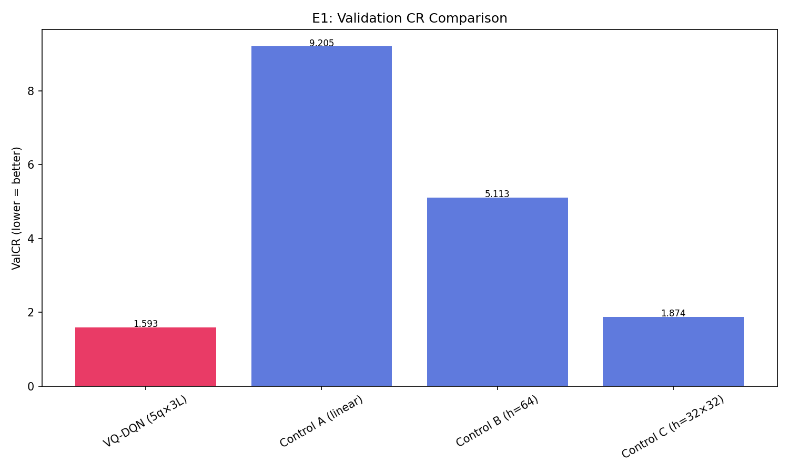
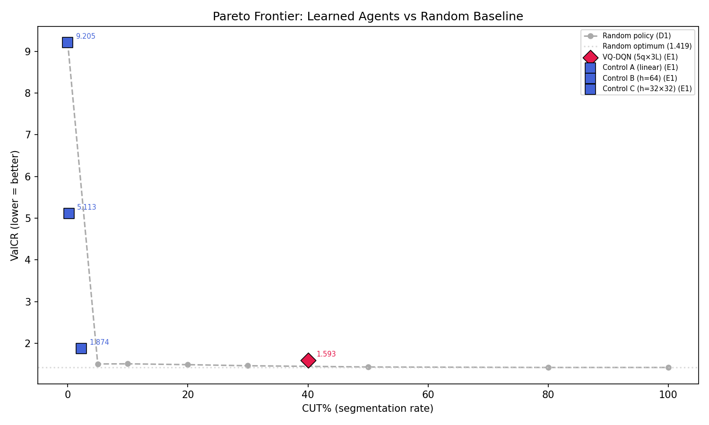

# Q-RLSTC Thesis Experiment Report

Generated: 2026-02-24T13:36:55.853364

## Protocol Constants

```json
{
  "batch_size": 32,
  "memory_size": 5000,
  "gamma": 0.9,
  "huber_delta": 1.0,
  "epsilon_start": 1.0,
  "epsilon_min": 0.1,
  "epsilon_decay": 0.99,
  "target_update_freq": 10,
  "L_MIN": 3,
  "CUT_PENALTY": 0.12,
  "EXTEND_COST": 0.01,
  "COMPLEXITY_LAMBDA": 0.03
}
```

## Full Terminal Output

```

══════════════════════════════════════════════════════════════════════
  Q-RLSTC THESIS EXPERIMENT RUNNER
  2026-02-24T13:25:38.066461
  Git: 4eb14ed84e33
  Python: 3.12.12  |  NumPy: 2.4.1
  Experiments: D1, E1
  Data: 30 trajectories, 1 epochs
  Seed: 42
  Output: results/thesis_pareto
══════════════════════════════════════════════════════════════════════

════════════════════════════════════════════════════════════════════════════════
  D1: ValCR vs CUT% — Random Policy Diagnostic (METRIC-ONLY)
  30 trajectories, no learning, no reward shaping
  NOTE: Tests metric degeneracy only — reward alignment is separate.
════════════════════════════════════════════════════════════════════════════════

 CutProb  ActualCUT%     ValCR   #Segs   AvgLen
───────────────────────────────────────────────────────
      0%        0.0%    9.2051       3    465.3
      5%        4.6%    1.5032      67     21.8
     10%        8.3%    1.5072     119     12.7
     20%       14.9%    1.4869     211      7.6
     30%       21.1%    1.4611     297      5.7
     50%       32.3%    1.4311     453      4.1
     80%       43.4%    1.4192     608      3.3
    100%       49.7%    1.4193     696      3.0
───────────────────────────────────────────────────────

  ✓  ValCR is NOT monotonically decreasing with CUT%.
     Best ValCR = 1.4192 at CUT = 80%

══════════════════════════════════════════════════════════════════════
  E1: CORE QUANTUM UTILITY
══════════════════════════════════════════════════════════════════════

───────────────────────────────────────────────────────
  VQ-DQN (5q×3L)  (34 params)
  Noise: ideal | Shots: 0
  Mode: standard | Data: 100%
  Epochs: 1 × 27 trajectories
───────────────────────────────────────────────────────
    ⏱ 35s total | epoch 1/1 | episode 3/27 | 35s this epoch
    ⏱ 74s total | epoch 1/1 | episode 5/27 | 74s this epoch
    ⏱ 110s total | epoch 1/1 | episode 7/27 | 110s this epoch
    ⏱ 147s total | epoch 1/1 | episode 9/27 | 147s this epoch
    ⏱ 184s total | epoch 1/1 | episode 11/27 | 184s this epoch
    ⏱ 219s total | epoch 1/1 | episode 13/27 | 219s this epoch
    ⏱ 257s total | epoch 1/1 | episode 15/27 | 257s this epoch
    ⏱ 295s total | epoch 1/1 | episode 17/27 | 295s this epoch
    ⏱ 333s total | epoch 1/1 | episode 19/27 | 333s this epoch
    ⏱ 368s total | epoch 1/1 | episode 21/27 | 368s this epoch
    ⏱ 403s total | epoch 1/1 | episode 23/27 | 403s this epoch
    ⏱ 439s total | epoch 1/1 | episode 25/27 | 439s this epoch
    ⏱ 477s total | epoch 1/1 | episode 27/27 | 477s this epoch
  Epoch  1/1: ValCR=1.5926 | R̄=+46.897 | CUT=40% | #segs=561 | ε=0.762 | Qmargin=-0.3650 | ReplayCUT=35% | BufCUT=37% ★ | Q̄ext=+1.207 Q̄cut=+1.572

───────────────────────────────────────────────────────
  Control A (linear)  (12 params)
  Noise: ideal | Shots: 0
  Mode: standard | Data: 100%
  Epochs: 1 × 27 trajectories
───────────────────────────────────────────────────────
  Epoch  1/1: ValCR=9.2051 | R̄=+37.922 | CUT=0% | #segs=3 | ε=0.762 | Qmargin=+0.1635 | ReplayCUT=31% | BufCUT=29% ★ | Q̄ext=-8.455 Q̄cut=-8.619

───────────────────────────────────────────────────────
  Control B (h=64)  (514 params)
  Noise: ideal | Shots: 0
  Mode: standard | Data: 100%
  Epochs: 1 × 27 trajectories
───────────────────────────────────────────────────────
  Epoch  1/1: ValCR=5.1133 | R̄=+49.312 | CUT=0% | #segs=6 | ε=0.762 | Qmargin=+0.2272 | ReplayCUT=31% | BufCUT=29% ★ | Q̄ext=+0.225 Q̄cut=-0.002

───────────────────────────────────────────────────────
  Control C (h=32×32)  (1314 params)
  Noise: ideal | Shots: 0
  Mode: standard | Data: 100%
  Epochs: 1 × 27 trajectories
───────────────────────────────────────────────────────
  Epoch  1/1: ValCR=1.8736 | R̄=+39.303 | CUT=2% | #segs=35 | ε=0.762 | Qmargin=+0.0706 | ReplayCUT=31% | BufCUT=29% ★ | Q̄ext=-0.253 Q̄cut=-0.324

══════════════════════════════════════════════════════════════════════════════════════════
  E1: Core Quantum Utility — Summary
══════════════════════════════════════════════════════════════════════════════════════════

Model                          Params    ValCR   CUT%  #Segs BestEp    Time  Qmargin
──────────────────────────────────────────────────────────────────────────────────────────
VQ-DQN (5q×3L)                     34   1.5926    40%    561      1  495.7s  -0.3650
Control A (linear)                 12   9.2051     0%      3      1    7.9s  +0.1635
Control B (h=64)                  514   5.1133     0%      6      1    2.9s  +0.2272
Control C (h=32×32)              1314   1.8736     2%     35      1    6.5s  +0.0706
──────────────────────────────────────────────────────────────────────────────────────────

══════════════════════════════════════════════════════════════════════
  GRAND SUMMARY
══════════════════════════════════════════════════════════════════════


══════════════════════════════════════════════════════════════════════════════════════════
  All Models — Summary
══════════════════════════════════════════════════════════════════════════════════════════

Model                          Params    ValCR   CUT%  #Segs BestEp    Time  Qmargin
──────────────────────────────────────────────────────────────────────────────────────────
VQ-DQN (5q×3L)                     34   1.5926    40%    561      1  495.7s  -0.3650
Control A (linear)                 12   9.2051     0%      3      1    7.9s  +0.1635
Control B (h=64)                  514   5.1133     0%      6      1    2.9s  +0.2272
Control C (h=32×32)              1314   1.8736     2%     35      1    6.5s  +0.0706
──────────────────────────────────────────────────────────────────────────────────────────

════════════════════════════════════════════════════════════════════════════════
  Pareto: Best ValCR at CUT ≤ threshold
════════════════════════════════════════════════════════════════════════════════

CUT ≤          Random (D1)    VQ-DQN (5q×3L)  Control A (linear)  Control B (h=64)  Control C (h=32×32)
────────────────────────────────────────────────────────────────────────────────
≤5%                 1.5032             (40%)            9.2051            5.1133            1.8736
≤10%                1.5032             (40%)            9.2051            5.1133            1.8736
≤20%                1.4869             (40%)            9.2051            5.1133            1.8736
≤30%                1.4611             (40%)            9.2051            5.1133            1.8736
≤40%                1.4611             (40%)            9.2051            5.1133            1.8736
≤50%                1.4311            1.5926            9.2051            5.1133            1.8736
≤80%                1.4192            1.5926            9.2051            5.1133            1.8736
────────────────────────────────────────────────────────────────────────────────

──────────────────────────────────────────────────────────────────────
  D2/D3/D5: Diagnostic Summary
  (Q-margins, Training Action Dist, Replay Buffer Dist)
──────────────────────────────────────────────────────────────────────

  VQ-DQN (5q×3L)                
    D2 Q-margin:    -0.365
    D3 TrainCUT%:   35%
    D5 BufferCUT%:  37%

  Control A (linear)            
    D2 Q-margin:    +0.163
    D3 TrainCUT%:   31%
    D5 BufferCUT%:  29%

  Control B (h=64)              
    D2 Q-margin:    +0.227
    D3 TrainCUT%:   31%
    D5 BufferCUT%:  29%

  Control C (h=32×32)           
    D2 Q-margin:    +0.071
    D3 TrainCUT%:   31%
    D5 BufferCUT%:  29%


════════════════════════════════════════════════════════════
  Generating Plots
════════════════════════════════════════════════════════════

  ✓ d1_valcr_vs_cut.png
  ✓ pareto_valcr_vs_cut.png
  ✓ e1_valcr_comparison.png

  Generated 3 plots → results/thesis_pareto/plots

```

## Plots







## Raw Results (JSON)

See `thesis_results_20260224_133655.json` for machine-readable data.
