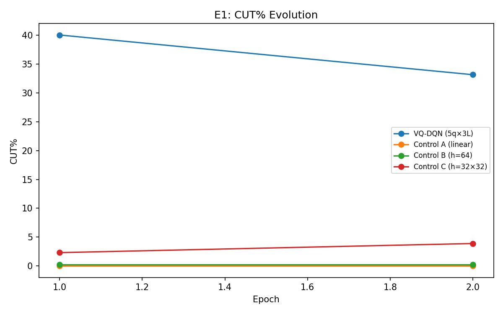
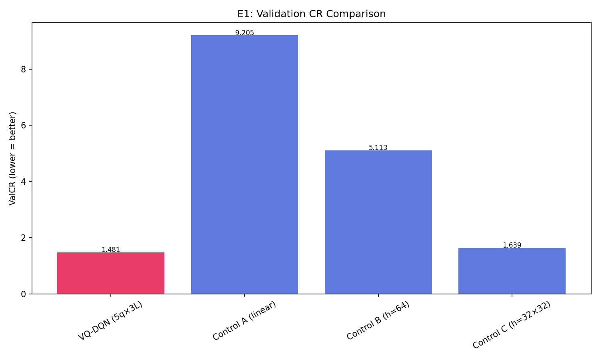

# Q-RLSTC Thesis Experiment Report

Generated: 2026-02-24T12:13:34.550165

## Protocol Constants

```json
{
  "batch_size": 32,
  "memory_size": 5000,
  "gamma": 0.9,
  "huber_delta": 1.0,
  "epsilon_start": 1.0,
  "epsilon_min": 0.1,
  "epsilon_decay": 0.99,
  "target_update_freq": 10,
  "L_MIN": 3,
  "CUT_PENALTY": 0.12,
  "EXTEND_COST": 0.01,
  "COMPLEXITY_LAMBDA": 0.03
}
```

## Full Terminal Output

```

══════════════════════════════════════════════════════════════════════
  Q-RLSTC THESIS EXPERIMENT RUNNER
  2026-02-24T11:56:02.536135
  Git: 4eb14ed84e33
  Python: 3.12.12  |  NumPy: 2.4.1
  Experiments: E1
  Data: 30 trajectories, 2 epochs
  Seed: 42
  Output: results/thesis_qfix
══════════════════════════════════════════════════════════════════════

══════════════════════════════════════════════════════════════════════
  E1: CORE QUANTUM UTILITY
══════════════════════════════════════════════════════════════════════

───────────────────────────────────────────────────────
  VQ-DQN (5q×3L)  (34 params)
  Noise: ideal | Shots: 0
  Mode: standard | Data: 100%
  Epochs: 2 × 27 trajectories
───────────────────────────────────────────────────────
    ⏱ 35s total | epoch 1/2 | episode 3/27 | 35s this epoch
    ⏱ 73s total | epoch 1/2 | episode 5/27 | 73s this epoch
    ⏱ 110s total | epoch 1/2 | episode 7/27 | 110s this epoch
    ⏱ 147s total | epoch 1/2 | episode 9/27 | 147s this epoch
    ⏱ 184s total | epoch 1/2 | episode 11/27 | 184s this epoch
    ⏱ 219s total | epoch 1/2 | episode 13/27 | 219s this epoch
    ⏱ 257s total | epoch 1/2 | episode 15/27 | 257s this epoch
    ⏱ 296s total | epoch 1/2 | episode 17/27 | 296s this epoch
    ⏱ 334s total | epoch 1/2 | episode 19/27 | 334s this epoch
    ⏱ 369s total | epoch 1/2 | episode 21/27 | 369s this epoch
    ⏱ 404s total | epoch 1/2 | episode 23/27 | 404s this epoch
    ⏱ 440s total | epoch 1/2 | episode 25/27 | 440s this epoch
    ⏱ 478s total | epoch 1/2 | episode 27/27 | 478s this epoch
  Epoch  1/2: ValCR=1.5926 | R̄=+46.897 | CUT=40% | #segs=561 | ε=0.762 | Qmargin=-0.3650 | ReplayCUT=35% | BufCUT=37% ★ | Q̄ext=+1.207 Q̄cut=+1.572
    ⏱ 534s total | epoch 2/2 | episode 3/27 | 37s this epoch
    ⏱ 569s total | epoch 2/2 | episode 5/27 | 72s this epoch
    ⏱ 607s total | epoch 2/2 | episode 7/27 | 110s this epoch
    ⏱ 644s total | epoch 2/2 | episode 9/27 | 147s this epoch
    ⏱ 680s total | epoch 2/2 | episode 11/27 | 183s this epoch
    ⏱ 715s total | epoch 2/2 | episode 13/27 | 218s this epoch
    ⏱ 752s total | epoch 2/2 | episode 15/27 | 255s this epoch
    ⏱ 791s total | epoch 2/2 | episode 17/27 | 294s this epoch
    ⏱ 826s total | epoch 2/2 | episode 19/27 | 329s this epoch
    ⏱ 860s total | epoch 2/2 | episode 21/27 | 363s this epoch
    ⏱ 896s total | epoch 2/2 | episode 23/27 | 399s this epoch
    ⏱ 932s total | epoch 2/2 | episode 25/27 | 435s this epoch
    ⏱ 969s total | epoch 2/2 | episode 27/27 | 472s this epoch
  Epoch  2/2: ValCR=1.4811 | R̄=+120.315 | CUT=33% | #segs=465 | ε=0.581 | Qmargin=-0.2721 | ReplayCUT=39% | BufCUT=40% ★ | Q̄ext=+2.885 Q̄cut=+3.157

───────────────────────────────────────────────────────
  Control A (linear)  (12 params)
  Noise: ideal | Shots: 0
  Mode: standard | Data: 100%
  Epochs: 2 × 27 trajectories
───────────────────────────────────────────────────────
  Epoch  1/2: ValCR=9.2051 | R̄=+37.922 | CUT=0% | #segs=3 | ε=0.762 | Qmargin=+0.1635 | ReplayCUT=31% | BufCUT=29% ★ | Q̄ext=-8.455 Q̄cut=-8.619
  Epoch  2/2: ValCR=9.2051 | R̄=+76.334 | CUT=0% | #segs=3 | ε=0.581 | Qmargin=+0.2277 | ReplayCUT=25% | BufCUT=23% | Q̄ext=-8.583 Q̄cut=-8.811

───────────────────────────────────────────────────────
  Control B (h=64)  (514 params)
  Noise: ideal | Shots: 0
  Mode: standard | Data: 100%
  Epochs: 2 × 27 trajectories
───────────────────────────────────────────────────────
  Epoch  1/2: ValCR=5.1133 | R̄=+49.312 | CUT=0% | #segs=6 | ε=0.762 | Qmargin=+0.2272 | ReplayCUT=31% | BufCUT=29% ★ | Q̄ext=+0.225 Q̄cut=-0.002
  Epoch  2/2: ValCR=5.1133 | R̄=+76.869 | CUT=0% | #segs=6 | ε=0.581 | Qmargin=+0.2439 | ReplayCUT=25% | BufCUT=23% | Q̄ext=+0.268 Q̄cut=+0.025

───────────────────────────────────────────────────────
  Control C (h=32×32)  (1314 params)
  Noise: ideal | Shots: 0
  Mode: standard | Data: 100%
  Epochs: 2 × 27 trajectories
───────────────────────────────────────────────────────
  Epoch  1/2: ValCR=1.8736 | R̄=+39.303 | CUT=2% | #segs=35 | ε=0.762 | Qmargin=+0.0706 | ReplayCUT=31% | BufCUT=29% ★ | Q̄ext=-0.253 Q̄cut=-0.324
  Epoch  2/2: ValCR=1.6390 | R̄=+74.095 | CUT=4% | #segs=57 | ε=0.581 | Qmargin=+0.0610 | ReplayCUT=25% | BufCUT=23% ★ | Q̄ext=-0.267 Q̄cut=-0.328

══════════════════════════════════════════════════════════════════════════════════════════
  E1: Core Quantum Utility — Summary
══════════════════════════════════════════════════════════════════════════════════════════

Model                          Params    ValCR   CUT%  #Segs BestEp    Time  Qmargin
──────────────────────────────────────────────────────────────────────────────────────────
VQ-DQN (5q×3L)                     34   1.4811    33%    465      2  987.2s  -0.2721
Control A (linear)                 12   9.2051     0%      3      1    8.7s  +0.2277
Control B (h=64)                  514   5.1133     0%      6      1    9.2s  +0.2439
Control C (h=32×32)              1314   1.6390     4%     57      2   10.0s  +0.0610
──────────────────────────────────────────────────────────────────────────────────────────

══════════════════════════════════════════════════════════════════════
  GRAND SUMMARY
══════════════════════════════════════════════════════════════════════


══════════════════════════════════════════════════════════════════════════════════════════
  All Models — Summary
══════════════════════════════════════════════════════════════════════════════════════════

Model                          Params    ValCR   CUT%  #Segs BestEp    Time  Qmargin
──────────────────────────────────────────────────────────────────────────────────────────
VQ-DQN (5q×3L)                     34   1.4811    33%    465      2  987.2s  -0.2721
Control A (linear)                 12   9.2051     0%      3      1    8.7s  +0.2277
Control B (h=64)                  514   5.1133     0%      6      1    9.2s  +0.2439
Control C (h=32×32)              1314   1.6390     4%     57      2   10.0s  +0.0610
──────────────────────────────────────────────────────────────────────────────────────────

──────────────────────────────────────────────────────────────────────
  D2/D3/D5: Diagnostic Summary
  (Q-margins, Training Action Dist, Replay Buffer Dist)
──────────────────────────────────────────────────────────────────────

  VQ-DQN (5q×3L)                
    D2 Q-margin:    -0.365 → -0.272
    D3 TrainCUT%:   35% → 39%
    D5 BufferCUT%:  37% → 40%

  Control A (linear)            
    D2 Q-margin:    +0.163 → +0.228
    D3 TrainCUT%:   31% → 25%
    D5 BufferCUT%:  29% → 23%

  Control B (h=64)              
    D2 Q-margin:    +0.227 → +0.244
    D3 TrainCUT%:   31% → 25%
    D5 BufferCUT%:  29% → 23%

  Control C (h=32×32)           
    D2 Q-margin:    +0.071 → +0.061
    D3 TrainCUT%:   31% → 25%
    D5 BufferCUT%:  29% → 23%


════════════════════════════════════════════════════════════
  Generating Plots
════════════════════════════════════════════════════════════

  ✓ d2_qmargin_VQ-DQN_(5q×3L).png
  ✓ d2_qmargin_Control_A_(linear).png
  ✓ d2_qmargin_Control_B_(h=64).png
  ✓ d2_qmargin_Control_C_(h=32×32).png
  ✓ e1_valcr_comparison.png
  ✓ e1_cut_evolution.png

  Generated 6 plots → results/thesis_qfix/plots

```

## Plots

.png)

.png)

.png)

.png)






## Raw Results (JSON)

See `thesis_results_20260224_121334.json` for machine-readable data.
