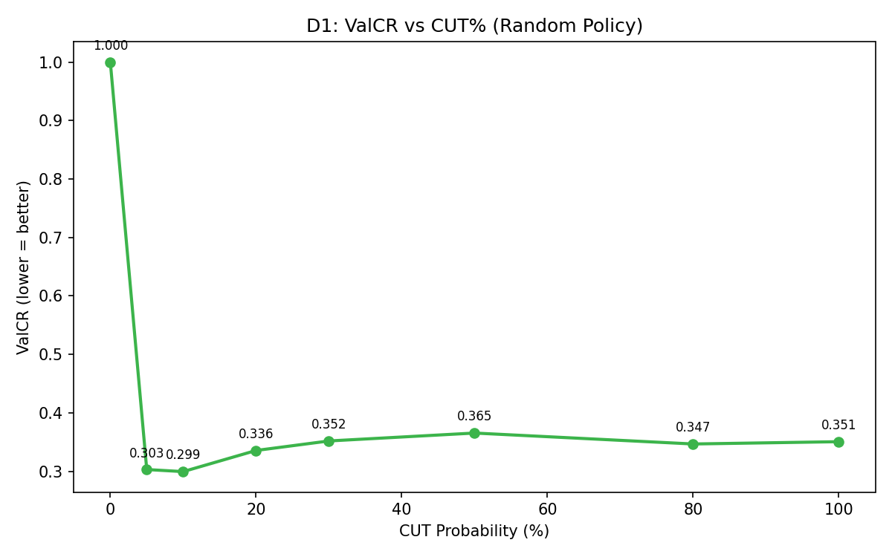
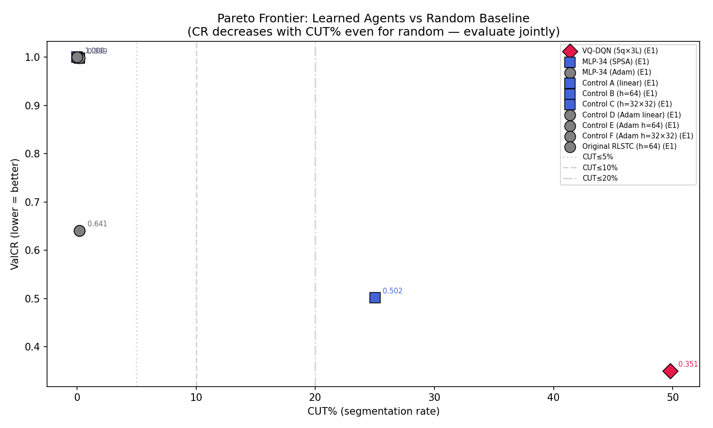

# Q-RLSTC Thesis Experiment Report

Generated: 2026-04-03T01:38:28.088361


## Metric Definitions
- **ValCR (Validation Competitive Ratio)**: OD_segmented / OD_baseline.
  Numerator: RMS distance from each point to its segment centroid (post-segmentation).
  Denominator (bs): RMS distance under the always-extend baseline on the SAME
  validation fold. Lower is better. <1.0 means segmentation improves clustering.
  NOTE: This is NOT the standard online-algorithms competitive ratio.
  ⚠ CR values are ONLY comparable when computed with IDENTICAL bs.
- **GreedyCUT%**: Fraction of validation timesteps where the greedy policy
  (ε=0, no exploration) selects CUT (action=1) AFTER L_MIN override.
  Numerator: count of effective CUT actions in validation.
  Denominator: total validation timesteps (CUT + EXTEND).
- **TrainCUT%**: Fraction of training actions that were CUT, INCLUDING
  exploration (ε-greedy) actions. Higher early due to random exploration.
- **BufCUT%**: CUT action fraction IN THE REPLAY BUFFER. May lag behind
  current policy because buffer contains old experience.
- **#segs (total)**: Total segments across ALL validation trajectories.
  Each trajectory produces at least 1 segment (the terminal segment).
  #segs = Σ_episodes (cuts_in_episode + 1).
- **segs/traj**: Average segments per validation trajectory = #segs / n_val_trajectories.
- **Silhouette Coefficient**: Standard cluster validity metric [-1, 1].
  Higher is better. Measures intra-cluster vs inter-cluster distance.
- **SSE**: Sum of squared errors from cluster centroids.
- **Q-margin**: Mean(Q_extend - Q_cut) across validation steps. Positive
  means the agent prefers extending; negative means it prefers cutting.
- **OD (Overall Distance)**: RMS distance from each point to its segment centroid.
- **bs (basesim)**: OD under the always-extend (no-segmentation) baseline for the
  same validation fold. Used as the denominator of ValCR.
  ⚠ If bs differs between two runs, their CR values are on different scales.
- **L_MIN override**: When the agent selects CUT but the current segment is
  shorter than L_MIN (=3) points, OR the remaining trajectory is shorter
  than L_MIN, the environment SILENTLY overrides CUT → EXTEND. The logged
  action is the POST-override (effective) action.

## Protocol Constants

```json
{
  "batch_size": 32,
  "memory_size": 5000,
  "gamma": 0.9,
  "huber_delta": 1.0,
  "epsilon_start": 1.0,
  "epsilon_min": 0.1,
  "epsilon_decay": 0.99,
  "target_update_freq": 10,
  "L_MIN": 3,
  "CUT_PENALTY": 0.12,
  "EXTEND_COST": 0.01,
  "COMPLEXITY_LAMBDA": 0.03,
  "MIN_CUT_BONUS": 0.3,
  "MIN_CUT_BONUS_FINAL": 0.15,
  "COLLAPSE_CUT_THRESHOLD": 1.0,
  "USE_LAGRANGIAN": true,
  "TARGET_CUT_PCT": 10.0,
  "B_HARD_CUT_PCT": 30.0,
  "LAGRANGIAN_LR": 0.02,
  "LAMBDA_MAX": 2.0,
  "LAMBDA_DELTA_MAX": 0.05,
  "LAMBDA_CUT_EMA": 0.9,
  "LAMBDA_FREEZE_EPOCHS": 1,
  "EPSILON_DECAY_MODE": "per_step",
  "EPSILON_DECAY_PER_STEP": 0.9995,
  "FORCED_CUT_PROB": 0.25,
  "FORCED_CUT_EPOCHS": 2,
  "USE_STRATIFIED_REPLAY": true,
  "MIN_CUT_QUOTA": 0.3,
  "EXPLORATION_MODE": "boltzmann",
  "BOLTZMANN_TEMP_START": 1.0,
  "BOLTZMANN_TEMP_MIN": 0.1,
  "BOLTZMANN_TEMP_DECAY": 0.99,
  "OPTIMISTIC_CUT_BIAS": 0.5,
  "Q_CLIP_RANGE": 50.0
}
```

## Full Terminal Output

```

══════════════════════════════════════════════════════════════════════
  Q-RLSTC THESIS EXPERIMENT RUNNER
  2026-04-03T01:36:06.895021
  Git: 14b918895796
  Python: 3.12.12  |  NumPy: 2.4.1
  Experiments: D1
  Data: 5 trajectories, 1 epochs
  Seed: 42
  Output: results/thesis
══════════════════════════════════════════════════════════════════════

════════════════════════════════════════════════════════════════════════════════
  D1: ValCR vs CUT% — Random Policy Diagnostic (METRIC-ONLY)
  5 trajectories, no learning, no reward shaping
  NOTE: Tests metric degeneracy only — reward alignment is separate.
════════════════════════════════════════════════════════════════════════════════

 CutProb  ActualCUT%     ValCR    nValCR    wValCR   #Segs   AvgLen
────────────────────────────────────────────────────────────────────────────────
      0%        0.0%    1.0000    0.0022    0.0011       1    453.0
      5%        4.6%    0.3030    0.0255    0.0072      22     21.5
     10%        8.8%    0.2994    0.0341    0.0130      41     12.0
     20%       16.4%    0.3356    0.0636    0.0257      75      7.0
     30%       22.1%    0.3518    0.0806    0.0351     101      5.5
     50%       31.9%    0.3654    0.1005    0.0503     145      4.1
     80%       43.8%    0.3467    0.1082    0.0624     199      3.3
    100%       49.8%    0.3506    0.1168    0.0699     226      3.0
────────────────────────────────────────────────────────────────────────────────

  ✓  ValCR is NOT monotonically decreasing with CUT%.
     Best ValCR = 0.2994 at CUT = 10%

  [Auto-Save] Saving intermediate results to results/thesis...

════════════════════════════════════════════════════════════
  Generating Plots
════════════════════════════════════════════════════════════

  ✓ d1_valcr_vs_cut.png
  ✓ pareto_valcr_vs_cut.png

  Generated 2 plots → results/thesis/plots

  JSON → results/thesis/thesis_results_20260403_013827.json
  Report → results/thesis/thesis_report_20260403_013827.md

══════════════════════════════════════════════════════════════════════
  GRAND SUMMARY
══════════════════════════════════════════════════════════════════════


════════════════════════════════════════════════════════════
  Generating Plots
════════════════════════════════════════════════════════════

  ✓ d1_valcr_vs_cut.png
  ✓ pareto_valcr_vs_cut.png

  Generated 2 plots → results/thesis/plots

```

## Plots






## Raw Results (JSON)

See `thesis_results_20260403_013828.json` for machine-readable data.
