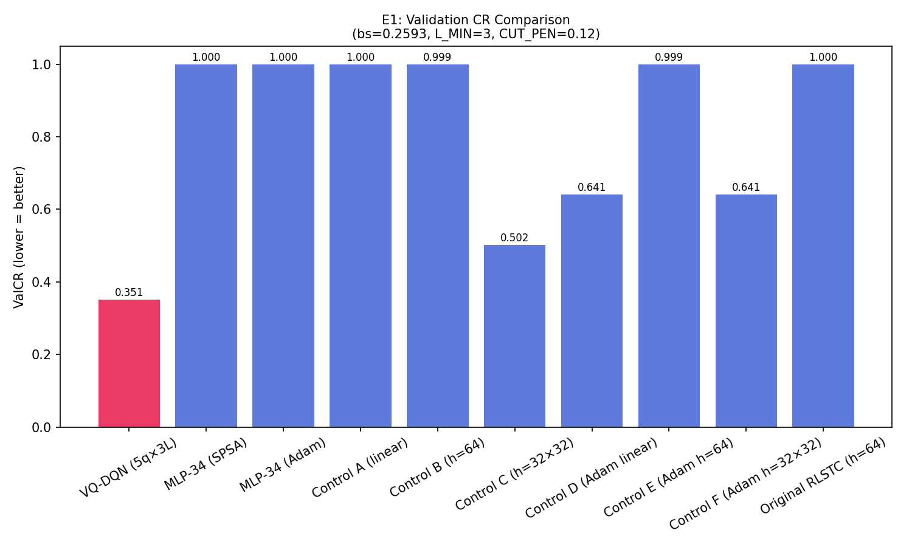

# Q-RLSTC Thesis Experiment Report

Generated: 2026-04-03T01:39:53.312102


## Metric Definitions
- **ValCR (Validation Competitive Ratio)**: OD_segmented / OD_baseline.
  Numerator: RMS distance from each point to its segment centroid (post-segmentation).
  Denominator (bs): RMS distance under the always-extend baseline on the SAME
  validation fold. Lower is better. <1.0 means segmentation improves clustering.
  NOTE: This is NOT the standard online-algorithms competitive ratio.
  ⚠ CR values are ONLY comparable when computed with IDENTICAL bs.
- **GreedyCUT%**: Fraction of validation timesteps where the greedy policy
  (ε=0, no exploration) selects CUT (action=1) AFTER L_MIN override.
  Numerator: count of effective CUT actions in validation.
  Denominator: total validation timesteps (CUT + EXTEND).
- **TrainCUT%**: Fraction of training actions that were CUT, INCLUDING
  exploration (ε-greedy) actions. Higher early due to random exploration.
- **BufCUT%**: CUT action fraction IN THE REPLAY BUFFER. May lag behind
  current policy because buffer contains old experience.
- **#segs (total)**: Total segments across ALL validation trajectories.
  Each trajectory produces at least 1 segment (the terminal segment).
  #segs = Σ_episodes (cuts_in_episode + 1).
- **segs/traj**: Average segments per validation trajectory = #segs / n_val_trajectories.
- **Silhouette Coefficient**: Standard cluster validity metric [-1, 1].
  Higher is better. Measures intra-cluster vs inter-cluster distance.
- **SSE**: Sum of squared errors from cluster centroids.
- **Q-margin**: Mean(Q_extend - Q_cut) across validation steps. Positive
  means the agent prefers extending; negative means it prefers cutting.
- **OD (Overall Distance)**: RMS distance from each point to its segment centroid.
- **bs (basesim)**: OD under the always-extend (no-segmentation) baseline for the
  same validation fold. Used as the denominator of ValCR.
  ⚠ If bs differs between two runs, their CR values are on different scales.
- **L_MIN override**: When the agent selects CUT but the current segment is
  shorter than L_MIN (=3) points, OR the remaining trajectory is shorter
  than L_MIN, the environment SILENTLY overrides CUT → EXTEND. The logged
  action is the POST-override (effective) action.

## Protocol Constants

```json
{
  "batch_size": 32,
  "memory_size": 5000,
  "gamma": 0.9,
  "huber_delta": 1.0,
  "epsilon_start": 1.0,
  "epsilon_min": 0.1,
  "epsilon_decay": 0.99,
  "target_update_freq": 10,
  "L_MIN": 3,
  "CUT_PENALTY": 0.12,
  "EXTEND_COST": 0.01,
  "COMPLEXITY_LAMBDA": 0.03,
  "MIN_CUT_BONUS": 0.3,
  "MIN_CUT_BONUS_FINAL": 0.15,
  "COLLAPSE_CUT_THRESHOLD": 1.0,
  "USE_LAGRANGIAN": true,
  "TARGET_CUT_PCT": 10.0,
  "B_HARD_CUT_PCT": 30.0,
  "LAGRANGIAN_LR": 0.02,
  "LAMBDA_MAX": 2.0,
  "LAMBDA_DELTA_MAX": 0.05,
  "LAMBDA_CUT_EMA": 0.9,
  "LAMBDA_FREEZE_EPOCHS": 1,
  "EPSILON_DECAY_MODE": "per_step",
  "EPSILON_DECAY_PER_STEP": 0.9995,
  "FORCED_CUT_PROB": 0.25,
  "FORCED_CUT_EPOCHS": 2,
  "USE_STRATIFIED_REPLAY": true,
  "MIN_CUT_QUOTA": 0.3,
  "EXPLORATION_MODE": "boltzmann",
  "BOLTZMANN_TEMP_START": 1.0,
  "BOLTZMANN_TEMP_MIN": 0.1,
  "BOLTZMANN_TEMP_DECAY": 0.99,
  "OPTIMISTIC_CUT_BIAS": 0.5,
  "Q_CLIP_RANGE": 50.0
}
```

## Full Terminal Output

```

══════════════════════════════════════════════════════════════════════
  Q-RLSTC THESIS EXPERIMENT RUNNER
  2026-04-03T01:36:19.126540
  Git: 14b918895796
  Python: 3.12.12  |  NumPy: 2.4.1
  Experiments: E1
  Data: 5 trajectories, 1 epochs
  Seed: 42
  Output: results/thesis
══════════════════════════════════════════════════════════════════════

══════════════════════════════════════════════════════════════════════
  E1: CORE QUANTUM UTILITY
══════════════════════════════════════════════════════════════════════

──────────────────────────────────────────────────────────────────────
  VQ-DQN (5q×3L) — SPSA — 34p — 5traj/1ep/seed=42 | 5q×3L linear | ideal | shots=0
  Reward weights: CUT_PEN=λ-adaptive EXTEND_COST=0.01 MIN_CUT_BONUS=0.3 COMPLEXITY_λ=0.03
  Lagrangian: target=10% lr=0.02 λ_init=0.12
  Epsilon: mode=per_step decay/step=0.9995
  bs (fold baseline OD) = 0.259310
  Epochs: 1 × 4 trajectories | val=1 trajectories
──────────────────────────────────────────────────────────────────────
    ⏱ 46s total | epoch 1/1 | episode 3/4 | 46s this epoch
  Epoch  1/1: ValCR=0.3506 (OD=0.0909/bs=0.2593) medCR=0.2474 wCR=0.0699 | Sil=+0.000 | R̄=-7.603 | GreedyCUT=50% | #segs=226(226.0/traj) | ε=0.382 | Qmargin=-0.9108 | TrainCUT=6% | BufCUT=6% ★ | Q̄ext=+0.012 Q̄cut=+0.923 | ΔQval=+0.911±0.009(100%>0) | ΔQtrn=-3.122±1.180 | forced=1
    R6 reward components: r̄_cut=-0.1103 r̄_ext=-0.0093 (Δ=-0.1010, bonus=0.300)
    λ [FROZEN]: 0.1200 (held) | batch=6.4% greedy=49.8%(diag)

──────────────────────────────────────────────────────────────────────
  MLP-34 (SPSA) — SPSA — 34p — 5traj/1ep/seed=42
  Reward weights: CUT_PEN=λ-adaptive EXTEND_COST=0.01 MIN_CUT_BONUS=0.3 COMPLEXITY_λ=0.03
  Lagrangian: target=10% lr=0.02 λ_init=0.12
  Epsilon: mode=per_step decay/step=0.9995
  bs (fold baseline OD) = 0.259310
  Epochs: 1 × 4 trajectories | val=1 trajectories
──────────────────────────────────────────────────────────────────────
  Epoch  1/1: ValCR=1.0000 (OD=0.2593/bs=0.2593) medCR=1.0000 wCR=0.0011 | Sil=+0.000 | R̄=-13.571 | GreedyCUT=0% | #segs=1(1.0/traj) | ε=0.382 | Qmargin=+4.0724 | TrainCUT=17% | BufCUT=17% ★ | Q̄ext=+1.343 Q̄cut=-2.729 | ΔQval=-4.072±0.338(0%>0) | ΔQtrn=-50.272±49.961
    R6 reward components: r̄_cut=-0.1163 r̄_ext=-0.0106 (Δ=-0.1056, bonus=0.300)
    λ [FROZEN]: 0.1200 (held) | batch=16.6% greedy=0.0%(diag)
  ⚠ COLLAPSED: CUT%=0.0% < 1.0% — policy never learned to cut

──────────────────────────────────────────────────────────────────────
  MLP-34 (Adam) — Adam — 34p — 5traj/1ep/seed=42
  Reward weights: CUT_PEN=λ-adaptive EXTEND_COST=0.01 MIN_CUT_BONUS=0.3 COMPLEXITY_λ=0.03
  Lagrangian: target=10% lr=0.02 λ_init=0.12
  Epsilon: mode=per_step decay/step=0.9995
  bs (fold baseline OD) = 0.259310
  Epochs: 1 × 4 trajectories | val=1 trajectories
──────────────────────────────────────────────────────────────────────
  Epoch  1/1: ValCR=1.0000 (OD=0.2593/bs=0.2593) medCR=1.0000 wCR=0.0011 | Sil=+0.000 | R̄=-17.772 | GreedyCUT=0% | #segs=1(1.0/traj) | ε=0.382 | Qmargin=+0.4200 | TrainCUT=25% | BufCUT=25% ★ | Q̄ext=+0.045 Q̄cut=-0.375 | ΔQval=-0.420±0.036(0%>0) | ΔQtrn=-25.120±43.367
    R6 reward components: r̄_cut=-0.1175 r̄_ext=-0.0101 (Δ=-0.1074, bonus=0.300)
    λ [FROZEN]: 0.1200 (held) | batch=24.9% greedy=0.0%(diag)
  ⚠ COLLAPSED: CUT%=0.0% < 1.0% — policy never learned to cut

──────────────────────────────────────────────────────────────────────
  Control A (linear) — SPSA — 12p — 5traj/1ep/seed=42
  Reward weights: CUT_PEN=λ-adaptive EXTEND_COST=0.01 MIN_CUT_BONUS=0.3 COMPLEXITY_λ=0.03
  Lagrangian: target=10% lr=0.02 λ_init=0.12
  Epsilon: mode=per_step decay/step=0.9995
  bs (fold baseline OD) = 0.259310
  Epochs: 1 × 4 trajectories | val=1 trajectories
──────────────────────────────────────────────────────────────────────
  Epoch  1/1: ValCR=1.0000 (OD=0.2593/bs=0.2593) medCR=1.0000 wCR=0.0011 | Sil=+0.000 | R̄=-22.229 | GreedyCUT=0% | #segs=1(1.0/traj) | ε=0.382 | Qmargin=+3.4607 | TrainCUT=33% | BufCUT=33% ★ | Q̄ext=-7.426 Q̄cut=-10.887 | ΔQval=-3.461±0.289(0%>0) | ΔQtrn=-0.027±0.234 | forced=1
    R6 reward components: r̄_cut=-0.1181 r̄_ext=-0.0101 (Δ=-0.1080, bonus=0.300)
    λ [FROZEN]: 0.1200 (held) | batch=33.3% greedy=0.0%(diag)
  ⚠ COLLAPSED: CUT%=0.0% < 1.0% — policy never learned to cut

──────────────────────────────────────────────────────────────────────
  Control B (h=64) — SPSA — 514p — 5traj/1ep/seed=42
  Reward weights: CUT_PEN=λ-adaptive EXTEND_COST=0.01 MIN_CUT_BONUS=0.3 COMPLEXITY_λ=0.03
  Lagrangian: target=10% lr=0.02 λ_init=0.12
  Epsilon: mode=per_step decay/step=0.9995
  bs (fold baseline OD) = 0.259310
  Epochs: 1 × 4 trajectories | val=1 trajectories
──────────────────────────────────────────────────────────────────────
  Epoch  1/1: ValCR=0.9986 (OD=0.2590/bs=0.2593) medCR=0.9986 wCR=0.0011 | Sil=+0.000 | R̄=-12.429 | GreedyCUT=0% | #segs=2(2.0/traj) | ε=0.382 | Qmargin=+99.1150 | TrainCUT=15% | BufCUT=15% ★ | Q̄ext=+49.558 Q̄cut=-49.558 | ΔQval=-99.115±13.274(0%>0) | ΔQtrn=-50.164±50.328 | forced=1
    R6 reward components: r̄_cut=-0.1158 r̄_ext=-0.0100 (Δ=-0.1058, bonus=0.300)
    λ [FROZEN]: 0.1200 (held) | batch=14.9% greedy=0.2%(diag)
  ⚠ COLLAPSED: CUT%=0.2% < 1.0% — policy never learned to cut

──────────────────────────────────────────────────────────────────────
  Control C (h=32×32) — SPSA — 1314p — 5traj/1ep/seed=42
  Reward weights: CUT_PEN=λ-adaptive EXTEND_COST=0.01 MIN_CUT_BONUS=0.3 COMPLEXITY_λ=0.03
  Lagrangian: target=10% lr=0.02 λ_init=0.12
  Epsilon: mode=per_step decay/step=0.9995
  bs (fold baseline OD) = 0.259310
  Epochs: 1 × 4 trajectories | val=1 trajectories
──────────────────────────────────────────────────────────────────────
  Epoch  1/1: ValCR=0.5023 (OD=0.1303/bs=0.2593) medCR=0.3369 wCR=0.0562 | Sil=+0.000 | R̄=-21.895 | GreedyCUT=25% | #segs=114(114.0/traj) | ε=0.382 | Qmargin=-0.0144 | TrainCUT=34% | BufCUT=34% ★ | Q̄ext=-0.315 Q̄cut=-0.300 | ΔQval=+0.014±0.147(50%>0) | ΔQtrn=+0.041±0.110
    R6 reward components: r̄_cut=-0.1181 r̄_ext=-0.0086 (Δ=-0.1096, bonus=0.300)
    λ [FROZEN]: 0.1200 (held) | batch=33.6% greedy=25.0%(diag)

──────────────────────────────────────────────────────────────────────
  Control D (Adam linear) — Adam — 12p — 5traj/1ep/seed=42
  Reward weights: CUT_PEN=λ-adaptive EXTEND_COST=0.01 MIN_CUT_BONUS=0.3 COMPLEXITY_λ=0.03
  Lagrangian: target=10% lr=0.02 λ_init=0.12
  Epsilon: mode=per_step decay/step=0.9995
  bs (fold baseline OD) = 0.259310
  Epochs: 1 × 4 trajectories | val=1 trajectories
──────────────────────────────────────────────────────────────────────
  Epoch  1/1: ValCR=0.6411 (OD=0.1662/bs=0.2593) medCR=0.6411 wCR=0.0014 | Sil=+0.000 | R̄=-22.157 | GreedyCUT=0% | #segs=2(2.0/traj) | ε=0.382 | Qmargin=+0.5073 | TrainCUT=33% | BufCUT=33% ★ | Q̄ext=+0.089 Q̄cut=-0.419 | ΔQval=-0.507±0.239(0%>0) | ΔQtrn=-0.024±0.118
    R6 reward components: r̄_cut=-0.1181 r̄_ext=-0.0101 (Δ=-0.1080, bonus=0.300)
    λ [FROZEN]: 0.1200 (held) | batch=33.2% greedy=0.2%(diag)
  ⚠ COLLAPSED: CUT%=0.2% < 1.0% — policy never learned to cut

──────────────────────────────────────────────────────────────────────
  Control E (Adam h=64) — Adam — 514p — 5traj/1ep/seed=42
  Reward weights: CUT_PEN=λ-adaptive EXTEND_COST=0.01 MIN_CUT_BONUS=0.3 COMPLEXITY_λ=0.03
  Lagrangian: target=10% lr=0.02 λ_init=0.12
  Epsilon: mode=per_step decay/step=0.9995
  bs (fold baseline OD) = 0.259310
  Epochs: 1 × 4 trajectories | val=1 trajectories
──────────────────────────────────────────────────────────────────────
  Epoch  1/1: ValCR=0.9986 (OD=0.2590/bs=0.2593) medCR=0.9986 wCR=0.0011 | Sil=+0.000 | R̄=-12.978 | GreedyCUT=0% | #segs=2(2.0/traj) | ε=0.382 | Qmargin=-0.2212 | TrainCUT=15% | BufCUT=15% ★ | Q̄ext=+49.558 Q̄cut=+49.779 | ΔQval=+0.221±8.144(0%>0) | ΔQtrn=-50.261±49.972
    R6 reward components: r̄_cut=-0.1160 r̄_ext=-0.0107 (Δ=-0.1053, bonus=0.300)
    λ [FROZEN]: 0.1200 (held) | batch=15.4% greedy=0.2%(diag)
  ⚠ COLLAPSED: CUT%=0.2% < 1.0% — policy never learned to cut

──────────────────────────────────────────────────────────────────────
  Control F (Adam h=32×32) — Adam — 1314p — 5traj/1ep/seed=42
  Reward weights: CUT_PEN=λ-adaptive EXTEND_COST=0.01 MIN_CUT_BONUS=0.3 COMPLEXITY_λ=0.03
  Lagrangian: target=10% lr=0.02 λ_init=0.12
  Epsilon: mode=per_step decay/step=0.9995
  bs (fold baseline OD) = 0.259310
  Epochs: 1 × 4 trajectories | val=1 trajectories
──────────────────────────────────────────────────────────────────────
  Epoch  1/1: ValCR=0.6411 (OD=0.1662/bs=0.2593) medCR=0.6411 wCR=0.0014 | Sil=+0.000 | R̄=-21.647 | GreedyCUT=0% | #segs=2(2.0/traj) | ε=0.382 | Qmargin=+0.2488 | TrainCUT=33% | BufCUT=33% ★ | Q̄ext=-0.457 Q̄cut=-0.706 | ΔQval=-0.249±0.083(0%>0) | ΔQtrn=-0.025±0.078
    R6 reward components: r̄_cut=-0.1181 r̄_ext=-0.0086 (Δ=-0.1095, bonus=0.300)
    λ [FROZEN]: 0.1200 (held) | batch=33.2% greedy=0.2%(diag)
  ⚠ COLLAPSED: CUT%=0.2% < 1.0% — policy never learned to cut

──────────────────────────────────────────────────────────────────────
  Original RLSTC (h=64) — SGD — 514p — 5traj/1ep/seed=42
  Reward weights: CUT_PEN=λ-adaptive EXTEND_COST=0.01 MIN_CUT_BONUS=0.3 COMPLEXITY_λ=0.03
  Lagrangian: target=10% lr=0.02 λ_init=0.12
  Epsilon: mode=per_step decay/step=0.9995
  bs (fold baseline OD) = 0.259310
  Epochs: 1 × 4 trajectories | val=1 trajectories
──────────────────────────────────────────────────────────────────────
  Epoch  1/1: ValCR=1.0000 (OD=0.2593/bs=0.2593) medCR=1.0000 wCR=0.0011 | Sil=+0.000 | R̄=-17.395 | GreedyCUT=0% | #segs=1(1.0/traj) | ε=0.382 | Qmargin=+0.1969 | TrainCUT=25% | BufCUT=25% ★ | Q̄ext=+0.158 Q̄cut=-0.039 | ΔQval=-0.197±0.007(0%>0) | ΔQtrn=+1593605320305008443392.000±50579030680186510114816.000 | forced=1
    R6 reward components: r̄_cut=-0.1175 r̄_ext=-0.0094 (Δ=-0.1081, bonus=0.300)
    λ [FROZEN]: 0.1200 (held) | batch=24.7% greedy=0.0%(diag)
  ⚠ COLLAPSED: CUT%=0.0% < 1.0% — policy never learned to cut

════════════════════════════════════════════════════════════════════════════════════════════════════════════════════════
  E1: Core Quantum Utility — Summary
════════════════════════════════════════════════════════════════════════════════════════════════════════════════════════

Model                          Params    ValCR       OD       bs   CUT%  #Segs    Sil BestEp    Time  Qmargin
────────────────────────────────────────────────────────────────────────────────────────────────────────────────────────
VQ-DQN (5q×3L)                     34   0.3506   0.0909   0.2593    50%    226 +0.000      1   93.1s  -0.9108
MLP-34 (SPSA)                      34   1.0000   0.2593   0.2593     0%      1 +0.000      1    6.4s  +4.0724
MLP-34 (Adam)                      34   1.0000   0.2593   0.2593     0%      1 +0.000      1    0.5s  +0.4200
Control A (linear)                 12   1.0000   0.2593   0.2593     0%      1 +0.000      1    2.7s  +3.4607
Control B (h=64)                  514   0.9986   0.2590   0.2593     0%      2 +0.000      1    5.2s +99.1150
Control C (h=32×32)              1314   0.5023   0.1303   0.2593    25%    114 +0.000      1    5.5s  -0.0144
Control D (Adam linear)            12   0.6411   0.1662   0.2593     0%      2 +0.000      1    2.5s  +0.5073
Control E (Adam h=64)             514   0.9986   0.2590   0.2593     0%      2 +0.000      1    2.7s  -0.2212
Control F (Adam h=32×32)         1314   0.6411   0.1662   0.2593     0%      2 +0.000      1    0.7s  +0.2488
Original RLSTC (h=64)             514   1.0000   0.2593   0.2593     0%      1 +0.000      1    0.5s  +0.1969
────────────────────────────────────────────────────────────────────────────────────────────────────────────────────────

  [Auto-Save] Saving intermediate results to results/thesis...

════════════════════════════════════════════════════════════
  Generating Plots
════════════════════════════════════════════════════════════

  ✓ pareto_valcr_vs_cut.png
  ✓ diagnostics for E1
  ✓ e1_valcr_comparison.png

  Generated 22 plots → results/thesis/plots

  JSON → results/thesis/thesis_results_20260403_013952.json
  Report → results/thesis/thesis_report_20260403_013952.md

══════════════════════════════════════════════════════════════════════
  GRAND SUMMARY
══════════════════════════════════════════════════════════════════════


════════════════════════════════════════════════════════════════════════════════════════════════════════════════════════
  Regime A: SGD/Adam (backprop) — Summary
════════════════════════════════════════════════════════════════════════════════════════════════════════════════════════

Model                          Params    ValCR       OD       bs   CUT%  #Segs    Sil BestEp    Time  Qmargin
────────────────────────────────────────────────────────────────────────────────────────────────────────────────────────
MLP-34 (Adam)                      34   1.0000   0.2593   0.2593     0%      1 +0.000      1    0.5s  +0.4200
Control D (Adam linear)            12   0.6411   0.1662   0.2593     0%      2 +0.000      1    2.5s  +0.5073
Control E (Adam h=64)             514   0.9986   0.2590   0.2593     0%      2 +0.000      1    2.7s  -0.2212
Control F (Adam h=32×32)         1314   0.6411   0.1662   0.2593     0%      2 +0.000      1    0.7s  +0.2488
Original RLSTC (h=64)             514   1.0000   0.2593   0.2593     0%      1 +0.000      1    0.5s  +0.1969
────────────────────────────────────────────────────────────────────────────────────────────────────────────────────────

════════════════════════════════════════════════════════════════════════════════════════════════════════════════════════
  Regime B: SPSA (gradient-free) — Summary
════════════════════════════════════════════════════════════════════════════════════════════════════════════════════════

Model                          Params    ValCR       OD       bs   CUT%  #Segs    Sil BestEp    Time  Qmargin
────────────────────────────────────────────────────────────────────────────────────────────────────────────────────────
VQ-DQN (5q×3L)                     34   0.3506   0.0909   0.2593    50%    226 +0.000      1   93.1s  -0.9108
MLP-34 (SPSA)                      34   1.0000   0.2593   0.2593     0%      1 +0.000      1    6.4s  +4.0724
Control A (linear)                 12   1.0000   0.2593   0.2593     0%      1 +0.000      1    2.7s  +3.4607
Control B (h=64)                  514   0.9986   0.2590   0.2593     0%      2 +0.000      1    5.2s +99.1150
Control C (h=32×32)              1314   0.5023   0.1303   0.2593    25%    114 +0.000      1    5.5s  -0.0144
────────────────────────────────────────────────────────────────────────────────────────────────────────────────────────

════════════════════════════════════════════════════════════════════════════════════════════════════
  CONSTRAINED LEADERBOARD: Best model at CUT% ≤ threshold
  (Immunizes against 'you just cut more' critique)
════════════════════════════════════════════════════════════════════════════════════════════════════

  Because CR decreases sharply with segmentation rate even for random
  policies (D1), all results are interpreted jointly with CUT%/#segs
  and relative to the random-cut envelope.

CUT ≤    Best Model                        ValCR   CUT%  #Segs       OD       bs    Sil Regime    
────────────────────────────────────────────────────────────────────────────────────────────────────
≤5%      Control D (Adam linear)          0.6411     0%      2   0.1662   0.2593 +0.000 SGD/Adam  
≤10%     Control D (Adam linear)          0.6411     0%      2   0.1662   0.2593 +0.000 SGD/Adam  
≤20%     Control D (Adam linear)          0.6411     0%      2   0.1662   0.2593 +0.000 SGD/Adam  
────────────────────────────────────────────────────────────────────────────────────────────────────

════════════════════════════════════════════════════════════════════════════════
  Pareto: Lowest (best) ValCR at CUT ≤ threshold  [lower = better]
════════════════════════════════════════════════════════════════════════════════

CUT ≤          Random (D1)    VQ-DQN (5q×3L)     MLP-34 (SPSA)     MLP-34 (Adam)  Control A (linear)  Control B (h=64)  Control C (h=32×32)  Control D (Adam linear)  Control E (Adam h=64)  Control F (Adam h=32×32)  Original RLSTC (h=64)
────────────────────────────────────────────────────────────────────────────────
≤5%                      —             (50%)            1.0000            1.0000            1.0000            0.9986             (25%)            0.6411            0.9986            0.6411            1.0000
≤10%                     —             (50%)            1.0000            1.0000            1.0000            0.9986             (25%)            0.6411            0.9986            0.6411            1.0000
≤20%                     —             (50%)            1.0000            1.0000            1.0000            0.9986             (25%)            0.6411            0.9986            0.6411            1.0000
≤30%                     —             (50%)            1.0000            1.0000            1.0000            0.9986            0.5023            0.6411            0.9986            0.6411            1.0000
≤40%                     —             (50%)            1.0000            1.0000            1.0000            0.9986            0.5023            0.6411            0.9986            0.6411            1.0000
≤50%                     —            0.3506            1.0000            1.0000            1.0000            0.9986            0.5023            0.6411            0.9986            0.6411            1.0000
≤80%                     —            0.3506            1.0000            1.0000            1.0000            0.9986            0.5023            0.6411            0.9986            0.6411            1.0000
────────────────────────────────────────────────────────────────────────────────

──────────────────────────────────────────────────────────────────────
  D2/D3/D5: Diagnostic Summary
  (Q-margins, Training Action Dist, Replay Buffer Dist)
──────────────────────────────────────────────────────────────────────

  VQ-DQN (5q×3L)                
    D2 Q-margin:    -0.911
    D3 TrainCUT%:   6%
    D5 BufferCUT%:  6%

  MLP-34 (SPSA)                 
    D2 Q-margin:    +4.072
    D3 TrainCUT%:   17%
    D5 BufferCUT%:  17%

  MLP-34 (Adam)                 
    D2 Q-margin:    +0.420
    D3 TrainCUT%:   25%
    D5 BufferCUT%:  25%

  Control A (linear)            
    D2 Q-margin:    +3.461
    D3 TrainCUT%:   33%
    D5 BufferCUT%:  33%

  Control B (h=64)              
    D2 Q-margin:    +99.115
    D3 TrainCUT%:   15%
    D5 BufferCUT%:  15%

  Control C (h=32×32)           
    D2 Q-margin:    -0.014
    D3 TrainCUT%:   34%
    D5 BufferCUT%:  34%

  Control D (Adam linear)       
    D2 Q-margin:    +0.507
    D3 TrainCUT%:   33%
    D5 BufferCUT%:  33%

  Control E (Adam h=64)         
    D2 Q-margin:    -0.221
    D3 TrainCUT%:   15%
    D5 BufferCUT%:  15%

  Control F (Adam h=32×32)      
    D2 Q-margin:    +0.249
    D3 TrainCUT%:   33%
    D5 BufferCUT%:  33%

  Original RLSTC (h=64)         
    D2 Q-margin:    +0.197
    D3 TrainCUT%:   25%
    D5 BufferCUT%:  25%


════════════════════════════════════════════════════════════
  Generating Plots
════════════════════════════════════════════════════════════

  ✓ pareto_valcr_vs_cut.png
  ✓ diagnostics for E1
  ✓ e1_valcr_comparison.png

  Generated 22 plots → results/thesis/plots

```

## Plots


.png)

.png)

.png)

.png)

.png)

.png)

.png)

.png)

.png)

.png)

.png)

.png)

.png)

.png)

.png)

.png)

.png)

.png)

.png)

.png)




## Raw Results (JSON)

See `thesis_results_20260403_013953.json` for machine-readable data.
